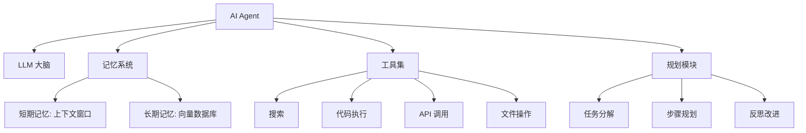

# AI Agent 开发

AI Agent 是能够自主规划、使用工具并完成复杂任务的智能体，代表了 AI 应用的发展方向。

## Agent 核心组件



## Agent 类型

### ReAct Agent

最经典的 Agent 模式，推理-行动交替：

```python
from langchain.agents import create_react_agent, AgentExecutor

prompt = hub.pull("hwchase17/react")
agent = create_react_agent(llm, tools, prompt)
executor = AgentExecutor(agent=agent, tools=tools, verbose=True)
```

### Plan-and-Execute Agent

先规划再执行，适合复杂的多步骤任务：

1. **规划阶段**：LLM 生成任务步骤列表
2. **执行阶段**：逐步执行每个步骤
3. **重规划**：如果执行结果不符预期，重新调整计划

### Multi-Agent 系统

多个专业化 Agent 协作完成复杂任务：

```python
from langgraph.graph import StateGraph

researcher = "你是一个信息研究员，负责搜索和整理信息"
writer = "你是一个技术作者，负责撰写内容"
reviewer = "你是一个审阅者，负责检查质量和提出建议"

workflow = StateGraph(AgentState)
workflow.add_node("research", research_node)
workflow.add_node("write", write_node)
workflow.add_node("review", review_node)
workflow.add_node("revise", revise_node)

workflow.add_edge("research", "write")
workflow.add_edge("write", "review")
workflow.add_conditional_edges("review", should_revise, {
    True: "revise",
    False: END,
})
workflow.add_edge("revise", "review")
```

## 工具设计最佳实践

### 工具描述

好的工具描述是 Agent 成功的关键：

```python
@tool
def query_database(sql: str) -> str:
    """执行 SQL 查询并返回结果。

    仅用于查询操作（SELECT），不支持修改操作。
    数据库包含用户表(users)、订单表(orders)、产品表(products)。

    Args:
        sql: SQL 查询语句，如 "SELECT * FROM users LIMIT 10"
    
    Returns:
        查询结果的 JSON 字符串
    """
    return execute_sql(sql)
```

### 工具选择指南

| 功能 | 推荐工具 | 说明 |
|------|---------|------|
| 网络搜索 | Tavili / SerpAPI | 获取实时信息 |
| 代码执行 | Python REPL / E2B | 安全执行代码 |
| 文件操作 | 文件读写工具 | 处理本地文件 |
| API 调用 | 自定义工具 | 对接外部服务 |

## Agent 安全

### 关键安全措施

1. **工具权限控制**：限制 Agent 可调用的工具和操作范围
2. **输入验证**：对工具参数进行校验和清洗
3. **执行沙箱**：代码执行在隔离环境中运行
4. **人类审批**：高风险操作需要人类确认
5. **成本控制**：设置最大 token 数和 API 调用次数

```python
executor = AgentExecutor(
    agent=agent,
    tools=tools,
    max_iterations=10,
    max_execution_time=60,
    handle_parsing_errors=True,
)
```
