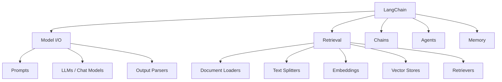

# LangChain 框架

LangChain 是最流行的 LLM 应用开发框架，提供了模块化的组件和丰富的集成，帮助开发者快速构建 AI 应用。

## 核心模块



## 快速开始

### 安装

```bash
pip install langchain langchain-openai langchain-community
```

### 基础用法

```python
from langchain_openai import ChatOpenAI
from langchain_core.prompts import ChatPromptTemplate
from langchain_core.output_parsers import StrOutputParser

llm = ChatOpenAI(model="gpt-4o-mini")

prompt = ChatPromptTemplate.from_messages([
    ("system", "你是一个 {role}，用中文回答问题。"),
    ("human", "{input}"),
])

chain = prompt | llm | StrOutputParser()

response = chain.invoke({"role": "AI 教程作者", "input": "什么是 RAG？"})
```

## LCEL（LangChain Expression Language）

LCEL 使用 `|` 操作符将组件串联成链：

```python
chain = prompt | llm | output_parser
```

### 并行执行

```python
from langchain_core.runnables import RunnableParallel

chain = RunnableParallel({
    "joke": joke_chain,
    "poem": poem_chain,
})
```

### 流式输出

```python
for chunk in chain.stream({"input": "你好"}):
    print(chunk, end="", flush=True)
```

## 工具与 Agent

### 定义工具

```python
from langchain_core.tools import tool

@tool
def search_web(query: str) -> str:
    """搜索网页获取信息"""
    return search_engine.search(query)

@tool
def calculate(expression: str) -> float:
    """计算数学表达式"""
    return eval(expression)
```

### 创建 Agent

```python
from langchain_openai import ChatOpenAI
from langchain.agents import create_tool_calling_agent, AgentExecutor

llm = ChatOpenAI(model="gpt-4o")
agent = create_tool_calling_agent(llm, [search_web, calculate], prompt)
agent_executor = AgentExecutor(agent=agent, tools=[search_web, calculate])

result = agent_executor.invoke({"input": "北京今天的天气如何？"})
```

## LangGraph

LangGraph 是 LangChain 的扩展，用于构建有状态的、多角色的 AI 应用：

```python
from langgraph.graph import StateGraph, END

workflow = StateGraph(AgentState)
workflow.add_node("think", think_node)
workflow.add_node("act", act_node)
workflow.add_node("observe", observe_node)

workflow.add_edge("think", "act")
workflow.add_edge("act", "observe")
workflow.add_conditional_edges("observe", should_continue, {
    True: "think",
    False: END,
})
```

LangGraph 适合构建复杂的 Agent 工作流，支持循环、分支和持久化状态。
