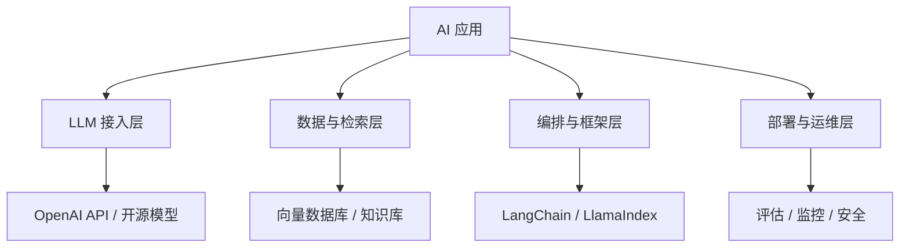

# AI 应用开发概述

AI 应用开发是将大语言模型的能力整合到实际产品中的工程实践。本章涵盖从 RAG 到 Agent 的核心技术栈。

## AI 应用的类型

| 类型 | 描述 | 典型场景 |
|------|------|---------|
| 问答系统 | 基于知识库回答问题 | 客服、企业知识库 |
| RAG 应用 | 检索增强生成 | 文档问答、研究报告 |
| AI Agent | 自主决策与行动 | 自动化工作流 |
| 内容生成 | 文本/代码/图像生成 | 写作助手、代码补全 |
| 对话系统 | 多轮对话交互 | 聊天机器人、教育 |

## 核心技术栈

## 开发范式转变

传统软件 → AI 应用的核心变化：

1. **非确定性**：相同输入可能产生不同输出
2. **评估驱动**：需要建立评估体系而非单元测试
3. **提示即代码**：提示模板是应用的核心逻辑
4. **数据飞轮**：用户反馈驱动持续优化

## 后续章节

- [RAG 检索增强生成](./rag) — 让 LLM 基于外部知识回答问题
- [LangChain 框架](./langchain) — LLM 应用开发框架
- [AI Agent 开发](./ai-agent) — 构建自主智能体
- [工具与生态](./tools) — 开发者工具和生态
