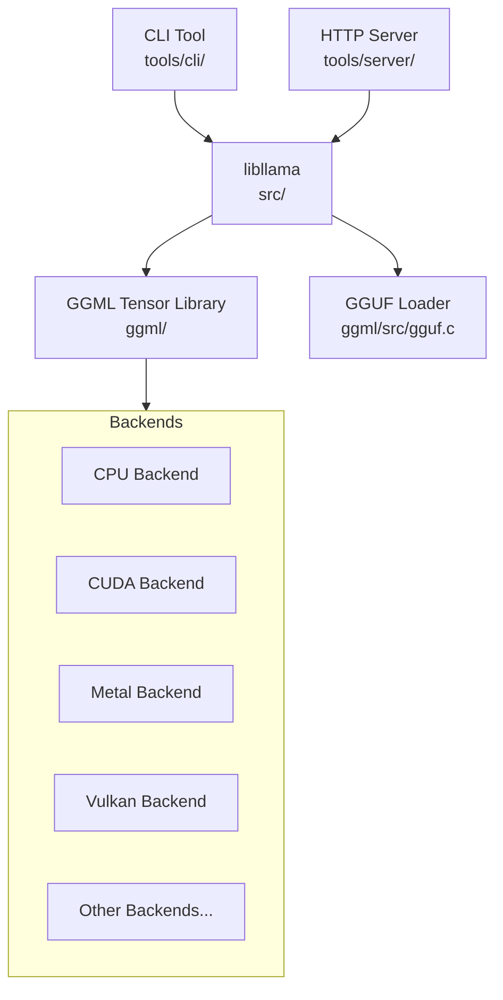

# llama.cpp — 概述与架构

**生成日期：** 2026-04-28
**仓库：** /home/colin/amuse/cpp/llama.cpp
**提交：** bd28a2e7200e7e8a77bd23a82dd7afb2ccca37af

## 1.1 项目分类

**混合型** — llama.cpp 是一个用于 LLM 推理的 C/C++ 库（`libllama`），包含两个主要的可执行封装：

1. **服务器/服务** — `llama-server` (tools/server/server.cpp)：长期运行的 HTTP 服务器，提供与 OpenAI 兼容的 REST API
2. **命令行工具** — `llama-cli` (tools/cli/cli.cpp)：交互式聊天/REPL 工具

核心 `libllama` 是一个被两个可执行程序及下游项目共同使用的库。

## 1.2 技术栈

| 组件 | 技术 |
|------|------|
| Primary Language | C++17 (with C99 for ggml core) |
| Total C/C++ files | ~749 |
| Total C/C++ lines | ~545,788 |
| Build System | CMake 3.14+ (CMakeLists.txt) |
| Key C++ Deps | nlohmann/json (HTTP server), httplib (HTTP server), ggml (tensor engine) |
| Quantization Formats | 42 types: F32, F16, BF16, Q4_0 through Q8_K, IQ series, TQ, MXFP4, NVFP4, Q1_0 |
| Supported Architectures | 100+ model architectures (see llama-arch.h) |

### 可选/条件性后端

| 后端 | 目录 | 加速器 |
|------|------|--------|
| CUDA | ggml/src/ggml-cuda/ | NVIDIA GPU |
| Metal | ggml/src/ggml-metal/ | Apple GPU |
| Vulkan | ggml/src/ggml-vulkan/ | 跨平台 GPU |
| HIP/ROCm | ggml/src/ggml-hip/ | AMD GPU |
| SYCL | ggml/src/ggml-sycl/ | Intel GPU |
| CANN | ggml/src/ggml-cann/ | 昇腾 NPU |
| OpenCL | ggml/src/ggml-opencl/ | OpenCL 设备 |
| OpenVINO | ggml/src/ggml-openvino/ | Intel OpenVINO |
| MUSA | ggml/src/ggml-musa/ | 摩尔线程 GPU |
| RPC | ggml/src/ggml-rpc/ | 远程过程调用 |
| BLAS | ggml/src/ggml-blas/ | BLAS 库 |
| Hexagon | ggml/src/ggml-hexagon/ | 高通 Hexagon DSP |
| VirtGPU | ggml/src/ggml-virtgpu/ | 虚拟 GPU |
| WebGPU | ggml/src/ggml-webgpu/ | WebGPU（浏览器） |
| CPU | ggml/src/ggml-cpu/ | 默认 CPU 回退 |

## 1.3 目录结构

| 目录 | 用途 |
|------|------|
| `src/` | 核心 llama.cpp 库实现（模型、上下文、词表、KV 缓存、采样器等） |
| `ggml/` | GGML 张量库 — 张量运算、后端、量化、分配器 |
| `ggml/src/` | GGML 后端实现（CPU、CUDA、Metal、Vulkan 等） |
| `ggml/include/` | GGML 公开头文件 (ggml.h, gguf.h, ggml-backend.h) |
| `include/` | 公共 llama API 头文件 (llama.h, llama-cpp.h) |
| `tools/server/` | HTTP 服务器实现（与 OpenAI 兼容的 API） |
| `tools/cli/` | 交互式 CLI 聊天工具 |
| `examples/` | 独立示例程序（embedding、batched、gguf 等） |
| `common/` | 共享 CLI 工具（参数解析、采样默认值、控制台） |
| `docs/` | 面向用户的文档 |
| `tests/` | 单元测试与集成测试 |
| `models/` | 模型转换脚本（Python） |
| `unicode-data/` | 分词器使用的 Unicode 规范化表 |
| `devops/` | CI/CD 配置 |
| `scripts/` | 构建和实用脚本 |
| `ggml/src/ggml-quants.c` | 量化/反量化内核 |

## 1.4 模块/组件图

### 模块说明

- **命令行工具** (`tools/cli/`)：用于与模型对话的交互式 REPL。内部使用 `server_context` 进行模型加载和推理编排。

- **HTTP 服务器** (`tools/server/`)：长期运行的 HTTP 服务器，提供与 OpenAI 兼容的 REST API 端点（`/v1/chat/completions`、`/v1/completions`、`/v1/embeddings` 等）。支持多槽位并发推理、流式 SSE 以及用于多模型服务的路由模式。

- **libllama** (`src/`)：核心推理库。包含模型加载、上下文管理、分词、KV 缓存、采样、语法约束生成和计算图构建。将计算分派到 GGML。

- **GGML 张量库** (`ggml/`)：底层张量计算引擎。定义了 `ggml_tensor` 类型，实现了惰性计算图构建，并提供了用于硬件分派的 `ggml_backend_i` 虚表接口。同时实现了所有量化内核。

- **硬件后端** (`ggml/src/ggml-*`)：`ggml_backend_i` 的平台特定实现。每个后端为其目标硬件提供张量分配、计算图执行和内存管理。

- **GGUF 加载器** (`ggml/include/gguf.h`)：解析 GGUF 二进制模型格式。读取元数据 KV 对和张量描述符，支持模型权重的内存映射加载。
