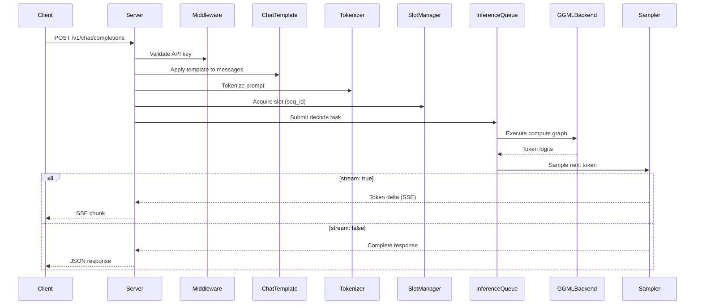

# llama.cpp — API / 接口分析

## 3.1 API 表面发现

llama.cpp 服务器使用 **httplib** (cpp-httplib) 暴露 HTTP REST API。路由在 `tools/server/server.cpp:172-225` 中通过 `ctx_http.get()` 和 `ctx_http.post()` 注册。服务器实现：

- OpenAI Chat Completions API (`/v1/chat/completions`)
- OpenAI Completions API (`/v1/completions`)
- OpenAI Embeddings API (`/v1/embeddings`)
- OpenAI Responses API (`/v1/responses`)
- Anthropic Messages API (`/v1/messages`)
- Audio Transcriptions API (`/v1/audio/transcriptions`)
- Reranking API (`/v1/rerank`)
- Token 工具端点
- 槽位管理端点
- LoRA 适配器热插拔

## 3.2 逐端点分析

### POST /v1/chat/completions

**处理器：** `routes.post_chat_completions`（注册于 server.cpp:183-184）
**输入：** JSON 正文 — model、messages[]、temperature、max_tokens、stream、tools、response_format 等
**执行流程：**

1. 验证 API 密钥（中间件，server-http.cpp:140）
2. 解析请求 JSON，提取消息和采样参数
3. 应用聊天模板将消息格式化为单个提示字符串
4. 使用模型的词汇表对提示进行分词
5. 从多槽位池中获取一个槽位
6. 向推理队列提交解码任务
7. 若 `stream: true`，返回服务器发送事件（SSE），包含增量 token 差值
8. 若 `stream: false`，缓冲所有 token 并返回完整 JSON 响应

**复杂逻辑：**
- 槽位分配：多个并发请求共享 KV 缓存；每个请求获得专用的序列 ID
- 流式传输：使用 SSE 格式的分块传输编码（`data: {json}\n\n`）
- 工具调用：通过语法约束生成支持函数调用
- 多模态：当模型支持时接受图像/音频输入



### POST /v1/completions

**处理器：** `routes.post_completions_oai` (server.cpp:181)
**输入：** JSON 正文 — model、prompt、max_tokens、temperature、stream、echo、stop 等
**执行流程：** 与聊天补全类似，但接收原始 `prompt` 字符串而非结构化的 `messages`。不应用聊天模板。

### POST /v1/embeddings

**处理器：** `routes.post_embeddings_oai` (server.cpp:193)
**输入：** JSON 正文 — model、input（string 或 string[]）、encoding_format
**执行流程：**

1. 对输入文本进行分词
2. 在启用池化的情况下通过模型处理
3. 返回嵌入向量（float 或 base64 编码）

### POST /v1/responses

**处理器：** `routes.post_responses_oai` (server.cpp:184-185)
**输入：** JSON 正文 — OpenAI Responses API 格式
**备注：** 用于结构化响应的较新 API 格式。

### POST /v1/messages

**处理器：** `routes.post_anthropic_messages` (server.cpp:188)
**输入：** JSON 正文 — Anthropic Messages API 格式（model、messages、max_tokens 等）
**备注：** 为 Anthropic API 消费者提供的兼容层。

### POST /v1/audio/transcriptions

**处理器：** `routes.post_transcriptions_oai` (server.cpp:186-187)
**输入：** Multipart 表单数据 — 音频文件、model
**备注：** 当模型支持音频输入时，提供 Whisper 风格的音频转录。

### POST /v1/rerank

**处理器：** `routes.post_rerank` (server.cpp:194-196)
**输入：** JSON 正文 — model、query、documents[]、top_n
**执行流程：**

1. 对查询 + 每个文档对进行分词
2. 使用分类头运行推理
3. 返回按分数排序的相关性得分

### POST /infill

**处理器：** `routes.post_infill` (server.cpp:190)
**输入：** JSON 正文 — model、input_prefix、input_suffix
**备注：** 代码填充 / FIM（Fill-In-the-Middle）补全。

### GET /health

**处理器：** `routes.get_health` (server.cpp:172-173)
**公开端点** — 不需要 API 密钥
**返回：** 服务器健康状态（loading、ready、error）

### GET /v1/models

**处理器：** `routes.get_models` (server.cpp:177-178)
**公开端点** — 不需要 API 密钥
**返回：** 已加载模型列表及其元数据

### GET /metrics

**处理器：** `routes.get_metrics` (server.cpp:174)
**返回：** Prometheus 格式的指标，包括：
- `llama_prompt_tokens_total` — 已处理的总提示 token 数
- `llama_tokens_generated_total` — 已生成的总补全 token 数
- `llama_request_success_total` — 成功请求计数
- 槽位利用率指标
- 时间指标（提示评估、生成）

### GET /props

**处理器：** `routes.get_props` (server.cpp:175)
**返回：** 服务器属性（模型名称、总槽位数、嵌入能力等）

### POST /tokenize

**处理器：** `routes.post_tokenize` (server.cpp:198)
**输入：** JSON 正文 — content
**返回：** 给定文本的 Token ID

### POST /detokenize

**处理器：** `routes.post_detokenize` (server.cpp:199)
**输入：** JSON 正文 — tokens[]
**返回：** 解码后的文本字符串

### GET /slots & POST /slots/:id_slot

**处理器：** `routes.get_slots` / `routes.post_slots` (server.cpp:205-206)
**返回：** 槽位状态（idle、busy、任务信息）或保存/加载槽位状态

### GET /lora-adapters & POST /lora-adapters

**处理器：** `routes.get_lora_adapters` / `routes.post_lora_adapters` (server.cpp:202-203)
**备注：** 在运行时热插拔 LoRA 适配器，无需重新加载基础模型

## 3.3 C 库 API (libllama)

公共 C API 定义在 `include/llama.h`（1565 行）中。关键函数组：

| 类别 | 关键函数 | 用途 |
|----------|--------------|---------|
| Backend Init | `llama_backend_init()`, `llama_backend_free()` | 初始化/关闭 GGML |
| Model | `llama_model_load_from_file()`, `llama_model_free()` | 加载/释放 GGUF 模型 |
| Context | `llama_init_from_model()`, `llama_free()` | 创建推理上下文 |
| Decode | `llama_decode()`, `llama_encode()` | 对批次运行推理 |
| Sampling | `llama_sampler_chain_init()`, `llama_sampler_sample()` | Token 采样管线 |
| KV Cache | `llama_kv_self_update()`, `llama_kv_self_clear()` | 管理 KV 缓存 |
| Tokenizer | `llama_tokenize()`, `llama_token_to_piece()` | 文本 ↔ token 转换 |
| Chat | `llama_chat_apply_template()` | 应用聊天模板 |
| Grammar | `llama_grammar_init()`, `llama_grammar_free()` | 约束生成 |
| Adapter | `llama_adapter_lora_init()`, `llama_adapter_apply()` | LoRA 适配器管理 |

### 核心解码循环（编程式使用）

```c
// 1. Create model and context
llama_model * model = llama_model_load_from_file(path, model_params);
llama_context * ctx = llama_init_from_model(model, ctx_params);

// 2. Create sampler chain
llama_sampler * smpl = llama_sampler_chain_init(chain_params);
llama_sampler_chain_add(smpl, llama_sampler_init_temp(0.8));
llama_sampler_chain_add(smpl, llama_sampler_init_dist(seed));

// 3. Tokenize prompt
llama_tokenize(model, prompt, tokens, n_tokens, add_bos, special);

// 4. Process prompt batch
llama_batch batch = llama_batch_get_one(tokens, n_tokens);
llama_decode(ctx, batch);

// 5. Auto-regressive decode loop
while (!done) {
 llama_token id = llama_sampler_sample(smpl, ctx, -1);
 llama_sampler_accept(smpl, id);
 // process token...
 batch = llama_batch_get_one(&id, 1);
 llama_decode(ctx, batch);
}
```
