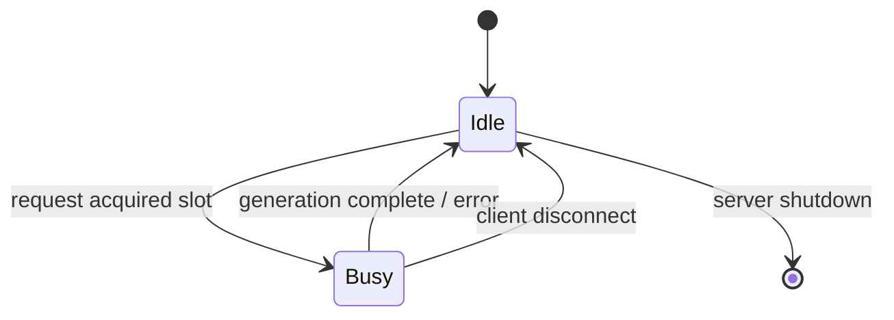

# llama.cpp — 横切关注点

## 8.1 认证与授权

**实现：** `tools/server/server-http.cpp:140-188`
**方案：** 静态 API 密钥（Bearer 令牌）

### 工作原理

1. API 密钥在启动时从 `--api-key` CLI 标志加载（可指定多个）
2. 中间件函数 `middleware_validate_api_key` 在每个请求之前运行
3. 公开端点跳过验证：

| 端点 | 公开 |
|----------|--------|
| `/health` | 是 |
| `/v1/health` | 是 |
| `/models` | 是 |
| `/v1/models` | 是 |
| `/` (index) | 是 |
| `/index.html` | 是 |
| `/bundle.js` | 是 |
| `/bundle.css` | 是 |

4. 受保护的端点需要在以下两个请求头之一中提供 API 密钥：
 - `Authorization: Bearer *** （标准方式）
 - `X-Api-Key: <key>` （Anthropic 兼容方式）

5. "Bearer " 前缀会被自动去除

6. 无效/缺失密钥 → HTTP 401，附带 JSON 错误体：
 ```json
 {"error": {"message": "Invalid API Key", "type": "authentication_error"}}
 ```

### 安全注意事项

- 密钥以明文字符串形式存储在内存中
- 启动时，仅记录第一个密钥的最后 4 个字符（用于验证）
- 没有按端点或按操作的授权 — 密钥授予完全访问权限
- 服务器未内置 TLS/HTTPS — 生产环境中预期部署在反向代理之后

## 8.2 可观测性

### 日志

**实现：** `ggml/include/ggml.h` — `GGML_LOG` 宏 + 服务器代码中的自定义 `LOG_INF`/`LOG_WRN`/`LOG_ERR` 宏

| 级别 | 用途 |
|-------|-------|
| ERROR | 致命故障（模型加载失败、OOM） |
| WARN | 可恢复的问题（无效参数、缓存驱逐） |
| INFO | 启动信息、模型加载进度、请求计数 |
| DEBUG | 逐 token 解码细节（详细模式） |

**日志输出：** stderr（控制台）。无结构化日志或基于文件的日志轮转。

**关键日志点：**
- 模型加载：架构、张量数量、内存使用量、加载时间
- 推理：每秒 token 数、批次大小、槽位分配
- 服务器：启动、关闭、请求处理错误

### 指标

**端点：** `GET /metrics` (server.cpp:174)
**格式：** Prometheus 文本展示格式

**关键指标：**

| 指标 | 类型 | 描述 |
|--------|------|-------------|
| `llama_prompt_tokens_total` | Counter | 所有请求中处理的提示 token 总数 |
| `llama_tokens_generated_total` | Counter | 生成的补全 token 总数 |
| `llama_request_success_total` | Counter | 成功的推理请求数 |
| `llama_request_fail_total` | Counter | 失败的推理请求数 |
| `llama_prompt_seconds_total` | Counter | 提示评估所花费的总时间 |
| `llama_tokens_seconds_total` | Counter | token 生成所花费的总时间 |
| `llama_kv_cache_usage_level` | Gauge | KV 缓存利用率（0.0 - 1.0） |
| `llama_slots_processing` | Gauge | 当前正在处理的槽位数 |

**额外的逐槽位指标**可通过 `GET /slots` 获取：
- 槽位状态（空闲/忙碌）
- 当前任务 ID 和提示
- 已处理的 token 数、生成速度

### 链路追踪

> llama.cpp 未实现分布式链路追踪（无 OpenTelemetry、Zipkin 或 Jaeger 集成）。请求计时仅通过日志输出和 `/metrics` 端点获取。

## 8.3 速率限制

> llama.cpp 未实现显式速率限制（无令牌桶、滑动窗口或熔断器）。并发通过以下方式隐式限制：

1. **槽位数量** — `--parallel` 标志控制可用的并发推理槽位数。当所有槽位都忙碌时，新请求收到 HTTP 503（"No slots available"），附带 `Retry-After` 头。

2. **批次大小** — `--batch-size` 和 `--ubatch-size` 标志限制单次 decode 调用中可处理的 token 数量，防止单个请求独占计算资源。

3. **上下文窗口** — 每个请求消耗的 KV 缓存与其提示 + 生成的 token 数成正比。当 KV 缓存已满时，最近最少使用的序列将被驱逐，或请求被拒绝。

### 基于槽位的并发控制 (server-context.cpp)



当所有槽位都被占用时：
- 新请求收到 `HTTP 503 Service Unavailable`
- 响应包含 `Retry-After: <seconds>` 头
- 客户端应在指示的延迟后重试
