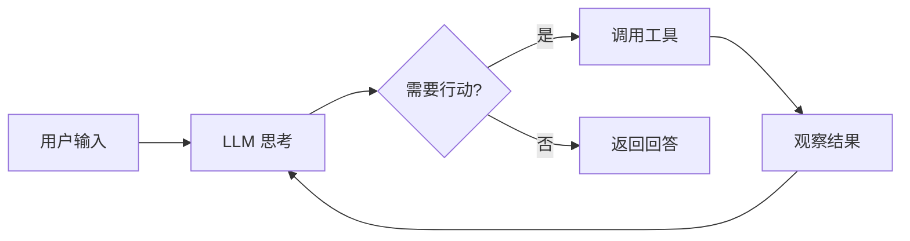

# AI Agent

AI Agent 是能够自主感知环境、做出决策并执行行动的智能体，代表了 LLM 应用的发展方向。提示工程是构建 Agent 的核心技术。

## Agent 基本架构



Agent 的核心组件：

- **LLM 大脑**：负责推理和决策
- **记忆系统**：短期记忆（上下文窗口）+ 长期记忆（向量数据库）
- **工具集**：搜索、代码执行、API 调用、文件操作
- **规划模块**：任务分解、步骤规划、反思改进

## Agent 模式

### ReAct 模式

ReAct（Reasoning + Acting）让模型交替进行推理和行动，是最经典的 Agent 模式：

```
你是一个智能助手，可以使用以下工具：
- search(query): 搜索信息
- calculate(expression): 计算数学表达式
- code_execute(code): 执行代码

请用 Thought-Action-Observation 循环来回答问题。

问题：2024 年奥斯卡最佳影片的导演是谁？他的上一部作品是什么？

Thought: 我需要先搜索 2024 年奥斯卡最佳影片
Action: search("2024 Oscar Best Picture winner")
Observation: Oppenheimer, directed by Christopher Nolan
Thought: 现在我知道是诺兰导演的，需要搜索他的上一部作品
Action: search("Christopher Nolan film before Oppenheimer")
Observation: Tenet (2020)
Thought: 我已经获得了所有需要的信息
Answer: 2024 年奥斯卡最佳影片是《奥本海默》，导演是克里斯托弗·诺兰，他的上一部作品是《信条》(2020)。
```

```python
from langchain.agents import create_react_agent, AgentExecutor

prompt = hub.pull("hwchase17/react")
agent = create_react_agent(llm, tools, prompt)
executor = AgentExecutor(agent=agent, tools=tools, verbose=True)
```

### 规划模式

让模型先制定计划，再逐步执行：

```
请完成以下任务，先制定计划，再逐步执行：

任务：分析一篇英文论文的核心贡献

计划：
1. 读取论文内容
2. 识别研究问题和动机
3. 总结提出的方法
4. 列出主要实验结果
5. 提炼核心贡献

执行计划步骤 1：...
```

### Plan-and-Execute Agent

适合复杂的多步骤任务：规划阶段 LLM 生成步骤列表 → 逐步执行 → 结果不符预期时重新规划。

### 多 Agent 协作

多个专业化 Agent 协作完成复杂任务：

```python
from langgraph.graph import StateGraph

researcher = "你是一个信息研究员，负责搜索和整理信息"
writer = "你是一个技术作者，负责撰写内容"
reviewer = "你是一个审阅者，负责检查质量和提出建议"

workflow = StateGraph(AgentState)
workflow.add_node("research", research_node)
workflow.add_node("write", write_node)
workflow.add_node("review", review_node)
workflow.add_edge("research", "write")
workflow.add_edge("write", "review")
workflow.add_conditional_edges("review", should_revise, {
    True: "revise", False: END,
})
```

**辩论模式**：多个 Agent 对同一问题给出不同观点，通过辩论达成更好的结论。

## 工具设计

好的工具描述是 Agent 成功的关键：

```python
@tool
def query_database(sql: str) -> str:
    """执行 SQL 查询并返回结果。

    仅用于查询操作（SELECT），不支持修改操作。
    数据库包含用户表(users)、订单表(orders)、产品表(products)。

    Args:
        sql: SQL 查询语句，如 "SELECT * FROM users LIMIT 10"

    Returns:
        查询结果的 JSON 字符串
    """
    return execute_sql(sql)
```

| 功能 | 推荐工具 | 说明 |
|------|---------|------|
| 网络搜索 | Tavili / SerpAPI | 获取实时信息 |
| 代码执行 | Python REPL / E2B | 安全执行代码 |
| 文件操作 | 文件读写工具 | 处理本地文件 |
| API 调用 | 自定义工具 | 对接外部服务 |

## Agent 安全

1. **工具权限控制**：限制 Agent 可调用的工具和操作范围
2. **输入验证**：对工具参数进行校验和清洗
3. **执行沙箱**：代码执行在隔离环境中运行
4. **人类审批**：高风险操作需要人类确认
5. **成本控制**：设置最大 token 数和 API 调用次数

```python
executor = AgentExecutor(
    agent=agent,
    tools=tools,
    max_iterations=10,
    max_execution_time=60,
    handle_parsing_errors=True,
)
```

## 最佳实践

1. **明确边界**：告诉 Agent 何时使用工具，何时直接回答
2. **错误处理**：提供工具调用失败时的回退策略
3. **迭代限制**：设置最大推理步数，防止无限循环
4. **输出格式**：要求结构化输出，便于解析
