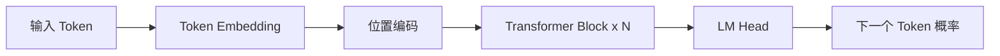

# Transformer 架构

Transformer 是 2017 年由 Google 在论文 "Attention Is All You Need" 中提出的序列建模架构，彻底改变了 NLP 乃至整个深度学习的格局。

## 自注意力机制（Self-Attention）

自注意力让模型在处理每个 token 时，能够关注序列中的所有其他 token。

### 计算过程

对于输入序列 X，计算查询（Query）、键（Key）、值（Value）：

Q = XW_Q,  K = XW_K,  V = XW_V

注意力得分：

Attention(Q, K, V) = softmax(QK^T / √d_k) · V

其中 d_k 是键向量的维度，除以 √d_k 可以防止点积值过大。

### 多头注意力

多头注意力让模型同时关注不同位置的不同表示子空间：

```python
# 简化的多头注意力
class MultiHeadAttention(nn.Module):
    def __init__(self, d_model, n_heads):
        super().__init__()
        self.n_heads = n_heads
        self.d_k = d_model // n_heads
        self.W_q = nn.Linear(d_model, d_model)
        self.W_k = nn.Linear(d_model, d_model)
        self.W_v = nn.Linear(d_model, d_model)
        self.W_o = nn.Linear(d_model, d_model)
```

## 编码器-解码器结构

### 编码器（Encoder）

由 N 个相同的层堆叠，每层包含：
1. 多头自注意力子层
2. 前馈神经网络子层
3. 残差连接 + Layer Norm

### 解码器（Decoder）

与编码器类似，但额外增加了一个交叉注意力层，用于关注编码器的输出。

## 仅解码器架构

GPT 系列采用仅解码器架构，使用因果注意力掩码（Causal Mask）确保每个位置只能关注之前的位置：



## 位置编码

Transformer 本身没有位置感知能力，需要额外注入位置信息：

- **正弦位置编码**：原始论文方案
- **旋转位置编码（RoPE）**：LLaMA 等模型使用
- **ALiBi**：无需位置嵌入，通过注意力偏置实现
