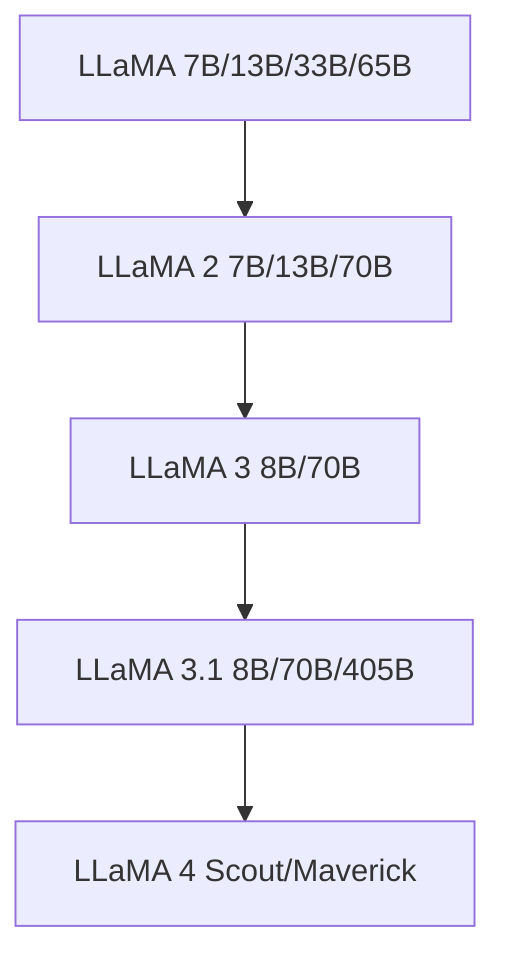

# 主流模型介绍

本节介绍当前最具影响力的大语言模型及其特点。

## 闭源模型

### GPT 系列（OpenAI）

| 模型 | 发布时间 | 参数规模 | 特点 |
|------|---------|---------|------|
| GPT-3 | 2020 | 175B | 首次展示少样本学习能力 |
| GPT-3.5 | 2022 | - | ChatGPT 的基础模型 |
| GPT-4 | 2023 | - | 多模态，推理能力大幅提升 |
| GPT-4o | 2024 | - | 端到端多模态，低延迟 |
| o1/o3 | 2024-2025 | - | 推理模型，强化思维链 |

### Claude 系列（Anthropic）

以安全性和长上下文著称，Claude 3.5 支持约 200K token 上下文窗口。

### Gemini 系列（Google）

原生多模态设计，深度整合 Google 生态系统。

## 开源模型

### LLaMA 系列（Meta）

LLaMA 系列是开源 LLM 生态的基石，绝大多数开源微调模型都基于 LLaMA 架构。

### Mistral 系列

以高效率著称，Mistral 7B 以极小的参数量达到接近 LLaMA 2 13B 的效果。

### Qwen 系列（阿里）

- 中文能力突出
- 多模态版本（Qwen-VL）
- 多种规模可选（1.5B ~ 72B+）

### DeepSeek 系列

- DeepSeek-V2：MoE 架构，推理成本低
- DeepSeek-R1：开源推理模型

## 模型选择指南

| 需求 | 推荐方案 |
|------|---------|
| 最高质量 | GPT-4o / Claude 3.5 |
| 中文场景 | Qwen 2.5 / DeepSeek |
| 本地部署 | LLaMA 3.1 8B / Mistral 7B |
| 代码生成 | CodeLlama / DeepSeek-Coder |
| 低成本推理 | 量化后的开源模型 + vLLM |
