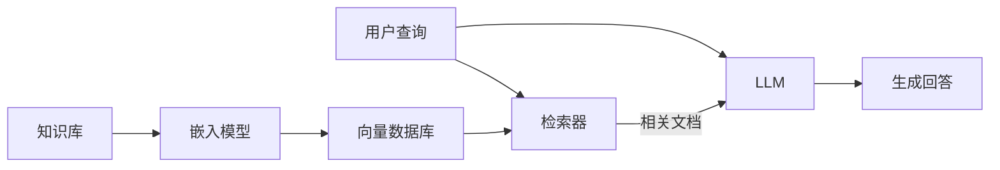

# RAG 检索增强生成

RAG（Retrieval-Augmented Generation）通过在生成前检索相关文档，让 LLM 基于外部知识回答问题，有效缓解幻觉问题。

## 基本架构



## 离线索引阶段

### 1. 文档切分

```python
from langchain.text_splitter import RecursiveCharacterTextSplitter

splitter = RecursiveCharacterTextSplitter(
    chunk_size=500,
    chunk_overlap=50,
    separators=["\n\n", "\n", "。", "！", "？", ".", " "],
)
chunks = splitter.split_text(document)
```

### 2. 向量化

```python
from langchain_openai import OpenAIEmbeddings

embeddings = OpenAIEmbeddings(model="text-embedding-3-small")
vectors = embeddings.embed_documents([chunk.page_content for chunk in chunks])
```

### 3. 存储到向量数据库

```python
from langchain_community.vectorstores import Chroma

vectorstore = Chroma.from_documents(
    documents=chunks,
    embedding=embeddings,
    persist_directory="./chroma_db",
)
```

## 在线查询阶段

```python
retriever = vectorstore.as_retriever(search_kwargs={"k": 4})

from langchain.chains import create_retrieval_chain
from langchain.chains.combine_documents import create_stuff_documents_chain

question_answer_chain = create_stuff_documents_chain(llm, qa_prompt)
rag_chain = create_retrieval_chain(retriever, question_answer_chain)

response = rag_chain.invoke({"input": "什么是 LoRA？"})
```

## 高级优化

### 查询优化

- **查询改写**：扩展或简化用户原始查询
- **HyDE**：让 LLM 先生成假设性回答，用其嵌入来检索
- **多查询检索**：生成多个查询变体，合并检索结果

### 重排序

使用 Cross-Encoder 对检索结果重新排序：

```python
from langchain.retrievers import ContextualCompressionRetriever
from langchain.retrievers.document_compressors import CrossEncoderReranker

compressor = CrossEncoderReranker(model="BAAI/bge-reranker-v2-m3", top_n=3)
compression_retriever = ContextualCompressionRetriever(
    base_compressor=compressor, base_retriever=retriever
)
```

### 混合检索

结合关键词检索（BM25）和向量检索，提高召回率：

```python
from langchain.retrievers import EnsembleRetriever

bm25_retriever = BM25Retriever.from_documents(documents, k=5)
vector_retriever = vectorstore.as_retriever(k=5)

ensemble_retriever = EnsembleRetriever(
    retrievers=[bm25_retriever, vector_retriever],
    weights=[0.4, 0.6],
)
```

## 评估

RAG 系统的关键评估维度：

| 维度 | 指标 | 含义 |
|------|------|------|
| 检索质量 | Recall@K | 检索到的相关文档比例 |
| 检索质量 | MRR | 首个相关文档的排名倒数 |
| 生成质量 | Faithfulness | 回答是否忠于检索文档 |
| 生成质量 | Relevancy | 回答是否切题 |
