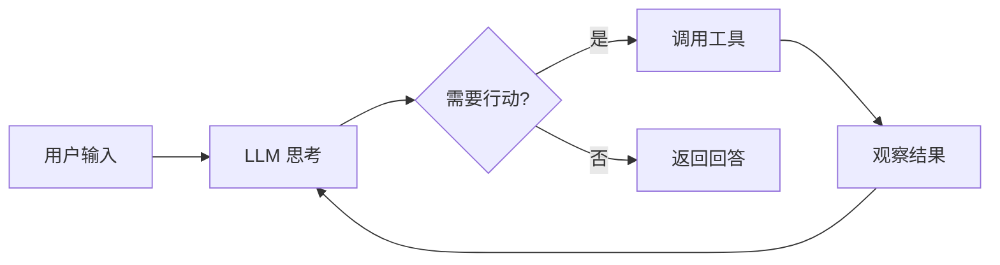

# Agent 提示模式

AI Agent 是能够自主感知环境、做出决策并执行行动的智能体。提示工程是构建 Agent 的核心技术。

## Agent 基本架构



## ReAct 模式

ReAct（Reasoning + Acting）让模型交替进行推理和行动：

```
你是一个智能助手，可以使用以下工具：
- search(query): 搜索信息
- calculate(expression): 计算数学表达式
- code_execute(code): 执行代码

请用 Thought-Action-Observation 循环来回答问题。

问题：2024 年奥斯卡最佳影片的导演是谁？他的上一部作品是什么？

Thought: 我需要先搜索 2024 年奥斯卡最佳影片
Action: search("2024 Oscar Best Picture winner")
Observation: Oppenheimer, directed by Christopher Nolan
Thought: 现在我知道是诺兰导演的，需要搜索他的上一部作品
Action: search("Christopher Nolan film before Oppenheimer")
Observation: Tenet (2020)
Thought: 我已经获得了所有需要的信息
Answer: 2024 年奥斯卡最佳影片是《奥本海默》，导演是克里斯托弗·诺兰，他的上一部作品是《信条》(2020)。
```

## 规划模式

让模型先制定计划，再逐步执行：

```
请完成以下任务，先制定计划，再逐步执行：

任务：分析一篇英文论文的核心贡献

计划：
1. 读取论文内容
2. 识别研究问题和动机
3. 总结提出的方法
4. 列出主要实验结果
5. 提炼核心贡献

执行计划步骤 1：...
```

## 多 Agent 协作

### 角色分工

```
系统中有以下角色：
- 研究员：负责搜索和整理信息
- 作者：负责撰写文章
- 审阅者：负责审查和提出修改建议

请按角色协作完成一篇技术博客的撰写。
```

### 辩论模式

多个 Agent 对同一问题给出不同观点，通过辩论达成更好的结论。

## 工具使用提示

设计工具描述是 Agent 提示工程的关键：

```
工具：get_weather
描述：获取指定城市的当前天气信息
参数：
  - city (string): 城市名称，如"北京"、"上海"
  - unit (string): 温度单位，"celsius" 或 "fahrenheit"
返回：包含温度、湿度、天气状况的 JSON

使用示例：
get_weather(city="北京", unit="celsius")
→ {"temperature": 22, "humidity": 45, "condition": "晴"}
```

## 最佳实践

1. **明确边界**：告诉 Agent 何时使用工具，何时直接回答
2. **错误处理**：提供工具调用失败时的回退策略
3. **迭代限制**：设置最大推理步数，防止无限循环
4. **输出格式**：要求结构化输出，便于解析
