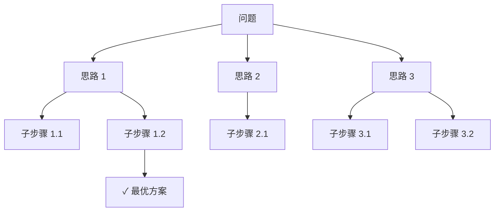

# Chain-of-Thought 推理

Chain-of-Thought（CoT）是一种让大语言模型通过逐步推理来解决复杂问题的技术。

## 核心思想

传统方式：问题 → 直接答案（容易出错）

CoT 方式：问题 → 推理步骤 1 → 推理步骤 2 → ... → 最终答案（更准确）

## 基础用法

### 隐式触发

在提示末尾添加"让我们一步步思考"：

```
如果小明有 5 个苹果，给了小红 2 个，又买了 3 个，请问小明现在有几个苹果？

让我们一步步思考。
```

### 显式示例

提供带推理过程的示例：

```
Q: 停车场有 3 辆车，又来了 2 辆，开走了 1 辆，还有几辆？
A: 停车场原有 3 辆车。又来了 2 辆，所以 3 + 2 = 5 辆。开走了 1 辆，所以 5 - 1 = 4 辆。答案是 4。

Q: 图书馆有 15 本书，借出 8 本，还回 3 本，还有几本？
A:
```

## 高级变体

### Self-Consistency

多次采样推理路径，取多数投票结果：

```python
# 伪代码
responses = [model.generate(prompt, temperature=0.7) for _ in range(5)]
answer = majority_vote(extract_answers(responses))
```

### 自动 CoT（Auto-CoT）

让模型先自动生成推理示例，再用这些示例进行推理，省去手动编写示例的工作。

### Tree-of-Thought（ToT）

将推理过程组织为树结构，允许探索和回溯：



## 适用场景

CoT 对以下类型的问题特别有效：

- 数学推理
- 逻辑推理
- 多步骤规划
- 因果分析
- 代码调试

## 注意事项

- CoT 增加输出 token 数，成本更高
- 简单任务不需要 CoT，直接回答即可
- 推理步骤中的错误会传播，需要验证中间结果
