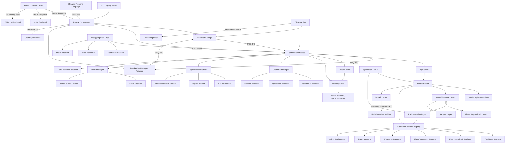

# 概述与架构

## 1.1 项目分类

**类型：** 混合型 — 服务器/服务 + CLI 工具 + 库/SDK

SGLang 主要是一个**长期运行的推理服务器**（SRT = SGLang Runtime），暴露与 OpenAI 兼容的 HTTP/gRPC API，用于 LLM 和多模态模型服务。它还提供：

- 一个 **CLI 工具**（`sglang serve`、`sglang generate`）用于启动和与服务器交互
- 一个 **Python 库/SDK**（`Engine` 类）用于在无需运行独立服务器进程的情况下进行编程访问
- 一个 **前端语言**（`sglang.lang`）用于以领域特定语法编写 LLM 程序
- 一个 **模型网关**（`sgl-model-gateway`）用 Rust 编写，用于跨多个后端的路由和负载均衡

## 1.2 技术栈

| 组件 | 技术 | 版本 / 备注 |
|-----------|-----------|----------------|
| 主要语言 | Python | 3.10+，2788 个 .py 文件 |
| 网关语言 | Rust | Edition 2021，248 个 .rs 文件 |
| CUDA 内核 | C++/CUDA | 53 个 .h + 37 个 .cpp/.cu 文件 |
| Go 工具 | Go | 22 个 .go 文件 |
| ML 框架 | PyTorch | 2.9.1 |
| Transformer 库 | HuggingFace Transformers | 5.3.0 |
| HTTP 框架 | FastAPI + Uvicorn | 使用 uvloop 实现异步 |
| 异步运行时 | uvloop | 高性能事件循环 |
| IPC | ZeroMQ (pyzmq) | 用于 scheduler/tokenizer/detokenizer 进程间通信 |
| Attention 内核 | FlashInfer | 0.6.7.post3 |
| 自定义内核 | sglang-kernel | 0.4.1（CMake + scikit-build-core） |
| 语法引擎 | xgrammar / llguidance / outlines | 结构化输出 |
| 序列化 | orjson, msgspec | 快速 JSON |
| 指标 | prometheus-client | OpenMetrics 格式 |
| 链路追踪 | OpenTelemetry | 分布式追踪 |
| 量化 | torchao, compressed-tensors | FP4/FP8/INT4/AWQ/GPTQ |
| 分布式 | NCCL (pynccl), MSCCL++, 自定义 all-reduce | 张量/流水线/专家并行 |
| 构建系统（Python） | setuptools | pyproject.toml |
| 构建系统（内核） | scikit-build-core + CMake | sgl-kernel/pyproject.toml |
| 构建系统（网关） | Cargo | sgl-model-gateway/Cargo.toml |

### 可选/条件后端

- **NVIDIA CUDA** — 主要 GPU 后端（GB200/B300/H100/A100/5090）
- **AMD ROCm** — 通过 AITER/Wave 后端支持 MI355/MI300
- **Intel CPU** — 支持 AMX 的 Xeon
- **Intel XPU** — GPU 支持
- **Google TPU** — 通过 SGLang-Jax 后端
- **Ascend NPU** — 华为 Ascend 支持
- **MoRI** — AMD 的 MoE 路由优化

## 1.3 目录映射

| 目录 | 用途 |
|-----------|---------|
| `python/sglang/` | 主要 Python 包根目录 |
| `python/sglang/srt/` | **SGLang Runtime (SRT)** — 核心服务引擎：调度器、模型执行器、KV 缓存、层、模型 |
| `python/sglang/srt/entrypoints/` | HTTP/gRPC 服务器入口点，OpenAI/Anthropic/Ollama API 处理器 |
| `python/sglang/srt/managers/` | 进程管理器：Scheduler、TokenizerManager、DetokenizerManager、TpWorker |
| `python/sglang/srt/mem_cache/` | KV 缓存：RadixAttention 树、内存池、存储后端（aibrix, lmcache, mooncake, nixl, hf3fs） |
| `python/sglang/srt/layers/` | 神经网络层：RadixAttention、linear、sampler、communicator、quantization、vocab embedding |
| `python/sglang/srt/models/` | 模型实现 — 169 个文件，覆盖 Llama、DeepSeek、Qwen、Gemma、Mistral、GPT 等 |
| `python/sglang/srt/disaggregation/` | Prefill-Decode 分离：传输后端（mooncake, nixl, mori, ascend） |
| `python/sglang/srt/distributed/` | 分布式训练/服务：并行状态、NCCL 通信器、自定义 all-reduce |
| `python/sglang/srt/speculative/` | 推测解码：EAGLE、ngram、独立 draft worker |
| `python/sglang/srt/constrained/` | 结构化输出 / 约束解码：xgrammar、llguidance、outlines 后端 |
| `python/sglang/srt/lora/` | 多 LoRA 批处理：注册表、管理器、Triton/Torch/Ascend 后端 |
| `python/sglang/srt/sampling/` | 采样逻辑：参数、惩罚库、自定义 logit 处理器 |
| `python/sglang/srt/observability/` | 可观测性：Prometheus 指标、OpenTelemetry 追踪、CPU 监控 |
| `python/sglang/srt/configs/` | 配置数据类：ModelConfig、ServerArgs、LoadConfig、DeviceConfig |
| `python/sglang/srt/grpc/` | gRPC 服务器协议定义 |
| `python/sglang/srt/hardware_backend/` | NPU、CPU 等的硬件抽象 |
| `python/sglang/srt/eplb/` | MoE 模型的专家并行负载均衡 |
| `python/sglang/srt/elastic_ep/` | 弹性专家并行：动态专家重新分配 |
| `python/sglang/srt/dllm/` | 扩散 LLM 支持（LLaDA 风格） |
| `python/sglang/srt/multiplex/` | 多路复用服务支持 |
| `python/sglang/srt/function_call/` | 工具/函数调用解析器和执行器 |
| `python/sglang/srt/parser/` | 聊天模板和补全模板解析器 |
| `python/sglang/srt/tokenizer/` | 分词器封装 |
| `python/sglang/srt/utils/` | 共享工具：网络、PyTorch 补丁、看门狗、内存节省器 |
| `python/sglang/lang/` | SGLang 前端语言：解释器、IR、追踪器、后端 |
| `python/sglang/cli/` | CLI 命令：serve、generate、killall |
| `python/sglang/multimodal_gen/` | 扩散模型服务（WAN、Qwen-Image） |
| `python/sglang/jit_kernel/` | JIT 编译的 Triton/CUDA 内核 |
| `sgl-kernel/` | 预编译 CUDA 内核库：attention、MoE、allreduce、mamba、quantization |
| `sgl-model-gateway/` | 基于 Rust 的 LLM 网关：路由、负载均衡、熔断、认证 |
| `benchmark/` | 基准测试：hellaswag、mmlu、gsm8k、deepseek_v3、mtbench 等 |
| `test/` | 测试套件：pytest、SRT 集成测试 |
| `docs/` | Sphinx 文档站点 |
| `examples/` | 使用示例：聊天模板、监控、运行时、性能分析器 |
| `docker/` | 各平台 Dockerfile（CUDA、ROCm、XPU、NPU、Xeon） |
| `scripts/` | 实用脚本：发布、CI、实验场 |
| `3rdparty/` | 第三方代码（AMD） |

## 1.4 模块 / 组件图

### 模块描述

- **CLI**（`python/sglang/cli/`）：命令行界面，用于启动服务器、生成文本和管理进程。解析参数并分派到相应的服务器模式。

- **Engine Orchestrator**（`python/sglang/srt/entrypoints/engine.py`）：主入口点，协调所有子进程组件。创建 TokenizerManager、Scheduler 和 DetokenizerManager 进程，管理其生命周期，并提供异步和同步 Python API。

- **TokenizerManager**（`python/sglang/srt/managers/tokenizer_manager.py`）：运行在主进程中。对传入的文本请求进行分词，通过 ZMQ 将其路由到 Scheduler，并将响应流式传输回 HTTP 服务器或 Engine API。

- **Scheduler**（`python/sglang/srt/managers/scheduler.py`）：以子进程方式运行。实现核心批调度逻辑 — 连续批处理、通过 RadixCache 实现前缀缓存、内存管理、语法约束解码以及推测解码协调。驱动 TpWorker 进行前向传播。

- **TpWorker / ModelRunner**（`python/sglang/srt/managers/tp_worker.py`、`model_executor/model_runner.py`）：张量并行 GPU worker，加载模型权重并执行前向传播。ModelRunner 处理 CUDA 图捕获、权重加载、KV 缓存分配，以及分派到相应的模型实现。

- **RadixCache**（`python/sglang/srt/mem_cache/radix_cache.py`）：核心 KV 缓存数据结构，实现 RadixAttention — 一种基数树，支持跨请求的自动前缀共享，显著减少共享系统提示和对话上下文的冗余计算。

- **Memory Pool**（`python/sglang/srt/mem_cache/memory_pool.py`）：两级内存管理：`ReqToTokenPool` 将请求映射到其 token 位置，`TokenToKVPoolAllocator` 管理物理 KV 缓存槽分配，支持可配置的淘汰策略（LRU、LFU、FIFO 等）。

- **模型实现**（`python/sglang/srt/models/`）：169 个模型文件，覆盖所有主要架构 — Llama、DeepSeek（V2/V3/R1 含 MLA）、Qwen、Gemma、Mistral、GPT-2/NeoX、Phi、StarCoder 等。每个模型使用 `RadixAttention` 层实现自动前缀缓存。

- **Attention 后端注册表**（`python/sglang/srt/layers/attention/attention_registry.py`）：可插拔的 attention 后端系统。可通过 `--attention-backend` 标志在运行时选择。支持 FlashInfer、FA3、FA4、FlashMLA、Triton 以及平台特定后端（AMD 的 AITER/Wave、Ascend、Intel AMX/XPU）。

- **GrammarManager**（`python/sglang/srt/constrained/grammar_manager.py`）：编排结构化输出生成。通过可插拔后端（xgrammar、llguidance、outlines）支持 JSON 模式、正则表达式和自定义语法约束。

- **推测解码 Worker**（`python/sglang/srt/speculative/`）：用于推测解码的 draft 模型 worker — EAGLE（带 draft 头的推测解码）、ngram（统计 n-gram 预测）和 standalone（独立的 draft 模型）。

- **LoRA 管理器**（`python/sglang/srt/lora/`）：动态多 LoRA 批处理。支持运行时加载/卸载 LoRA 适配器，使用 Triton 优化的 SGMV 内核实现高效批处理服务。

- **Model Gateway**（`sgl-model-gateway/`）：基于 Rust 的 L7 网关，用于多后端路由。支持 SGLang、vLLM、TRT-LLM、OpenAI 和 Anthropic 后端。包括 JWT/API 密钥认证、熔断和负载感知路由。

- **sgl-kernel**（`sgl-kernel/`）：预编译 CUDA 内核库，提供 attention、MoE、all-reduce、mamba、quantization 和逐元素操作的优化实现。使用 CMake 构建并以 Python wheel 形式分发。

- **分离层**（`python/sglang/srt/disaggregation/`）：支持 prefill-decode 分离，即 prefill 和 decode 在不同的 GPU 节点上运行。KV 缓存通过可插拔后端（Mooncake、NIXL、MoRI）在节点间传输。

- **SGLang 前端语言**（`python/sglang/lang/`）：领域特定语言，用于编写具有控制流、分支和变量绑定的 LLM 程序。编译为 IR，在后端（SRT、OpenAI、Anthropic、LiteLLM）上执行。

- **可观测性**（`python/sglang/srt/observability/`）：集成的指标（Prometheus）、分布式追踪（OpenTelemetry）、CPU 监控和请求级时间统计收集。
