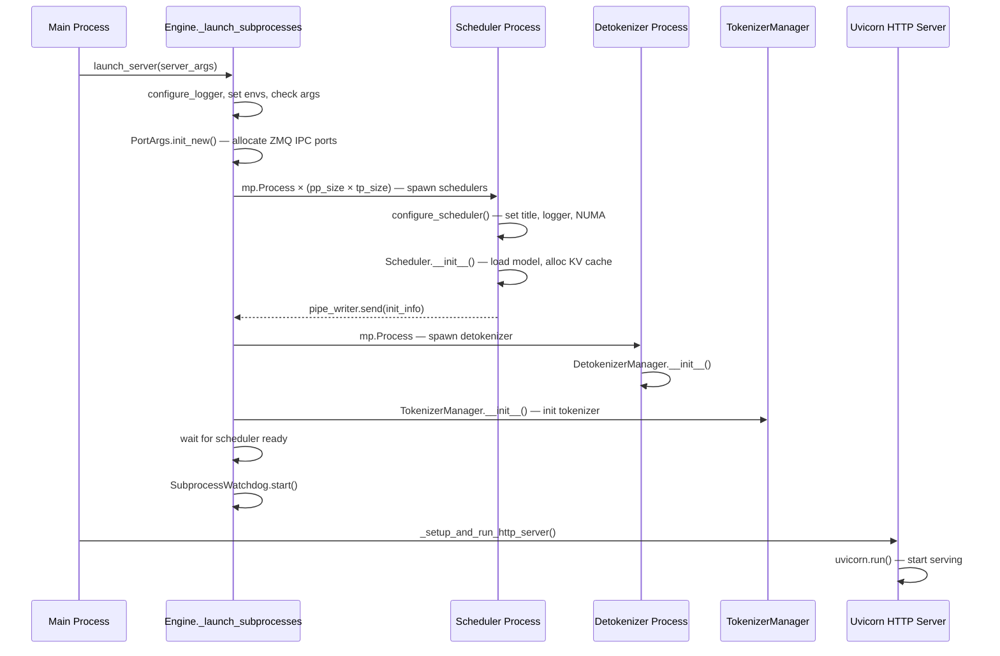
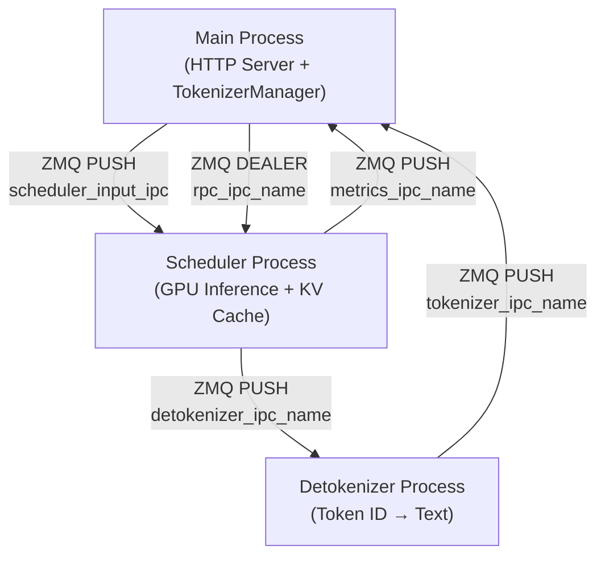

# 启动流程

## 2.1 入口点

SGLang 提供三个主要入口点：

### 1. CLI 服务器模式
```bash
python -m sglang.launch_server [options]
# or
python -m sglang_api [options]
```
参数通过 `ServerArgs` 数据类（server_args.py）解析，该类内部使用 Python 的 `argparse`。关键标志包括 `--model-path`、`--tp`、`--host`、`--port`、`--mem-fraction-static` 等。

### 2. Python API 模式
```python
engine = Engine(model_path="meta-llama/Meta-Llama-3-8B-Instruct")
```
`Engine` 类（engine.py:164）接受与 `ServerArgs` 相同的参数作为关键字参数。

### 3. HTTP 服务器模式（编程式）
```python
launch_server(server_args)
```
由 CLI 和 Engine 两条路径内部调用。

---

## 2.2 核心初始化序列

以下跟踪从 `launch_server()` 到所有子进程初始化的完整启动序列。

### 启动序列概览



### 逐步详解

**主进程 — `launch_server()` (http_server.py:2135)**

1. 调用 `Engine._launch_subprocesses()`（engine.py:620）— 生成所有子进程
2. 调用 `_setup_and_run_http_server()`（http_server.py:1962）— 启动 FastAPI/uvicorn

**`_launch_subprocesses()` (engine.py:620)**

1. `configure_logger(server_args)` — 设置日志级别和格式（engine.py:640）
2. `_set_envs_and_config(server_args)` — 配置 CUDA/内存环境变量（engine.py:641）
3. `server_args.check_server_args()` — 验证参数（engine.py:642）
4. `_set_gc(server_args)` — 配置 Python GC 阈值（engine.py:643）
5. `PortArgs.init_new(server_args)` — 分配 ZMQ IPC 端口名称和 NCCL 端口（engine.py:647）
6. 可选启动 `EngineInfoBootstrapServer` 用于多节点场景（engine.py:652-665）
7. **生成调度器进程** — `_launch_scheduler_processes()`（engine.py:668）
8. **生成反分词器进程** — `mp.Process(target=run_detokenizer_process_func)`（engine.py:710-717）
9. **初始化 TokenizerManager** — 若 `tokenizer_worker_num > 1` 则使用 `MultiTokenizerRouter`（engine.py:720-727）
10. `scheduler_init_result.wait_for_ready()` — 阻塞直到调度器报告就绪（engine.py:730）
11. 从调度器信息设置 `tokenizer_manager.max_req_input_len`（engine.py:733）
12. `SubprocessWatchdog(processes, names).start()` — 监控子进程存活性（engine.py:743-746）

**`_launch_scheduler_processes()` (engine.py:514)**

对于 `dp_size == 1`（最常见情况）：
- 计算秩范围：`_calculate_rank_ranges(nnodes, pp_size, tp_size, node_rank)`（engine.py:536）
- 对于每个 `(pp_rank, tp_rank)` 对：
  1. 创建 `mp.Pipe(duplex=False)` 用于初始化信息回调（engine.py:547）
  2. 从秩拓扑计算 `gpu_id`（engine.py:548-551）
  3. 计算并行秩：`attn_cp_rank, moe_dp_rank, moe_ep_rank`（engine.py:553）
  4. 生成 `mp.Process(target=run_scheduler_process_func, args=(...))`（engine.py:558）
  5. `proc.start()`（engine.py:576）

对于 `dp_size > 1`：
- 生成单个 `run_data_parallel_controller_process`，由其内部管理 DP 工作进程

**`run_scheduler_process()` (scheduler.py:3560)**

1. `configure_scheduler()` — 设置进程标题（`sglang::scheduler_TP0`）、faulthandler、日志前缀（scheduler.py:3572）
2. `kill_itself_when_parent_died()` — 父进程退出时自动终止（scheduler.py:3576）
3. 如果启用，设置 CPU 亲和性和 NUMA 绑定（scheduler.py:3580-3586）
4. 如果 `enable_trace=True`，初始化 OpenTelemetry 追踪（scheduler.py:3589）
5. **创建 `Scheduler` 对象** — 重量级初始化（scheduler.py:3600）
6. `pipe_writer.send(scheduler.get_init_info())` — 向父进程发送初始化信息（scheduler.py:3613）
7. `scheduler.run_event_loop()` — 进入主事件循环（scheduler.py:3616）

**`Scheduler.__init__()` (scheduler.py:288)**

| 步骤 | 方法 | 用途 |
|------|------|------|
| 1 | `init_model_config()` (scheduler.py:363) | 从 server_args 加载 `ModelConfig` |
| 2 | `init_metrics(tp_rank, pp_rank, dp_rank)` (scheduler.py:366) | 初始化 Prometheus 指标 |
| 3 | `init_ipc_channels(port_args)` (scheduler.py:369) | 创建 ZMQ PUSH/PULL/DEALER 套接字 |
| 4 | `init_pdmux()` (scheduler.py:372) | 初始化 PD 复用上下文 |
| 5 | `init_tokenizer()` (scheduler.py:376) | 初始化用于反分词的分词器 |
| 6 | `init_moe_gemm_config()` (scheduler.py:379) | 配置 FP8/FP4 MoE GEMM |
| 7 | `init_mamba_backend()` (scheduler.py:382) | 初始化 Mamba 选择性状态更新 |
| 8 | **`init_model_worker()`** (scheduler.py:385) | 创建 `TpModelWorker`，**将模型权重加载到 GPU** |
| 9 | **`init_cache_with_memory_pool()`** (scheduler.py:391) | 分配 KV 缓存内存池 |
| 10 | `init_running_status()` (scheduler.py:394) | 初始化批次跟踪状态 |
| 11 | `init_chunked_prefill()` (scheduler.py:397) | 配置分块预填充 |
| 12 | `init_overlap()` (scheduler.py:415) | 配置重叠调度 |
| 13 | `init_request_dispatcher()` (scheduler.py:424) | 初始化请求路由 |
| 14 | `GrammarManager(self)` (scheduler.py:433) | 初始化约束生成后端 |

最耗时的步骤是 **#8**（从磁盘/safetensors 加载模型权重）和 **#9**（基于剩余 GPU 内存分配 KV 缓存）。

**`run_detokenizer_process()` (detokenizer_manager.py:389)**

1. `kill_itself_when_parent_died()`（第 394 行）
2. `setproctitle("sglang::detokenizer")`（第 395 行）
3. `configure_logger(server_args)`（第 396 行）
4. 创建 `DetokenizerManager(server_args, port_args)`（第 401 行）
5. 运行 `manager.event_loop()` 或 `multi_http_worker_event_loop()`（第 402-405 行）

**`TokenizerManager.__init__()` (tokenizer_manager.py:181)**

1. `init_model_config()` — 读取模型配置（tokenizer_manager.py:194）
2. `init_tokenizer_and_processor()` — 加载 HF 分词器（tokenizer_manager.py:197）
3. `init_ipc_channels(port_args)` — 创建到调度器的 ZMQ 套接字（tokenizer_manager.py:200）
4. `init_running_status()` — 初始化异步请求跟踪（tokenizer_manager.py:203）
5. `init_request_logging_and_dumping()`（tokenizer_manager.py:206）
6. `init_weight_update()` — 设置权重更新通道（tokenizer_manager.py:209）
7. `init_lora()` — 初始化 LoRA 注册表（tokenizer_manager.py:212）
8. `init_metric_collector_watchdog()`（tokenizer_manager.py:221）
9. `init_request_dispatcher()`（tokenizer_manager.py:224）

---

## 2.3 线程模型

| 线程 | 创建位置 | 角色 |
|------|----------|------|
| **主线程** | OS | Uvicorn 事件循环，FastAPI 请求处理 |
| **TokenizerManager 异步循环** | Engine.__init__ | 用于分词和与调度器 IPC 的 `asyncio.EventLoop` |
| **调度器事件循环** | scheduler.py:1290 | 主批次调度 + GPU 前向传播 |
| **调度器 CUDA 流** | scheduler.py:1296 | 用于 GPU 计算的 `torch.cuda.Stream(priority=0)` |
| **ZMQ 接收线程** | init_ipc_channels | 接收 ZMQ 消息的后台线程 |
| **SubprocessWatchdog** | engine.py:743 | 监控子进程存活性，自动重启 |

在重叠调度模式（scheduler.py:1331）下，调度器使用独立的 CUDA 流，将批次 N+1 的 CPU 处理与批次 N 的 GPU 计算交错执行。

---

## 2.4 进程模型



| 进程 | 生成方 | IPC 机制 | 核心职责 |
|------|--------|----------|----------|
| 主进程（HTTP + TokenizerMgr） | OS / 用户 | ZMQ 客户端 | 对请求分词，路由到调度器，返回结果 |
| 调度器 × (pp×tp) | `_launch_scheduler_processes` 中的 `mp.Process` | ZMQ PUSH/PULL/DEALER | GPU 批次调度、模型前向传播、KV 缓存管理 |
| 反分词器 | `_launch_subprocesses` 中的 `mp.Process` | ZMQ PUSH/PULL | 将 token ID 解码为文本，流式传输到分词器管理器 |
| 数据并行控制器 | `mp.Process`（当 dp_size>1 时） | 内部 | 跨 DP 副本路由请求 |

**ZMQ IPC 通道**（定义在 `PortArgs`，server_args.py:6547）：

| 通道 | 套接字类型 | 方向 | 用途 |
|------|-----------|------|------|
| `scheduler_input_ipc_name` | PULL | TokenizerMgr → Scheduler | 发送分词后的请求 |
| `detokenizer_ipc_name` | PUSH | Scheduler → Detokenizer | 发送输出 token ID |
| `tokenizer_ipc_name` | PUSH | Detokenizer → TokenizerMgr | 返回解码后的文本 |
| `rpc_ipc_name` | DEALER | Engine → Scheduler | RPC 调用（权重更新、刷新等） |
| `metrics_ipc_name` | PUSH | Scheduler → Main | 指标数据 |

**管道通信**：调度器进程在启动期间还使用 `mp.Pipe` 将初始化信息发送回父进程。

**NCCL**：张量并行通信使用通过 NCCL 在 `port_args.nccl_port` 上初始化的 `torch.distributed`。

---

## 2.5 启动时的内存布局

### GPU VRAM 分配

调度器初始化期间，GPU 内存划分如下：

```
┌─────────────────────────────────────────────────┐
│ GPU VRAM │
├─────────────────────────────────────────────────┤
│ Model Weights │
│ (safetensors → torch.Tensor on GPU) │
│ Loaded by TpModelWorker via ModelLoader │
│ Size: depends on model + quantization │
├─────────────────────────────────────────────────┤
│ KV Cache (token_to_kv_pool) │
│ Allocated by init_cache_with_memory_pool() │
│ Size: (1 - mem_fraction_static) × remaining │
│ Per-layer: [size, page_size, head_dim, 2] │
│ dtype: FP16/F32/FP8 based on quantization │
├─────────────────────────────────────────────────┤
│ req_to_token_pool │
│ torch.zeros((max_running_reqs, max_ctx_len)) │
│ dtype: int32 — maps request → token positions │
├─────────────────────────────────────────────────┤
│ Activation buffers, CUDA workspace │
│ Temporary tensors for forward pass │
└─────────────────────────────────────────────────┘
```

### CPU 内存分配

| 区域 | 用途 | 大小 |
|------|------|------|
| 分词器词表 | HuggingFace 分词器模型 | ~1-10 MB |
| ZMQ 缓冲区 | IPC 消息队列 | 较小 |
| 请求元数据 | 待处理/运行中的请求对象 | O(max_running_reqs) |
| 模型配置 | HuggingFace config.json | 较小 |
| LoRA 适配器 | 如果启用，每个适配器的权重 | 可变 |

### 内存池架构

1. **`ReqToTokenPool`**（memory_pool.py:126）：预分配的 `[size × max_context_len]` int32 张量。每行将一个请求的 token 映射到其 KV 缓存槽位索引。

2. **`TokenToKVPoolAllocator`**（allocator.py:117）：管理空闲 KV 缓存页池。`free_pages` 张量跟踪可用槽位；`alloc(n)` 返回 n 个连续页索引。

3. **`KVCache`**（memory_pool.py:645）：每层 KV 缓存张量的抽象基类。具体实现使用可配置页大小处理分页注意力。

KV 缓存大小由以下公式决定：
```
available_memory = total_gpu_memory - model_weights_size
kv_cache_tokens = available_memory × mem_fraction_static / bytes_per_token
```
其中 `bytes_per_token` 取决于模型隐藏大小、层数和 KV 数据类型。
