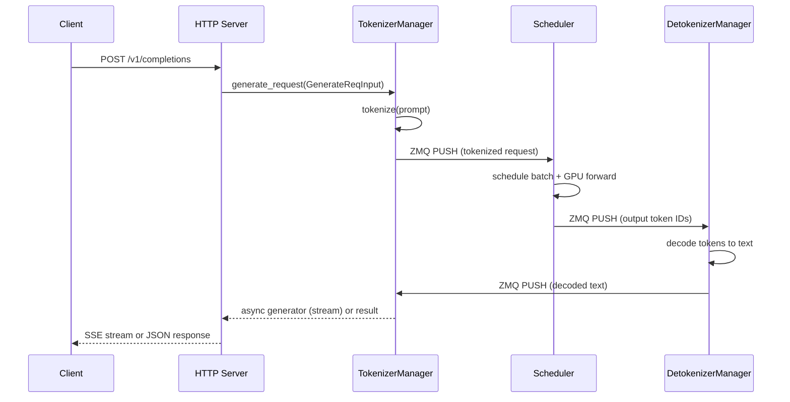

# API / 接口分析

## 3.1 API 概览

SGLang 暴露三个 API 接口：

1. **HTTP API** — 通过 FastAPI 提供兼容 OpenAI 的 REST 端点 (http_server.py)
2. **Python API** — 直接使用 `Engine` 类进行编程访问 (engine.py)
3. **Ollama/Anthropic 兼容** — Ollama 和 Anthropic API 的子集

---

## 3.2 HTTP API 端点

### 生成端点

#### POST /v1/completions (http_server.py:1380)

兼容 OpenAI 的文本补全端点。

**处理函数：** `handle_completions()` 通过 `generate_request` 管道

**输入：**
| 字段 | 类型 | 描述 |
|------|------|------|
| model | string | 模型名称 |
| prompt | string/array | 输入文本或 token ID |
| max_tokens | int | 最大生成 token 数 |
| temperature | float | 采样温度 |
| top_p | float | 核采样阈值 |
| stream | bool | 启用 SSE 流式传输 |
| stop | string/array | 停止序列 |
| logprobs | int | 返回对数概率 |

**执行流程：**
1. 解析并验证请求体
2. 创建 `GenerateReqInput` 对象 (io_struct.py:133)
3. 提交至 `TokenizerManager.generate_request()` — 对输入进行分词
4. TokenizerManager 通过 ZMQ 将分词后的请求发送至 Scheduler
5. Scheduler 调度批次，运行 GPU 前向传播
6. 输出 token 通过 ZMQ 发送至 DetokenizerManager
7. DetokenizerManager 解码 token，返回至 TokenizerManager
8. TokenizerManager 以流式或非流式方式将响应返回给 HTTP 客户端

#### POST /v1/chat/completions (http_server.py:1388)

兼容 OpenAI 的聊天补全端点。与 `/v1/completions` 管道相同，但接受聊天消息格式（`messages` 数组）而非原始 `prompt`。

**额外输入：**
| 字段 | 类型 | 描述 |
|------|------|------|
| messages | array | 带角色的聊天消息历史 |
| tools | array | 工具/函数定义 |
| tool_choice | string/object | 工具选择策略 |
| response_format | object | JSON schema 约束 |

聊天模板通过分词器中的模型 `chat_template` 将消息转换为单个提示字符串，然后再进行分词。

#### POST /v1/responses (http_server.py:1563)

OpenAI Responses API — 用于多轮交互的较新有状态 API。

**处理函数：** 创建带有响应特定参数的 `GenerateReqInput`。

**额外功能：**
- 具有 `response_id` 的有状态响应对象
- 支持 `previous_response_id` 链式调用
- 内置工具使用

#### GET /v1/responses/`{response_id}` (http_server.py:1583)

通过 ID 检索先前创建的响应。

#### POST /v1/responses/`{response_id}`/cancel (http_server.py:1591)

取消正在进行的响应。

---

### 嵌入端点

#### POST /v1/embeddings (http_server.py:1398)

兼容 OpenAI 的嵌入生成。

**处理函数：** `handle_embeddings()` → `TokenizerManager.encode_request()`

**输入：**
| 字段 | 类型 | 描述 |
|------|------|------|
| model | string | 模型名称 |
| input | string/array | 要嵌入的文本或 token ID |

**执行流程：** 相同管道，但调度器以嵌入模式运行（不进行采样，仅从最后一层提取隐藏状态）。

#### POST /v1/score (http_server.py:1555)

评分/重排序端点。计算给定文本的对数概率分数。

---

### 音频端点

#### POST /v1/audio/transcriptions (http_server.py:1458)

使用 Whisper 风格模型进行音频转录。接受多部分音频文件上传，返回转录文本。

---

### 模型信息端点

#### GET /v1/models (http_server.py:1498)

列出可用模型。返回兼容 OpenAI 的模型列表。

#### GET /v1/models/`{model}` (http_server.py:1530)

获取特定模型的详细信息。

#### GET /get_model_info (http_server.py:551) / GET /model_info (http_server.py:561)

返回模型特定信息：上下文长度、分词器信息等。

#### GET /get_server_info (http_server.py:591) / GET /server_info (http_server.py:601)

返回服务器状态：GPU 内存使用量、队列长度等。

#### GET /get_load (http_server.py:621)

返回当前服务器负载指标。

---

### 健康检查端点

#### GET /health (http_server.py:476)

轻量级健康检查 — 服务器运行时返回 200 OK。

#### GET /health_generate (http_server.py:477)

带实际生成的健康检查 — 生成一个短 token 以验证完整管道是否正常工作。

---

### 权重管理端点

#### POST /update_weights_from_disk (http_server.py:938)

从磁盘路径加载新的模型权重。用于模型热切换。

**输入：**
| 字段 | 类型 | 描述 |
|------|------|------|
| model_path | string | 新模型权重的路径 |
| load_format | string | 权重加载格式 |

#### POST /update_weights_from_tensor (http_server.py:1066)

在内存中更新特定权重张量。

#### POST /update_weights_from_distributed (http_server.py:1088)

从分布式源更新权重（用于多节点权重同步）。

#### POST /update_weights_from_ipc (http_server.py:1107)

通过 IPC 共享内存更新权重。

#### POST /init_weights_update_group (http_server.py:1035)

初始化权重更新组，用于协调多节点更新。

#### POST /destroy_weights_update_group (http_server.py:1051)

销毁先前创建的权重更新组。

#### POST /weights_checker (http_server.py:1193)

验证当前模型权重的完整性。

---

### 控制端点

#### POST /abort_request (http_server.py:1300)

通过 ID 中止正在进行的请求。

**输入：**
| 字段 | 类型 | 描述 |
|------|------|------|
| rid | string | 要中止的请求 ID |

#### POST /pause_generation (http_server.py:1355)

暂停生成引擎（停止接受新批次）。

#### POST /continue_generation (http_server.py:1366)

暂停后恢复生成引擎。

#### POST /flush_cache (internal)

清除 KV 缓存和基数树。

---

### Anthropic 兼容端点

#### POST /v1/messages (http_server.py:1658)

Anthropic Messages API 兼容层。将 Anthropic 请求格式转换为内部 `GenerateReqInput`。

#### POST /v1/messages/count_tokens (http_server.py:1668)

使用 Anthropic API 格式为给定消息序列计算 token 数量。

---

### Ollama 兼容端点

#### POST /api/chat (http_server.py:1629)

Ollama 聊天 API — 将 Ollama 请求格式转换为内部格式。

#### POST /api/generate (http_server.py:1635)

Ollama 生成 API。

#### GET /api/tags (http_server.py:1643)

Ollama 标签 API — 列出可用模型。

#### POST /api/show (http_server.py:1649)

Ollama 详情 API — 模型详细信息。

---

### HiCache 存储端点

#### GET /hicache/storage-backend (http_server.py:831)

返回分层缓存存储后端配置的信息。

---

## 3.3 Python API — Engine 类

`Engine` 类 (engine.py:164) 提供了用于所有服务器功能的编程式 Python API：

### 生成方法

| 方法 | 描述 |
|------|------|
| `generate(prompt, sampling_params)` | 生成文本补全 |
| `encode(prompt)` | 生成嵌入 |
| `async_generate(prompt, sampling_params)` | 带流式传输的异步生成 |

### 会话方法

| 方法 | 描述 |
|------|------|
| `open_session(capacity, session_id, streaming, timeout)` | 打开具有共享 KV 缓存的多轮对话会话 |
| `close_session(session_id)` | 关闭会话并释放资源 |

### 权重管理方法

| 方法 | 描述 |
|------|------|
| `update_weights_from_disk(model_path)` | 热切换模型权重 |
| `update_weights_from_tensor(named_tensors)` | 更新特定权重张量 |
| `init_weights_update_group()` | 初始化权重更新协调 |
| `destroy_weights_update_group()` | 清理权重更新组 |

### 性能分析方法

| 方法 | 描述 |
|------|------|
| `start_profile()` | 启动 PyTorch 性能分析器 |
| `stop_profile()` | 停止分析器并保存追踪 |
| `start_expert_distribution_record()` | 记录 MoE 专家使用情况 |
| `stop_expert_distribution_record()` | 停止专家分布记录 |

### 实用方法

| 方法 | 描述 |
|------|------|
| `flush_cache()` | 清除 KV 缓存 |
| `shutdown()` | 优雅关闭所有子进程 |

---

## 3.4 内部 IPC API

进程通过 ZMQ 使用序列化的 Python 对象进行通信。关键消息类型定义在 `io_struct.py` 中：

### 请求消息（TokenizerManager → Scheduler）

| 类 | 用途 |
|----|------|
| `GenerateReqInput` (io_struct.py:133) | 文本生成请求 |
| `EmbeddingReqInput` (io_struct.py:771) | 嵌入请求 |
| `TokenizedGenerateReqInput` (io_struct.py:671) | 预分词的生成请求 |
| `TokenizedEmbeddingReqInput` (io_struct.py:922) | 预分词的嵌入请求 |

### 响应消息（Detokenizer → TokenizerManager）

| 类 | 用途 |
|----|------|
| `BatchTokenIDOutput` (io_struct.py:961) | 批量输出 token ID |
| `BatchStrOutput` (io_struct.py:1029) | 批量解码字符串 |
| `BatchEmbeddingOutput` (io_struct.py:1092) | 批量嵌入向量 |

### RPC 消息（Engine → Scheduler 通过 DEALER）

RPC 调用支持：`flush_cache`、`update_weights`、`start_profile`、`abort_request`、`open_session`、`close_session` 等。
