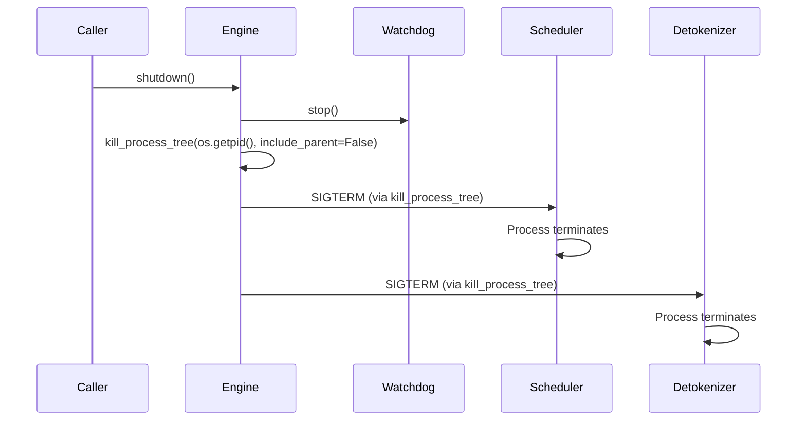

# 关闭与清理

## 4.1 信号处理

### 主进程信号处理

在启动阶段，SGLang 注册了一个 SIGQUIT 处理器 (engine.py:1157)：

```python
signal.signal(signal.SIGQUIT, launch_phase_sigquit_handler)
```

在服务器参数完全处理完毕后，如果指定了自定义的 SIGQUIT 处理器，它将替换默认处理器 (engine.py:1163)：

```python
signal.signal(signal.SIGQUIT, server_args.custom_sigquit_handler)
```

### 子进程信号行为

调度器和反词器子进程都使用了：

- **`kill_itself_when_parent_died()`** (scheduler.py:3576, detokenizer_manager.py:394) — 监控父进程的存活状态。如果父进程死亡，子进程会自动终止。这可以防止产生孤儿进程。

- **`faulthandler.enable()`** (scheduler.py:3551) — 启用 Python 的 faulthandler，在段错误时转储回溯信息。

- **异常时向父进程发送 SIGQUIT** — 如果任一子进程遇到未处理的异常，它会在终止前向父进程发送 `SIGQUIT`：
 - 调度器：`parent_process.send_signal(signal.SIGQUIT)` (scheduler.py:3621)
 - 反词器：`parent_process.send_signal(signal.SIGQUIT)` (detokenizer_manager.py:411)

这种设计确保了如果任何关键组件发生故障，整个服务器将关闭，而不是在损坏的状态下继续运行。

---

## 4.2 关闭序列

### Engine.shutdown() (engine.py:756)



**详细步骤：**

1. **停止 SubprocessWatchdog** (engine.py:762) — 首先停止监控子进程存活状态的看门狗线程。

2. **杀死所有子进程** (engine.py:763) — `kill_process_tree(os.getpid(), include_parent=False)` 向所有后代进程发送 SIGTERM：
 - 所有调度器进程（每个 tp_rank × pp_rank 一个）
 - 反词器进程
 - 任何数据并行控制器进程

3. **返回** — 该函数不会显式等待进程终止或清理 GPU 资源。操作系统在进程收到 SIGTERM 时负责处理进程清理。

### atexit 注册

`Engine.__init__` 方法将 `shutdown()` 注册为 atexit 处理器 (engine.py:188)：

```python
atexit.register(self.shutdown)
```

这确保了即使用户没有显式调用 `shutdown()`，子进程也会在 Python 解释器退出时被杀死。

### 上下文管理器支持

Engine 类支持 Python 的上下文管理器协议 (engine.py:765-769)：

```python
with Engine(model_path="...") as engine:
 result = engine.generate(...)
# 退出时自动调用 shutdown()
```

---

## 4.3 资源清理清单

| 资源 | 清理方式 | 位置 | 备注 |
|----------|---------------|---------|-------|
| 调度器进程 | `kill_process_tree()` | engine.py:763 | 向所有子进程 PID 发送 SIGTERM |
| 反词器进程 | `kill_process_tree()` | engine.py:763 | 作为主进程的子进程被杀死 |
| SubprocessWatchdog 线程 | `watchdog.stop()` | engine.py:762 | 停止监控线程 |
| ZMQ 套接字 | 进程退出清理 | 操作系统级别 | 进程死亡时关闭 ZMQ 套接字 |
| NCCL 通信器 | 进程退出清理 | 操作系统级别 | 进程终止时清理 NCCL |
| GPU KV 缓存内存 | 进程退出清理 | CUDA 运行时 | 进程退出时由 CUDA 运行时调用 `cudaFree` |
| 模型权重（GPU） | 进程退出清理 | CUDA 运行时 | 进程退出时由 CUDA 运行时调用 `cudaFree` |
| PyTorch CUDA 流 | 进程退出清理 | CUDA 运行时 | 自动销毁 |
| 共享内存（如使用） | 操作系统清理 | 操作系统级别 | 进程退出时释放 `/dev/shm` 段 |
| IPC 管道 | `mp.Pipe` 清理 | 操作系统级别 | 进程退出时关闭文件描述符 |

---

## 4.4 优雅关闭的考量

当前的关闭实现**并非**传统意义上的优雅关闭：

- **无进行中请求排空**：活跃请求在调度器进程被杀死时终止。
- **无 KV 缓存持久化**：关闭前不会将 KV 缓存保存到磁盘。
- **无 WAL 刷写**：没有可在重启时重放的预写日志。
- **无连接排空**：HTTP 服务器停止接受新连接，但不会等待活跃的 HTTP 连接完成。

设计理念优先考虑简洁性：由于 SGLang 是一个无状态推理服务器（除了在启动时重建的 KV 缓存），通过杀死进程树的硬关闭方式已经足够。KV 缓存是临时的，可以在请求到达时重新构建。
