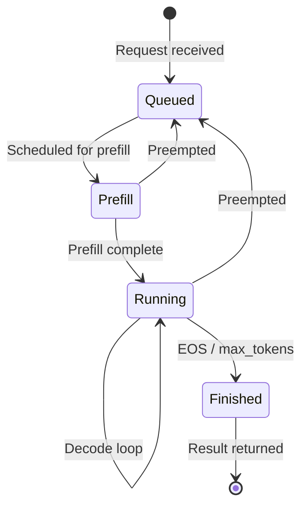

# 核心数据结构

## 5.1 概述

SGLang 的核心数据结构服务于三个主要目的：
1. **请求生命周期** — 从接收到完成全程跟踪请求
2. **内存管理** — 为 KV 缓存高效分配 GPU 内存
3. **批量调度** — 将请求分组以供 GPU 执行

---

## 5.2 请求结构

### `Req` (schedule_batch.py:557)

跟踪单个推理请求所有状态的基本请求对象。

**用途：** 在整个生命周期中保存一个请求的输入、输出、内存映射和调度状态。

**关键字段：**

| 字段 | 类型 | 用途 |
|-------|------|---------|
| `rid` | str | 唯一请求标识符 |
| `origin_input_text` | str | 原始输入文本 |
| `origin_input_ids` | List[int] | 分词后的输入 ID（已填充） |
| `origin_input_ids_unpadded` | Tuple[int] | 分词后的输入 ID（图像填充前） |
| `output_ids` | List[int] | 已生成的输出 token ID |
| `fill_ids` | List[int] | 合并的输入 + 输出 token ID |
| `sampling_params` | SamplingParams | 温度、top_p、top_k 等 |
| `stream` | bool | 是否流式输出 |
| `return_logprob` | bool | 是否返回对数概率 |
| `req_pool_idx` | int/None | 该请求在 `ReqToTokenPool` 中的索引 |
| `kv_committed_len` | int | 已提交的 KV 缓存长度 |
| `kv_allocated_len` | int | 已分配的 KV 缓存长度 |
| `session` | Session/None | 多轮会话对象 |
| `lora_id` | str/None | LoRA 适配器 ID |
| `input_embeds` | List/None | 自定义输入嵌入 |
| `priority` | int/None | 调度优先级 |
| `extend_batch_idx` | int | 在当前扩展（预填充）批次中的索引 |
| `decode_batch_idx` | int | 在当前解码批次中的索引 |
| `http_worker_ipc` | str/None | 多工作进程响应的 IPC 通道 |

**关键状态机：**



**复杂逻辑：**
- KV 缓存内存跟踪：`kv_committed_len` 和 `kv_allocated_len` 跟踪已提交（可安全保留）与过度分配（可能需要释放）的 KV 缓存槽位之间的边界。
- SWA（滑动窗口注意力）淘汰：`swa_evicted_seqlen` 跟踪从滑动窗口中已淘汰的旧 token 数量。

---

### `GenerateReqInput` (io_struct.py:133)

从 HTTP 或 Python API 接收的面向公众的请求对象，在分词之前。

**用途：** 将面向用户的参数（文本、采样参数）从 API 层传递到 TokenizerManager。

**关键字段：**

| 字段 | 类型 | 用途 |
|-------|------|---------|
| `text` | str | 输入提示文本 |
| `sampling_params` | dict/SamplingParams | 生成参数 |
| `rid` | str | 客户端提供的请求 ID |
| `stream` | bool | 流式模式标志 |
| `return_logprob` | bool | 返回对数概率 |
| `lora_path` | str/None | LoRA 适配器路径 |
| `session_id` | str/None | 多轮会话 ID |

---

## 5.3 内存池结构

### `ReqToTokenPool` (memory_pool.py:126)

**用途：** 将每个活跃请求映射到其在 KV 缓存中的 token 位置。这是允许通过基数树灵活共享 KV 缓存的核心间接层。

**结构：**
```
req_to_token: torch.Tensor # shape: [max_running_reqs, max_context_len], dtype=int32
free_slots: List[int] # Available row indices
```

- 每行对应一个请求（通过 `req.req_pool_idx` 索引）。
- 每列保存该位置 token 的 KV 缓存槽位索引。
- 该池在启动时根据 `max_running_requests` 和 `max_context_len` 预分配。

**关键方法：**

| 方法 | 复杂度 | 备注 |
|--------|-----------|-------|
| `alloc(reqs)` | O(n) | 为新请求分配行；支持复用现有槽位用于分块预填充 |
| `free(req)` | O(1) | 将一行返回到空闲列表 |
| `write(indices, values)` | O(1) | 写入 token→KV 映射条目 |

**复杂逻辑：** `alloc()` 方法支持为从前一个分块预填充批次继续的请求复用现有槽位。这对于分块预填充至关重要，因为单个长请求可能跨越多个批次。

---

### `TokenToKVPoolAllocator` (allocator.py:117)

**用途：** 管理空闲 KV 缓存页槽位池。分配和释放 KV 缓存存储的页面。

**结构：**
```
free_pages: torch.Tensor # Available page indices, shape: [N], dtype=int64
release_pages: torch.Tensor # Pages pending release (sorted mode)
free_group: List[Tensor] # Batched free operations
```

**关键方法：**

| 方法 | 复杂度 | 备注 |
|--------|-----------|-------|
| `alloc(need_size)` | O(1) 摊销 | 从 `free_pages` 前部返回 `need_size` 个连续页索引 |
| `free(free_index)` | O(1) | 将释放的页面追加到 `release_pages` 或 `free_group` |
| `merge_and_sort_free()` | O(n log n) | 将 `release_pages` 合并到 `free_pages` 并排序以支持连续分配 |

**设计意图：** 两级空闲列表（`free_pages` + `release_pages`）摊销了排序的开销。释放的页面先累积在 `release_pages` 中，只有当 `alloc()` 需要连续页面且主 `free_pages` 不足时才合并回去。

---

### `KVCache` (memory_pool.py:645)

**用途：** GPU 上每层 KV 缓存存储的抽象基类。

**关键字段：**

| 字段 | 类型 | 用途 |
|-------|------|---------|
| `size` | int | token 槽位总数 |
| `page_size` | int | 每页的 token 数 |
| `dtype` | torch.dtype | 存储数据类型（FP16、FP8 等） |
| `layer_num` | int | 模型总层数 |
| `start_layer` / `end_layer` | int | 层范围（用于流水线并行） |

**具体实现：**
- `TorchKVCache` — 基于 PyTorch 张量的标准 KV 缓存
- `FlashInferKVCache` — 针对 FlashInfer 注意力后端优化
- `TokenAttentionKVCache` — 用于 token 级注意力后端

---

## 5.4 缓存结构

### `RadixCache` (radix_cache.py:285)

**用途：** 前缀感知缓存树，支持具有公共前缀的请求之间自动共享 KV 缓存。这是 SGLang 高效多轮和多请求服务的关键创新。

**结构：** 一棵树，其中：
- 每个节点代表一个 token 序列前缀
- 节点存储 KV 缓存槽位范围（通过 `token_to_kv_pool_allocator`）
- 树结构实现 O(log n) 的前缀匹配

**关键操作：**

| 操作 | 复杂度 | 备注 |
|-----------|-----------|-------|
| `match_prefix(key)` | O(depth) | 在树中查找最长匹配前缀 |
| `insert(key, value)` | O(depth) | 插入新前缀，可能拆分节点 |
| `evict(size)` | O(evicted_nodes) | 淘汰最近最少使用的节点以释放 KV 缓存页面 |

**淘汰策略：**

| 策略 | 类 | 行为 |
|--------|-------|----------|
| LRU | `LRUStrategy` | 淘汰最近最少访问的 |
| LFU | `LFUStrategy` | 淘汰最不经常访问的 |
| FIFO | `FIFOStrategy` | 淘汰最早插入的 |
| MRU | `MRUStrategy` | 淘汰最近访问的 |
| FILO | `FILOStrategy` | 淘汰最新插入的 |
| Priority | `PriorityStrategy` | 按优先级淘汰 |
| SLRU | `SLRUStrategy` | 分段 LRU |

**设计意图：** 基数缓存实现了"自动 KV 缓存共享" — 当两个请求共享公共的系统提示或对话前缀时，该前缀的 KV 缓存仅计算一次并在请求间共享。这大幅减少了多轮对话的计算量和内存使用。

### `RadixCacheCpp` (radix_cache_cpp.py:35)

基数缓存的 C++ 实现，通过 pybind11 提供更高性能。支持分层缓存（HiCache）的直写和回写缓存策略。

---

## 5.5 批次结构

### `ScheduleBatch` (schedule_batch.py:1307)

**用途：** 将在 GPU 上执行一批请求所需的所有信息组合在一起。

**关键字段：**

| 字段 | 类型 | 用途 |
|-------|------|---------|
| `reqs` | List[Req] | 该批次中的请求 |
| `req_to_token_pool` | ReqToTokenPool | 内存池引用 |
| `token_to_kv_pool_allocator` | TokenToKVPoolAllocator | KV 页面分配器 |
| `tree_cache` | BasePrefixCache | 基数缓存引用 |
| `forward_mode` | ForwardMode | EXTEND（预填充）或 DECODE |
| `input_ids` | torch.Tensor [b] | 该批次步的 token ID |
| `req_pool_indices` | torch.Tensor [b] | 请求池索引 |
| `seq_lens` | torch.Tensor [b] | 当前序列长度 |
| `out_cache_loc` | torch.Tensor [b] | 输出 KV 缓存位置 |
| `sampling_info` | SamplingBatchInfo | 批量采样参数 |
| `multimodal_inputs` | List/None | 图像/音频输入 |

**设计意图：** 批次是调度器循环每次迭代中创建的临时对象。它由待处理/运行中的请求组装而成，发送给模型工作进程进行 GPU 执行，然后拆解以处理结果。

### `ModelWorkerBatch` (schedule_batch.py:2486)

**用途：** 为 GPU 执行优化的批次扁平化表示。包含为模型前向传播准备好的预计算张量。

---

## 5.6 模型配置

### `ModelConfig` (model_config.py:96)

**用途：** 集中管理从 HuggingFace config.json 解析的所有模型特定配置。

**关键字段：**

| 字段 | 类型 | 用途 |
|-------|------|---------|
| `model_path` | str | HuggingFace 模型 ID 或本地路径 |
| `context_len` | int | 最大序列长度 |
| `hf_config` | AutoConfig | 解析后的 HuggingFace 配置 |
| `is_generation` | bool | 模型是否生成文本（vs. 嵌入） |
| `is_multimodal` | bool | 模型是否接受图像/音频 |
| `head_dim` | int | 注意力头维度 |
| `num_attention_heads` | int | 注意力头数量 |
| `num_key_value_heads` | int | KV 头数量（GQA） |
| `num_hidden_layers` | int | Transformer 层数 |
| `hidden_size` | int | 隐藏维度 |
| `vocab_size` | int | 词汇表大小 |
| `page_size` | int | KV 缓存页大小 |

### `ModelImpl` (model_config.py:48)

模型实现后端的枚举：
- `SGLANG` — SGLang 自定义实现（优化版）
- `TRANSFORMERS` — HuggingFace Transformers 后端（兼容版）

---

## 5.7 IPC 消息结构

### `PortArgs` (server_args.py:6547)

**用途：** 定义所有 ZMQ IPC 通道名称和 NCCL 端口，用于进程间通信。

| 字段 | 类型 | 用途 |
|-------|------|---------|
| `tokenizer_ipc_name` | str | ZMQ 套接字：Detokenizer → TokenizerManager |
| `scheduler_input_ipc_name` | str | ZMQ 套接字：TokenizerManager → Scheduler |
| `detokenizer_ipc_name` | str | ZMQ 套接字：Scheduler → Detokenizer |
| `nccl_port` | int | NCCL 分布式初始化端口 |
| `rpc_ipc_name` | str | ZMQ 套接字：Engine RPC → Scheduler |
| `metrics_ipc_name` | str | ZMQ 套接字：Scheduler 指标 → Main |
| `tokenizer_worker_ipc_name` | str/None | 多分词器工作进程通道 |

---

## 5.8 辅助结构

### `Session` (io_struct.py)

**用途：** 多轮对话会话，在请求间维护共享的 KV 缓存上下文。

### `GrammarManager` (grammar_manager.py:24)

**用途：** 通过后端实现管理受约束生成（JSON 模式、正则表达式、文法）：
- `XGrammarGrammarBackend` — 基于 xgrammar
- `GuidanceBackend` — 基于 llguidance
- `ReasonerGrammarBackend` — 感知推理

### `MemoryMetrics` (tokenizer_manager.py:1759)

**用途：** 跟踪 GPU 内存使用统计，用于监控和自动扩缩容。
