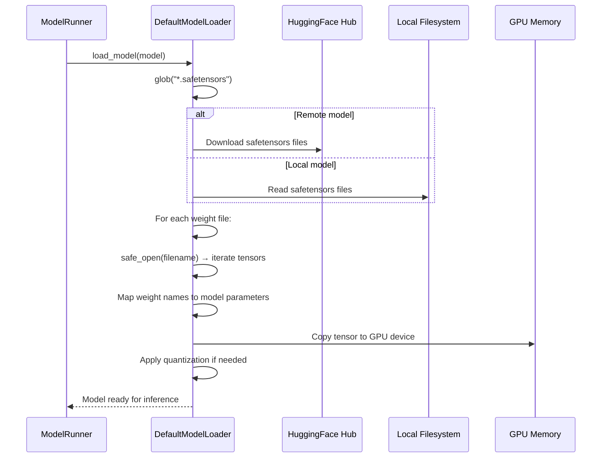

# 存储文件分析

## 6.1 概述

SGLang 从持久化存储中读取模型权重，并可选择写入分层缓存数据。它不为模型权重维护自定义文件格式——而是利用 HuggingFace 生态系统（safetensors 格式）并添加了专用加载器。

---

## 6.2 模型权重文件

### SafeTensors 格式（`.safetensors`）

**位置：** 由 `--model-path` 指定（HuggingFace 模型 ID 或本地路径）

**加载链：**

1. `ModelRunner.load_model()` (model_runner.py:1071) — 入口点
2. `ModelRunner._load_model()` (model_runner.py:101) — 创建模型架构
3. `loader.load_model()` (model_runner.py:1159) — 将权重加载到模型中

**模型加载器**（loader.py）：

| 加载器 | 类 | 使用场景 |
|--------|-------|-----------|
| DefaultModelLoader | loader.py:302 | 标准 safetensors/PyTorch 加载 |
| LayeredModelLoader | loader.py:712 | 逐层加载以节省内存 |
| QuantizedRLModelLoader | loader.py:786 | 量化模型（GPTQ、AWQ） |
| GGUFModelLoader | loader.py:1974 | GGUF 格式模型 |
| BitsAndBytesModelLoader | loader.py:1496 | bitsandbytes 量化模型 |
| ShardedStateLoader | loader.py:1315 | 从 PyTorch 分片状态字典加载 |
| RemoteModelLoader | loader.py:2413 | 从远程服务器加载 |
| RemoteInstanceModelLoader | loader.py:2080 | 从远程 SGLang 实例加载 |
| DummyModelLoader | loader.py:1259 | 测试用（无真实权重） |
| ModelOptModelLoader | loader.py:2594 | NVIDIA ModelOpt 量化模型 |

**默认加载流程：**



**SafeTensors 文件格式：**
```
[8 bytes] Header length (uint64, little-endian)
[N bytes] JSON header: {"__metadata": {...}, "tensor_name": {dtype, shape, data_offsets}}
[Padding] Alignment to 8-byte boundary
[N bytes] Raw tensor data (contiguous, mmap-able)
```

safetensors 格式优于 PyTorch 的 `.bin` 格式，原因如下：
- 内存安全：无需 pickle 反序列化（不会执行任意代码）
- 支持 Mmap：张量可以通过内存映射加载，无需载入 RAM
- 快速：大型模型支持零拷贝加载

---

## 6.3 权重更新存储

### 动态权重更新

SGLang 支持在运行时热切换模型权重：

| 端点 | 存储来源 | 加载器 |
|----------|---------------|--------|
| `/update_weights_from_disk` | 本地文件系统路径 | 通过 DefaultModelLoader 重新加载 |
| `/update_weights_from_tensor` | 内存中的张量字典 | 直接参数拷贝 |
| `/update_weights_from_distributed` | 远程源 | RemoteModelLoader |
| `/update_weights_from_ipc` | IPC 共享内存 | 直接内存拷贝 |

权重更新在 GPU 上就地执行，无需重新初始化模型架构，从而实现快速模型切换。

---

## 6.4 分层缓存存储（HiCache）

### HiCacheFile（hicache_storage.py:303）

**用途：** 持久化分层缓存，可将 KV 缓存页面卸载到磁盘或远程存储。

**配置：**

| 字段 | 类型 | 用途 |
|-------|------|---------|
| `hicache_storage_backend` | str/None | 后端类型（文件等） |
| `hicache_write_policy` | str | "write_through" 或 "write_back" |

HiCache 存储通过二级存储层扩展了基数缓存：
- **写穿透（Write-through）**：KV 缓存页面在创建时立即写入存储
- **写回（Write-back）**：KV 缓存页面在从 GPU 内存中驱逐时延迟写入存储

---

## 6.5 配置文件

SGLang 在启动时读取以下配置文件：

| 文件 | 位置 | 用途 |
|------|----------|---------|
| `config.json` | 模型目录 | HuggingFace 模型配置（架构、维度、注意力类型） |
| `tokenizer.json` / `tokenizer.model` | 模型目录 | 分词器词表和合并规则 |
| `tokenizer_config.json` | 模型目录 | 分词器元数据、对话模板 |
| `generation_config.json` | 模型目录 | 默认生成参数 |
| `*.safetensors` | 模型目录 | 模型权重文件 |
| `adapter_model.safetensors` | LoRA 目录 | LoRA 适配器权重 |

---

## 6.6 崩溃转储存储

当指定 `--crash-dump-folder` 时，SGLang 会在崩溃时写入诊断转储信息：

| 文件 | 内容 |
|------|---------|
| `scheduler_dump_*.json` | 崩溃时的调度器状态 |
| `detokenizer_dump_*.json` | 崩溃时的反分词器状态 |

---

## 6.7 总结

> SGLang 不定义任何自定义持久化文件格式。它依赖 HuggingFace safetensors 格式来存储模型权重，并为各种量化方案和远程源添加了专用加载器。它唯一写入的持久化存储是可选的 HiCache（用于 KV 缓存卸载）和崩溃转储。
