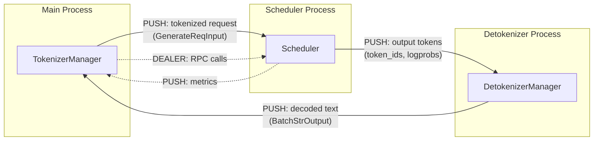

# 网络协议分析

## 7.1 概述

SGLang 使用 **ZMQ（ZeroMQ）** 在其三个进程组件之间进行进程间通信。协议非常简单：Python 对象通过 pickle 序列化后，经由 ZMQ PUSH/PULL/DEALER 套接字发送。没有自定义的二进制帧协议——ZMQ 原生处理消息边界。

对于外部通信，SGLang 使用标准 HTTP（通过 FastAPI/uvicorn），采用 JSON 请求/响应体，以及 SSE 用于流式传输。

---

## 7.2 ZMQ IPC 协议

### 消息传输

**库：** `pyzmq`（ZeroMQ 的 Python 绑定）

**套接字类型：**

| 套接字 | 类型 | 模式 | 用途 |
|--------|------|------|------|
| TokenizerMgr → Scheduler | PUSH/PULL | 管道 | 发送分词后的请求 |
| Scheduler → Detokenizer | PUSH/PULL | 管道 | 发送输出 token |
| Detokenizer → TokenizerMgr | PUSH/PULL | 管道 | 返回解码后的文本 |
| Engine → Scheduler (RPC) | DEALER/ROUTER | 请求-回复 | RPC 调用（权重更新、刷新等） |
| Scheduler → Main (Metrics) | PUSH/PULL | 管道 | 发送指标数据 |

### IPC 通道设置（PortArgs）

在 Linux 上，通道使用 Unix 域套接字（IPC 传输）：

```python
# PortArgs.init_new() (server_args.py:6568)
tokenizer_ipc_name = f"ipc://{tempfile.NamedTemporaryFile(delete=False).name}"
scheduler_input_ipc_name = f"ipc://{tempfile.NamedTemporaryFile(delete=False).name}"
detokenizer_ipc_name = f"ipc://{tempfile.NamedTemporaryFile(delete=False).name}"
rpc_ipc_name = f"ipc://{tempfile.NamedTemporaryFile(delete=False).name}"
metrics_ipc_name = f"ipc://{tempfile.NamedTemporaryFile(delete=False).name}"
```

每个 IPC 名称是 `/tmp/` 中的一个唯一 Unix 域套接字路径。

### 消息格式

ZMQ 消息是使用 pickle 序列化的 Python 对象：

```
┌─────────────────────────────────────────┐
│ ZMQ Message Frame (auto-delimited) │
│ ┌───────────────────────────────────┐ │
│ │ Pickled Python object │ │
│ │ (GenerateReqInput, │ │
│ │ BatchTokenIDOutput, │ │
│ │ FlushCacheReqInput, etc.) │ │
│ └───────────────────────────────────┘ │
└─────────────────────────────────────────┘
```

ZMQ 保证：
- **消息完整性**：每次 `send()`/`recv()` 配对精确传输一条完整消息
- **无需帧封装**：ZMQ 内部处理消息边界
- **无需校验和**：ZMQ 保证 IPC 上的有序、无损传输

### 消息流程图



### 关键消息类型

**请求消息（TokenizerManager → Scheduler）：**

| 类 | 字段 | 用途 |
|----|------|------|
| `TokenizedGenerateReqInput` | input_ids, sampling_params, rid, stream, ... | 分词后的生成请求 |
| `TokenizedEmbeddingReqInput` | input_ids, rid, ... | 分词后的嵌入请求 |
| `FlushCacheReqInput` | (无) | 清除 KV 缓存 |
| `AbortReqInput` | rid | 取消正在运行的请求 |
| `UpdateWeightReqInput` | model_path, load_format | 热替换权重 |

**响应消息（Scheduler/Detokenizer → TokenizerManager）：**

| 类 | 字段 | 用途 |
|----|------|------|
| `BatchTokenIDOutput` | rids, output_ids, logprobs, ... | 原始 token ID 输出 |
| `BatchStrOutput` | rids, output_str, logprobs, ... | 解码后的文本输出 |
| `BatchEmbeddingOutput` | rids, embeddings | 嵌入向量 |

---

## 7.3 HTTP API 协议

### 标准请求/响应

对于非流式端点，SGLang 使用标准 HTTP JSON：

```
POST /v1/completions HTTP/1.1
Content-Type: application/json

{"model": "meta-llama/Meta-Llama-3-8B", "prompt": "Hello", "max_tokens": 100}
```

```
HTTP/1.1 200 OK
Content-Type: application/json

{"id": "cmpl-xxx", "choices": [{"text": " world!", "index": 0}], ...}
```

### 服务器推送事件（SSE）流式传输

对于流式端点（`stream: true`），SGLang 使用 SSE：

```
POST /v1/completions HTTP/1.1
Content-Type: application/json

{"model": "...", "prompt": "Hello", "max_tokens": 100, "stream": true}
```

```
HTTP/1.1 200 OK
Content-Type: text/event-stream
Cache-Control: no-cache

data: {"id": "cmpl-xxx", "choices": [{"text": " world", "index": 0}], ...}

data: {"id": "cmpl-xxx", "choices": [{"text": "!", "index": 0}], ...}

data: [DONE]
```

流式传输间隔由 `--stream-interval` 控制（默认：每个 SSE 事件 2 个 token）。

---

## 7.4 NCCL 分布式通信

对于张量并行和流水线并行，SGLang 使用 NCCL（NVIDIA 集合通信库）：

**传输方式：** 通过 `nccl_port` 的 TCP 用于初始化，然后使用 NVLink/PCIe 进行数据传输。

**集合操作：**
- AllReduce — 张量并行：跨 GPU 汇总部分结果
- AllGather — 流水线并行：收集中间激活值
- Broadcast — 跨 rank 广播模型权重
- Send/Recv — 流水线并行阶段间通信

NCCL 在 `TpModelWorker` 启动时通过 `torch.distributed.init_process_group(backend="nccl")` 进行初始化。

---

## 7.5 总结

> SGLang 没有实现自定义的应用层网络协议。它使用 ZMQ 加 pickle 序列化进行内部 IPC，使用标准 HTTP/JSON 进行外部 API 通信，使用 NCCL 进行 GPU 间的分布式通信。这种设计优先考虑简单性和兼容性，而非协议效率——瓶颈在于 GPU 计算，而非 IPC 开销。
