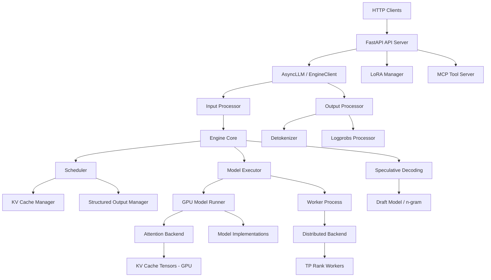

# vLLM — 概览与架构

## 1.1 项目分类

**混合型：服务器/服务 + 库/SDK + CLI**

vLLM 是一个面向大语言模型 (LLM) 的高吞吐、内存高效的推理与服务引擎。它以三种模式运行：

- **服务器模式 (Server mode)** (`vllm serve`)：长期运行的 HTTP 服务器，提供 OpenAI 兼容、Anthropic 兼容及其他 API。
- **离线批处理模式 (Offline batch mode)** (`LLM` 类)：库风格的 Python API，用于无需服务器的批量推理。
- **异步引擎模式 (Async engine mode)** (`AsyncLLM` 类)：异步库，用于集成到自定义应用中。

## 1.2 技术栈

| 组件 | 技术 |
|------|------|
| 主要语言 | Python（含 C++/CUDA 扩展、Triton 内核） |
| Web 框架 | FastAPI + Uvicorn (ASGI) |
| GPU 计算 | PyTorch、自定义 CUDA/Triton 内核 |
| 分布式执行 | Ray、多进程 (multiprocessing, mp) 或单进程 (uniprocess) |
| 序列化 | msgspec/msgpack 用于 IPC，Pydantic 用于 API 验证 |
| 进程间通信 | ZMQ（异步）、Python 多进程队列 (multiprocessing Queues) |
| 指标 | Prometheus 客户端（多进程模式） |
| 链路追踪 | OpenTelemetry（可选） |
| 模型格式 | SafeTensors、GGUF、BitsAndBytes、Tensorizer、RunAI Streamer |
| 构建系统 | `uv` (Python)、CMake (C++/CUDA 扩展)、pre-commit 钩子 |

**可选/条件后端 (Optional/conditional backends)：** CUDA (NVIDIA GPU)、ROCm (AMD GPU)、CPU、Intel Gaudi (HPU)、TPU、AWS Neuron、FPGA。

## 1.3 目录映射

| 目录 | 用途 |
|------|------|
| `vllm/` | 核心库源码 |
| `vllm/v1/` | V1 架构 — 调度器 (scheduler)、引擎核心 (engine core)、工作器 (worker)、注意力后端 (attention backends) |
| `vllm/v1/engine/` | 引擎核心、异步 LLM、输入/输出处理器、反分词器 (detokenizer) |
| `vllm/v1/core/` | 调度器 (scheduler)、KV 缓存管理器 (KV cache manager)、结构化输出管理器 (structured output manager) |
| `vllm/v1/worker/` | GPU 模型运行器 (GPU model runner)、块表 (block tables)、KV 缓存工作器端逻辑 |
| `vllm/v1/executor/` | 抽象执行器 (abstract executor)、单进程/多进程/Ray 执行器 |
| `vllm/v1/attention/` | 注意力后端实现 (FlashAttn、FlashInfer 等) |
| `vllm/v1/spec_decode/` | 推测解码 (Speculative Decoding, Eagle、Medusa、n-gram 等) |
| `vllm/entrypoints/` | HTTP API 服务器 (OpenAI、Anthropic、MCP、SageMaker) |
| `vllm/model_executor/` | 模型加载、量化层 (quantization layers)、模型实现 |
| `vllm/model_executor/models/` | 100+ 模型架构 (Llama、Qwen、Mixtral 等) |
| `vllm/model_executor/layers/` | 自定义线性/注意力/量化层 |
| `vllm/distributed/` | 张量并行 (Tensor Parallel)、流水线并行 (Pipeline Parallel)、数据并行 (Data Parallel)、KV 传输 |
| `vllm/lora/` | LoRA 适配器加载、服务与管理 |
| `vllm/tracing/` | OpenTelemetry 集成 |
| `vllm/v1/metrics/` | Prometheus 指标、统计收集、日志器 |
| `vllm/v1/structured_output/` | 语法引导生成 (xgrammar、outlines、guidance、LM format enforcer) |
| `vllm/plugins/` | 通过 Python 入口点 (entry points) 的插件系统 |
| `vllm/multimodal/` | 多模态输入处理 (视觉、音频、视频) |
| `vllm/compilation/` | torch.compile / CUDA 图 (CUDA graph) 支持 |
| `vllm/platforms/` | 硬件平台抽象 (CUDA、ROCm、CPU、TPU 等) |
| `tests/` | 单元测试与集成测试 |
| `docs/` | 面向用户的文档 |
| `benchmarks/` | 性能基准测试脚本 |
| `examples/` | 使用示例与脚本样例 |
| `csrc/` | C++/CUDA 扩展源码 |

## 1.4 模块/组件图

### 模块职责

- **API 服务器 (API Server)**：FastAPI 应用，提供 OpenAI 兼容端点 (chat/completions、completions、embeddings、responses 等)、Anthropic 兼容消息端点，以及 vLLM 特有的管理端点 (sleep、profile、LoRA、cache 等)。
- **AsyncLLM / EngineClient**：引擎核心的异步接口。通过 asyncio 队列和 ZMQ IPC 管理请求提交、输出收集和流式传输。
- **输入处理器 (Input Processor)**：对提示词 (prompts) 进行分词 (tokenize)、处理多模态输入、解析 LoRA 请求，并构造 `EngineCoreRequest` 对象。
- **引擎核心 (Engine Core)**：中央编排循环 — 调度请求、执行模型前向传播 (forward pass)、处理输出。在独立进程中运行（多进程模式）以实现隔离。
- **调度器 (Scheduler)**：决定每个步骤中哪些请求获得 token、管理 KV 缓存块分配、处理抢占 (preemption)，并强制执行吞吐量/内存约束。
- **KV 缓存管理器 (KV Cache Manager)**：分配和释放 KV 缓存块、通过块哈希管理前缀缓存 (prefix caching)，并支持 KV 缓存事件用于外部可观测性。
- **模型执行器 (Model Executor)**：单进程/多进程/Ray 执行的抽象层。生成工作进程、分发模型执行、收集结果。
- **GPU 模型运行器 (GPU Model Runner)**：准备输入张量、构建注意力元数据 (attention metadata)、执行模型前向传播，并在工作器端管理 CUDA 图 (CUDA graphs) 和 KV 缓存操作。
- **注意力后端 (Attention Backend)**：可插拔后端 (FlashAttn、FlashInfer、ROCm、CPU、Triton 等)，实现实际的 KV 缓存注意力计算。
- **输出处理器 (Output Processor)**：收集模型输出、应用停止 token、运行增量反分词 (incremental detokenization)、计算 logprobs，并组装 `RequestOutput` 对象。
- **结构化输出管理器 (Structured Output Manager)**：编译并应用语法约束 (JSON schema、regex、choices)，确保模型输出符合指定格式。
- **推测解码 (Speculative Decoding)**：通过 n-gram 提议器 (proposer)、Eagle 或 Medusa 头生成草稿 token (draft tokens)，然后针对目标模型进行验证以加速推理。
- **分布式后端 (Distributed Backend)**：张量并行 (Tensor Parallelism, TP)、流水线并行 (Pipeline Parallelism, PP)、数据并行 (Data Parallelism, DP)、专家并行 (Expert Parallelism, EP)，以及用于解耦服务 (disaggregated serving) 的 KV 连接器 (KV connector)。
