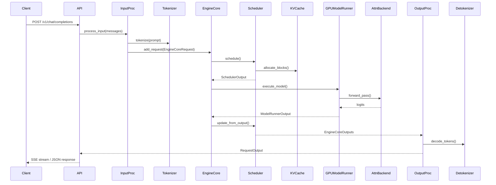

# vLLM — API / 接口分析

## 3.1 API 表面概述

vLLM 通过模块化的 FastAPI Router 架构暴露多个 API 族。Router 根据模型支持的任务（supported tasks）进行条件注册。

### Router 注册层次结构

```
api_server.py (build_and_serve)
├── register_vllm_serve_api_routers() — 管理/管理员端点（Management/admin endpoints）
│ ├── lora/ — LoRA 适配器 CRUD
│ ├── profile/ — CUDA 性能分析控制
│ ├── sleep/ — 休眠/唤醒电源管理
│ ├── rpc/ — 直接 RPC 到引擎核心（Engine Core）
│ ├── cache/ — 前缀缓存管理（Prefix cache management）
│ ├── tokenize/ — 分词工具（Tokenization utilities）
│ └── instrumentator/ — Prometheus 指标
├── models/ — GET /v1/models
├── sagemaker/ — SageMaker 兼容端点
├── generate/ — 核心生成的端点（Core generation endpoints）
│ ├── chat_completion/ — /v1/chat/completions
│ ├── responses/ — /v1/responses
│ ├── completion/ — /v1/completions
│ └── anthropic/ — /v1/messages
├── disagg/ — 分离式服务协调（Disaggregated serving coordination）
├── rlhf/ — RLHF 专用端点
├── elastic_ep/ — 弹性专家并行（Elastic expert parallelism）
├── generative_scoring/ — 评分端点
├── render/ — 提示词渲染（Prompt rendering）
├── speech_to_text/ — 音频转录
├── realtime/ — 实时 WebSocket API
└── pooling/ — 嵌入（Embeddings）、评分、排序
```

## 3.2 逐端点分析

### POST /v1/chat/completions

**处理器（Handler）：** `vllm/entrypoints/openai/chat_completion/api_router.py:create_chat_completion()`

**输入（Input）：** JSON 请求体 — model、messages（含 role/content）、temperature、max_tokens、stream、tools、response_format 等。

**执行流程（Execution Flow）：**
1. 通过 `validate_json_request` 依赖项验证请求
2. 检查负载感知调用门控（load-aware call gating）
3. 从 `app.state.openai_serving_chat` 解析处理器
4. 调用 `OpenAIServingChat.create_chat_completion()`
5. 若为流式（streaming）：返回带有 SSE 事件的 `StreamingResponse`
6. 若为非流式（non-streaming）：返回包含完整补全结果的 `JSONResponse`

**复杂逻辑（Complex Logic）：**
- 工具调用（Tool calling）支持通过可配置的工具解析器（如 `ToolParserManager`）解析模型输出中的函数调用
- 结构化输出（Structured Output，JSON 模式）与 `StructuredOutputManager` 集成以约束生成过程
- 批量端点（`/v1/chat/completions/batch`）支持离线批处理



### POST /v1/completions

**处理器（Handler）：** `vllm/entrypoints/openai/completion/api_router.py:create_completion()`

**输入（Input）：** JSON 请求体 — model、prompt、max_tokens、temperature、stream、logprobs、echo 等。

**执行流程（Execution Flow）：** 与聊天补全类似，但接受原始文本提示（raw text prompt）而非消息（messages）。使用 `OpenAIServingCompletion` 处理器。

### POST /v1/responses

**处理器（Handler）：** `vllm/entrypoints/openai/responses/api_router.py:create_responses()`

**输入（Input）：** JSON 请求体 — model、input、instructions、tools、stream 等。

**执行流程（Execution Flow）：**
1. 解析响应请求（responses request）
2. 通过 MCP 工具服务器集成支持工具使用
3. 通过 SSE 流式传输带类型事件名的事件
4. 将内部生成器转换为 SSE 格式（`_convert_stream_to_sse_events`）

**复杂逻辑（Complex Logic）：**
- 工具会话（Tool sessions）按请求管理，通过 `ResponseContext.cleanup_session()` 进行清理
- 支持 MCP（Model Context Protocol，模型上下文协议）工具服务器连接，用于外部工具执行

### POST /v1/messages（Anthropic 兼容）

**处理器（Handler）：** `vllm/entrypoints/anthropic/api_router.py:create_messages()`

**输入（Input）：** Anthropic 格式的消息请求（model、messages、max_tokens 等）

**执行流程（Execution Flow）：**
1. 将 Anthropic 请求格式转换为内部格式
2. 通过 `AnthropicServingMessages` 执行
3. 将错误转换回 Anthropic 错误格式
4. 同时暴露 `POST /v1/messages/count_tokens` 端点

### GET /v1/models

**处理器（Handler）：** `vllm/entrypoints/openai/models/api_router.py:show_available_models()`

返回可用模型列表，包括 LoRA 适配器。

### 池化端点（Pooling Endpoints）（嵌入、评分、排序）

**注册方式（Registered via）：** `vllm/entrypoints/pooling/factories.py:register_pooling_api_routers()`

根据 `supported_tasks` 条件注册：
- 嵌入（Embeddings）：`/v1/embeddings`
- 评分（Scoring）：`/v1/score`
- 排序（Ranking）：`/v1/rerank`、`/v1/score`（取决于模型能力）

### 管理端点（Management Endpoints）

| 端点（Endpoint） | 方法（Method） | 用途（Purpose） |
|----------|--------|---------|
| `/v1/loras` | POST | 加载 LoRA 适配器 |
| /v1/loras/{'{lora_id}'} | DELETE | 卸载 LoRA 适配器 |
| /v1/loras/{'{lora_id}'}/pin | POST | 将 LoRA 适配器固定在内存中 |
| `/sleep` | POST | 休眠模式（节能） |
| `/wake-up` | POST | 从休眠中唤醒 |
| `/start-profile` | POST | 启动 CUDA 性能分析 |
| `/stop-profile` | POST | 停止 CUDA 性能分析 |
| `/reset_prefix_cache` | POST | 清除前缀缓存（Prefix cache） |
| `/is_sleeping` | GET | 检查休眠状态 |
| `/metrics` | GET | Prometheus 指标端点 |

## 3.3 Python SDK 接口

### LLM（离线批处理，Offline Batch）

```python
from vllm import LLM, SamplingParams
llm = LLM(model="meta-llama/Llama-3-8B")
outputs = llm.generate(["Hello"], SamplingParams(max_tokens=100))
```

**关键方法（Key methods）：**
- `LLM.generate()` — 批量文本生成
- `LLM.encode()` — 批量嵌入/池化（embedding/pooling）
- `LLM.start_profile()` / `LLM.stop_profile()` — 性能分析

### AsyncLLM（异步，Async）

```python
from vllm import AsyncLLMEngine
engine = AsyncLLMEngine.from_engine_args(engine_args)
async for output in engine.generate(request):
 process(output)
```

**关键方法（Key methods）：**
- `AsyncLLM.generate()` — 异步流式生成
- `AsyncLLM.encode()` — 异步嵌入
- `AsyncLLM.abort()` — 取消进行中的请求（in-flight request）
- `AsyncLLM.sleep()` / `AsyncLLM.wake_up()` — 电源管理
