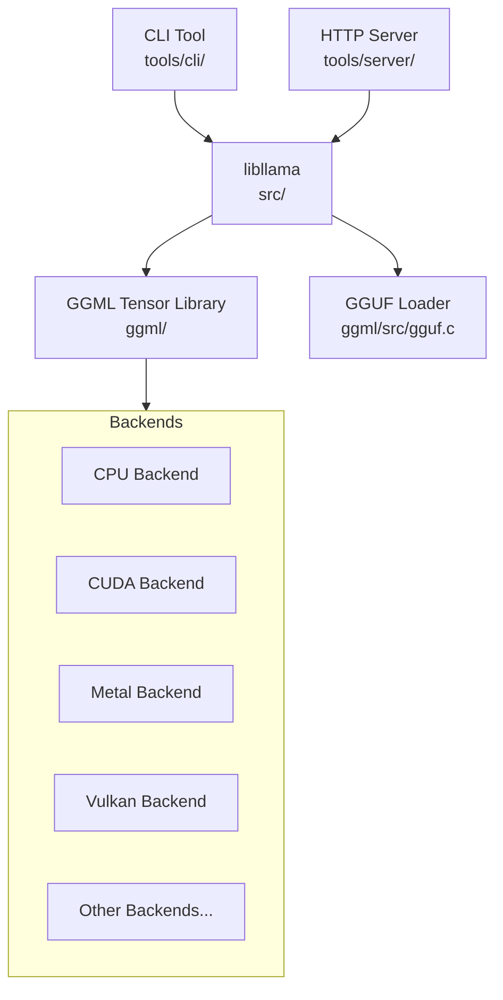

# llama.cpp — Overview & Architecture

## 1.1 Project Classification

**Hybrid** — llama.cpp is a C/C++ library for LLM inference (`libllama`) with two primary executable wrappers:

1. **Server / Service** — `llama-server` (tools/server/server.cpp): long-running HTTP server exposing OpenAI-compatible REST API
2. **CLI Tool** — `llama-cli` (tools/cli/cli.cpp): interactive chat/repl tool

The core `libllama` is a library consumed by both executables and by downstream projects.

## 1.2 Tech Stack

| Component | Technology |
|-----------|-----------|
| Primary Language | C++17 (with C99 for ggml core) |
| Total C/C++ files | ~749 |
| Total C/C++ lines | ~545,788 |
| Build System | CMake 3.14+ (CMakeLists.txt) |
| Key C++ Deps | nlohmann/json (HTTP server), httplib (HTTP server), ggml (tensor engine) |
| Quantization Formats | 42 types: F32, F16, BF16, Q4_0 through Q8_K, IQ series, TQ, MXFP4, NVFP4, Q1_0 |
| Supported Architectures | 100+ model architectures (see llama-arch.h) |

### Optional / Conditional Backends

| Backend | Directory | Accelerator |
|---------|-----------|-------------|
| CUDA | ggml/src/ggml-cuda/ | NVIDIA GPU |
| Metal | ggml/src/ggml-metal/ | Apple GPU |
| Vulkan | ggml/src/ggml-vulkan/ | Cross-platform GPU |
| HIP/ROCm | ggml/src/ggml-hip/ | AMD GPU |
| SYCL | ggml/src/ggml-sycl/ | Intel GPU |
| CANN | ggml/src/ggml-cann/ | Ascend NPU |
| OpenCL | ggml/src/ggml-opencl/ | OpenCL devices |
| OpenVINO | ggml/src/ggml-openvino/ | Intel OpenVINO |
| MUSA | ggml/src/ggml-musa/ | Moore Threads GPU |
| RPC | ggml/src/ggml-rpc/ | Remote procedure call |
| BLAS | ggml/src/ggml-blas/ | BLAS libraries |
| Hexagon | ggml/src/ggml-hexagon/ | Qualcomm Hexagon DSP |
| VirtGPU | ggml/src/ggml-virtgpu/ | Virtual GPU |
| WebGPU | ggml/src/ggml-webgpu/ | WebGPU (browser) |
| CPU | ggml/src/ggml-cpu/ | Default CPU fallback |

## 1.3 Directory Map

| Directory | Purpose |
|-----------|---------|
| `src/` | Core llama.cpp library implementation (model, context, vocab, KV cache, sampler, etc.) |
| `ggml/` | GGML tensor library — tensor ops, backends, quantization, allocator |
| `ggml/src/` | GGML backend implementations (CPU, CUDA, Metal, Vulkan, etc.) |
| `ggml/include/` | GGML public headers (ggml.h, gguf.h, ggml-backend.h) |
| `include/` | Public llama API headers (llama.h, llama-cpp.h) |
| `tools/server/` | HTTP server implementation (OpenAI-compatible API) |
| `tools/cli/` | Interactive CLI chat tool |
| `examples/` | Standalone example programs (embedding, batched, gguf, etc.) |
| `common/` | Shared CLI utilities (arg parsing, sampling defaults, console) |
| `docs/` | User-facing documentation |
| `tests/` | Unit and integration tests |
| `models/` | Model conversion scripts (Python) |
| `unicode-data/` | Unicode normalization tables for tokenizer |
| `devops/` | CI/CD configuration |
| `scripts/` | Build and utility scripts |
| `ggml/src/ggml-quants.c` | Quantization/dequantization kernels |

## 1.4 Module / Component Diagram

### Module Descriptions

- **CLI Tool** (`tools/cli/`): Interactive REPL for chatting with models. Uses `server_context` internally for model loading and inference orchestration.

- **HTTP Server** (`tools/server/`): Long-running HTTP server exposing OpenAI-compatible REST API endpoints (`/v1/chat/completions`, `/v1/completions`, `/v1/embeddings`, etc.). Supports multi-slot concurrent inference, streaming SSE, and a router mode for multi-model serving.

- **libllama** (`src/`): Core inference library. Contains model loading, context management, tokenization, KV cache, sampling, grammar-constrained generation, and graph construction. Dispatches compute to GGML.

- **GGML Tensor Library** (`ggml/`): Low-level tensor compute engine. Defines the `ggml_tensor` type, implements lazy compute graph construction, and provides the `ggml_backend_i` vtable interface for hardware dispatch. Also implements all quantization kernels.

- **Hardware Backends** (`ggml/src/ggml-*`): Platform-specific implementations of `ggml_backend_i`. Each backend provides tensor allocation, compute graph execution, and memory management for its target hardware.

- **GGUF Loader** (`ggml/include/gguf.h`): Parses the GGUF binary model format. Reads metadata KV pairs and tensor descriptors, enables memory-mapped loading of model weights.
