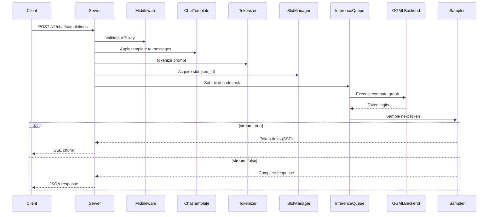

# llama.cpp — API / Interface Analysis

## 3.1 API Surface Discovery

The llama.cpp server exposes an HTTP REST API using **httplib** (cpp-httplib). Routes are registered in `tools/server/server.cpp:172-225` via `ctx_http.get()` and `ctx_http.post()`. The server implements:

- OpenAI Chat Completions API (`/v1/chat/completions`)
- OpenAI Completions API (`/v1/completions`)
- OpenAI Embeddings API (`/v1/embeddings`)
- OpenAI Responses API (`/v1/responses`)
- Anthropic Messages API (`/v1/messages`)
- Audio Transcriptions API (`/v1/audio/transcriptions`)
- Reranking API (`/v1/rerank`)
- Token utility endpoints
- Slot management endpoints
- LoRA adapter hotswap

## 3.2 Per-Endpoint Analysis

### POST /v1/chat/completions

**Handler:** `routes.post_chat_completions` (registered at server.cpp:183-184)
**Input:** JSON body — model, messages[], temperature, max_tokens, stream, tools, response_format, etc.
**Execution Flow:**

1. Validate API key (middleware, server-http.cpp:140)
2. Parse request JSON, extract messages and sampling parameters
3. Apply chat template to format messages into a single prompt string
4. Tokenize the prompt using the model's vocabulary
5. Acquire a slot from the multi-slot pool
6. Submit decode task to the inference queue
7. If `stream: true`, return Server-Sent Events (SSE) with incremental token deltas
8. If `stream: false`, buffer all tokens and return complete JSON response

**Complex Logic:**
- Slot allocation: multiple concurrent requests share the KV cache; each request gets a dedicated sequence ID
- Streaming: uses chunked transfer encoding with SSE format (`data: {json}\n\n`)
- Tool calling: supports function calling via grammar-constrained generation
- Multi-modal: accepts image/audio inputs when model supports it



### POST /v1/completions

**Handler:** `routes.post_completions_oai` (server.cpp:181)
**Input:** JSON body — model, prompt, max_tokens, temperature, stream, echo, stop, etc.
**Execution Flow:** Similar to chat completions but takes a raw `prompt` string instead of structured `messages`. No chat template is applied.

### POST /v1/embeddings

**Handler:** `routes.post_embeddings_oai` (server.cpp:193)
**Input:** JSON body — model, input (string or string[]), encoding_format
**Execution Flow:**

1. Tokenize input text(s)
2. Process through model with pooling enabled
3. Return embedding vectors (float or base64 encoded)

### POST /v1/responses

**Handler:** `routes.post_responses_oai` (server.cpp:184-185)
**Input:** JSON body — OpenAI Responses API format
**Notes:** Newer API format for structured responses.

### POST /v1/messages

**Handler:** `routes.post_anthropic_messages` (server.cpp:188)
**Input:** JSON body — Anthropic Messages API format (model, messages, max_tokens, etc.)
**Notes:** Compatibility layer for Anthropic API consumers.

### POST /v1/audio/transcriptions

**Handler:** `routes.post_transcriptions_oai` (server.cpp:186-187)
**Input:** Multipart form data — audio file, model
**Notes:** Whisper-style audio transcription when model supports audio input.

### POST /v1/rerank

**Handler:** `routes.post_rerank` (server.cpp:194-196)
**Input:** JSON body — model, query, documents[], top_n
**Execution Flow:**

1. Tokenize query + each document pair
2. Run inference with classification head
3. Return relevance scores sorted by score

### POST /infill

**Handler:** `routes.post_infill` (server.cpp:190)
**Input:** JSON body — model, input_prefix, input_suffix
**Notes:** Code infill / FIM (Fill-In-the-Middle) completion.

### GET /health

**Handler:** `routes.get_health` (server.cpp:172-173)
**Public endpoint** — no API key required
**Returns:** Server health status (loading, ready, error)

### GET /v1/models

**Handler:** `routes.get_models` (server.cpp:177-178)
**Public endpoint** — no API key required
**Returns:** List of loaded models with metadata

### GET /metrics

**Handler:** `routes.get_metrics` (server.cpp:174)
**Returns:** Prometheus-format metrics including:
- `llama_prompt_tokens_total` — total prompt tokens processed
- `llama_tokens_generated_total` — total completion tokens generated
- `llama_request_success_total` — successful request count
- Slot utilization metrics
- Timing metrics (prompt eval, generation)

### GET /props

**Handler:** `routes.get_props` (server.cpp:175)
**Returns:** Server properties (model name, total slots, embedding capability, etc.)

### POST /tokenize

**Handler:** `routes.post_tokenize` (server.cpp:198)
**Input:** JSON body — content
**Returns:** Token IDs for the given text

### POST /detokenize

**Handler:** `routes.post_detokenize` (server.cpp:199)
**Input:** JSON body — tokens[]
**Returns:** Decoded text string

### GET /slots & POST /slots/:id_slot

**Handler:** `routes.get_slots` / `routes.post_slots` (server.cpp:205-206)
**Returns:** Slot status (idle, busy, task info) or save/load slot state

### GET /lora-adapters & POST /lora-adapters

**Handler:** `routes.get_lora_adapters` / `routes.post_lora_adapters` (server.cpp:202-203)
**Notes:** Hot-swap LoRA adapters at runtime without reloading the base model

## 3.3 C Library API (libllama)

The public C API is defined in `include/llama.h` (1565 lines). Key function groups:

| Category | Key Functions | Purpose |
|----------|--------------|---------|
| Backend Init | `llama_backend_init()`, `llama_backend_free()` | Initialize/shutdown GGML |
| Model | `llama_model_load_from_file()`, `llama_model_free()` | Load/free GGUF model |
| Context | `llama_init_from_model()`, `llama_free()` | Create inference context |
| Decode | `llama_decode()`, `llama_encode()` | Run inference on a batch |
| Sampling | `llama_sampler_chain_init()`, `llama_sampler_sample()` | Token sampling pipeline |
| KV Cache | `llama_kv_self_update()`, `llama_kv_self_clear()` | Manage KV cache |
| Tokenizer | `llama_tokenize()`, `llama_token_to_piece()` | Text ↔ token conversion |
| Chat | `llama_chat_apply_template()` | Apply chat template |
| Grammar | `llama_grammar_init()`, `llama_grammar_free()` | Constrained generation |
| Adapter | `llama_adapter_lora_init()`, `llama_adapter_apply()` | LoRA adapter management |

### Core Decode Loop (programmatic usage)

```c
// 1. Create model and context
llama_model * model = llama_model_load_from_file(path, model_params);
llama_context * ctx = llama_init_from_model(model, ctx_params);

// 2. Create sampler chain
llama_sampler * smpl = llama_sampler_chain_init(chain_params);
llama_sampler_chain_add(smpl, llama_sampler_init_temp(0.8));
llama_sampler_chain_add(smpl, llama_sampler_init_dist(seed));

// 3. Tokenize prompt
llama_tokenize(model, prompt, tokens, n_tokens, add_bos, special);

// 4. Process prompt batch
llama_batch batch = llama_batch_get_one(tokens, n_tokens);
llama_decode(ctx, batch);

// 5. Auto-regressive decode loop
while (!done) {
    llama_token id = llama_sampler_sample(smpl, ctx, -1);
    llama_sampler_accept(smpl, id);
    // process token...
    batch = llama_batch_get_one(&id, 1);
    llama_decode(ctx, batch);
}
```
