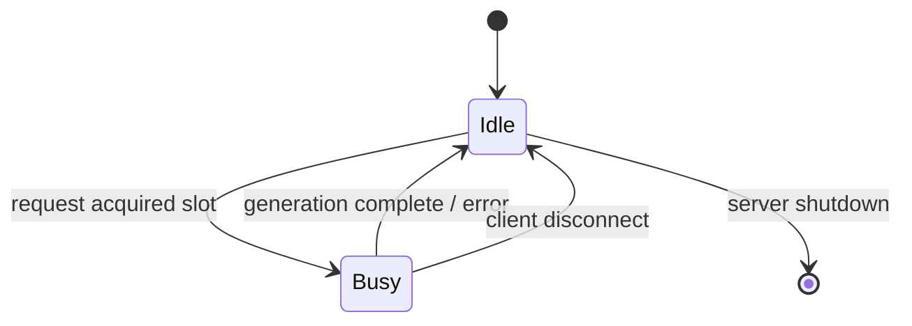

# llama.cpp — Cross-Cutting Concerns

## 8.1 Authentication & Authorization

**Implementation:** `tools/server/server-http.cpp:140-188`
**Scheme:** Static API Key (Bearer token)

### How It Works

1. API keys are loaded at startup from the `--api-key` CLI flag (can specify multiple)
2. A middleware function `middleware_validate_api_key` runs before every request
3. Public endpoints bypass validation:

| Endpoint | Public |
|----------|--------|
| `/health` | Yes |
| `/v1/health` | Yes |
| `/models` | Yes |
| `/v1/models` | Yes |
| `/` (index) | Yes |
| `/index.html` | Yes |
| `/bundle.js` | Yes |
| `/bundle.css` | Yes |

4. Protected endpoints require an API key in one of two headers:
   - `Authorization: Bearer <key>` (standard)
   - `X-Api-Key: <key>` (Anthropic compatibility)

5. The "Bearer " prefix is stripped automatically

6. Invalid/missing key → HTTP 401 with JSON error body:
   ```json
   {"error": {"message": "Invalid API Key", "type": "authentication_error"}}
   ```

### Security Notes

- Keys are stored in memory as plaintext strings
- At startup, only the last 4 characters of the first key are logged (for verification)
- No per-endpoint or per-operation authorization — keys grant full access
- No TLS/HTTPS built into the server — expected to be behind a reverse proxy in production

## 8.2 Observability

### Logging

**Implementation:** `ggml/include/ggml.h` — `GGML_LOG` macros + custom `LOG_INF`/`LOG_WRN`/`LOG_ERR` macros in server code

| Level | Usage |
|-------|-------|
| ERROR | Fatal failures (model load failure, OOM) |
| WARN | Recoverable issues (invalid params, cache eviction) |
| INFO | Startup info, model load progress, request counts |
| DEBUG | Per-token decode details (verbose mode) |

**Log Output:** stderr (console). No structured logging or file-based log rotation.

**Key Log Points:**
- Model loading: architecture, tensor count, memory usage, load time
- Inference: tokens per second, batch size, slot allocation
- Server: startup, shutdown, request handling errors

### Metrics

**Endpoint:** `GET /metrics` (server.cpp:174)
**Format:** Prometheus text exposition format

**Key Metrics:**

| Metric | Type | Description |
|--------|------|-------------|
| `llama_prompt_tokens_total` | Counter | Total prompt tokens processed across all requests |
| `llama_tokens_generated_total` | Counter | Total completion tokens generated |
| `llama_request_success_total` | Counter | Number of successful inference requests |
| `llama_request_fail_total` | Counter | Number of failed inference requests |
| `llama_prompt_seconds_total` | Counter | Total time spent on prompt evaluation |
| `llama_tokens_seconds_total` | Counter | Total time spent on token generation |
| `llama_kv_cache_usage_level` | Gauge | KV cache utilization ratio (0.0 - 1.0) |
| `llama_slots_processing` | Gauge | Number of slots currently processing |

**Additional per-slot metrics** are available via `GET /slots`:
- Slot state (idle/busy)
- Current task ID and prompt
- Tokens processed, generation speed

### Tracing

> llama.cpp does not implement distributed tracing (no OpenTelemetry, Zipkin, or Jaeger integration). Request timing is available through log output and the `/metrics` endpoint only.

## 8.3 Rate Limiting

> llama.cpp does not implement explicit rate limiting (no token bucket, sliding window, or circuit breaker). Concurrency is implicitly bounded by:

1. **Slot count** — The `--parallel` flag controls how many concurrent inference slots are available. When all slots are busy, new requests receive HTTP 503 ("No slots available") with a `Retry-After` header.

2. **Batch size** — The `--batch-size` and `--ubatch-size` flags limit how many tokens can be processed in a single decode call, preventing any single request from monopolizing compute.

3. **Context window** — Each request consumes KV cache proportional to its prompt + generated tokens. When the KV cache is full, the least-recently-used sequences are evicted or the request is rejected.

### Slot-Based Concurrency Control (server-context.cpp)



When all slots are occupied:
- New requests receive `HTTP 503 Service Unavailable`
- Response includes `Retry-After: <seconds>` header
- Client should retry after the indicated delay
