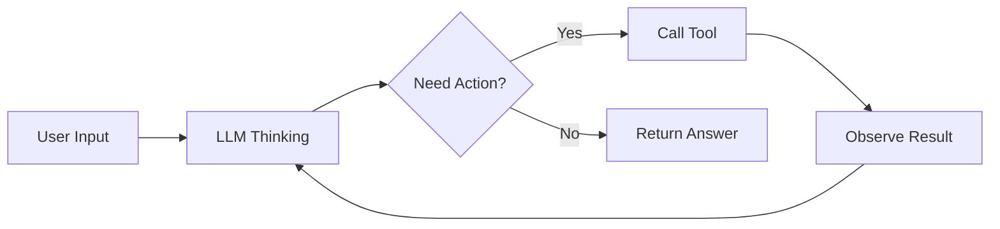

# AI Agent

AI Agents are intelligent entities capable of autonomously perceiving their environment, making decisions, and executing actions — representing the future direction of LLM applications. Prompt engineering is the core technology for building Agents.

## Agent Architecture



Core Agent components:

- **LLM Brain**: Responsible for reasoning and decision-making
- **Memory System**: Short-term memory (context window) + Long-term memory (vector database)
- **Toolset**: Search, code execution, API calls, file operations
- **Planning Module**: Task decomposition, step planning, reflection and improvement

## Agent Patterns

### ReAct Pattern

ReAct (Reasoning + Acting) alternates between reasoning and action; it is the most classic Agent pattern:

```
You are an intelligent assistant that can use the following tools:
- search(query): Search for information
- calculate(expression): Calculate mathematical expressions
- code_execute(code): Execute code

Please use the Thought-Action-Observation loop to answer questions.

Question: Who directed the 2024 Oscar Best Picture? What was their previous work?

Thought: I need to search for the 2024 Oscar Best Picture first
Action: search("2024 Oscar Best Picture winner")
Observation: Oppenheimer, directed by Christopher Nolan
Thought: Now I know it was Nolan, I need to search for his previous work
Action: search("Christopher Nolan film before Oppenheimer")
Observation: Tenet (2020)
Thought: I have all the information I need
Answer: The 2024 Oscar Best Picture was Oppenheimer, directed by Christopher Nolan. His previous film was Tenet (2020).
```

```python
from langchain.agents import create_react_agent, AgentExecutor

prompt = hub.pull("hwchase17/react")
agent = create_react_agent(llm, tools, prompt)
executor = AgentExecutor(agent=agent, tools=tools, verbose=True)
```

### Planning Pattern

Have the model make a plan first, then execute step by step:

```
Please complete the following task: first make a plan, then execute step by step.

Task: Analyze the core contributions of an English research paper

Plan:
1. Read the paper content
2. Identify the research question and motivation
3. Summarize the proposed method
4. List the main experimental results
5. Distill the core contributions

Executing plan step 1: ...
```

### Plan-and-Execute Agent

Suitable for complex multi-step tasks: planning phase generates a step list → execute step by step → replan when results don't meet expectations.

### Multi-Agent Collaboration

Multiple specialized Agents collaborate to complete complex tasks:

```python
from langgraph.graph import StateGraph

researcher = "You are an information researcher, responsible for searching and organizing information"
writer = "You are a technical writer, responsible for writing content"
reviewer = "You are a reviewer, responsible for checking quality and providing suggestions"

workflow = StateGraph(AgentState)
workflow.add_node("research", research_node)
workflow.add_node("write", write_node)
workflow.add_node("review", review_node)
workflow.add_edge("research", "write")
workflow.add_edge("write", "review")
workflow.add_conditional_edges("review", should_revise, {
    True: "revise", False: END,
})
```

**Debate Pattern**: Multiple Agents present different viewpoints on the same question and reach better conclusions through debate.

## Tool Design

Good tool descriptions are key to Agent success:

```python
@tool
def query_database(sql: str) -> str:
    """Execute a SQL query and return results.

    Only for query operations (SELECT); modification operations are not supported.
    The database contains users, orders, and products tables.

    Args:
        sql: SQL query statement, e.g. "SELECT * FROM users LIMIT 10"

    Returns:
        JSON string of query results
    """
    return execute_sql(sql)
```

| Function | Recommended Tool | Description |
|------|---------|------|
| Web search | Tavili / SerpAPI | Get real-time information |
| Code execution | Python REPL / E2B | Safely execute code |
| File operations | File read/write tools | Process local files |
| API calls | Custom tools | Interface with external services |

## Agent Safety

1. **Tool permission control**: Limit which tools and operations the Agent can access
2. **Input validation**: Validate and sanitize tool parameters
3. **Execution sandbox**: Run code execution in an isolated environment
4. **Human approval**: High-risk operations require human confirmation
5. **Cost control**: Set maximum token count and API call limits

```python
executor = AgentExecutor(
    agent=agent,
    tools=tools,
    max_iterations=10,
    max_execution_time=60,
    handle_parsing_errors=True,
)
```

## Best Practices

1. **Define boundaries clearly**: Tell the Agent when to use tools and when to answer directly
2. **Error handling**: Provide fallback strategies when tool calls fail
3. **Iteration limits**: Set maximum reasoning steps to prevent infinite loops
4. **Output format**: Require structured output for easier parsing
