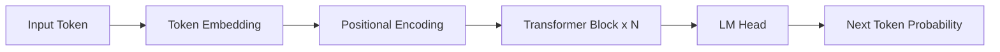

# Transformer Architecture

The Transformer is a sequence modeling architecture proposed by Google in the 2017 paper "Attention Is All You Need," which revolutionized NLP and the entire deep learning landscape.

## Self-Attention

Self-attention allows the model to attend to all other tokens in the sequence when processing each token.

### Computation

For input sequence X, compute Query, Key, and Value:

Q = XW_Q, K = XW_K, V = XW_V

Attention scores:

Attention(Q, K, V) = softmax(QK^T / √d_k) · V

Where d_k is the dimension of the key vectors; dividing by √d_k prevents dot product values from becoming too large.

### Multi-Head Attention

Multi-head attention allows the model to jointly attend to different representation subspaces at different positions:

```python
# Simplified multi-head attention
class MultiHeadAttention(nn.Module):
    def __init__(self, d_model, n_heads):
        super().__init__()
        self.n_heads = n_heads
        self.d_k = d_model // n_heads
        self.W_q = nn.Linear(d_model, d_model)
        self.W_k = nn.Linear(d_model, d_model)
        self.W_v = nn.Linear(d_model, d_model)
        self.W_o = nn.Linear(d_model, d_model)
```

## Encoder-Decoder Structure

### Encoder

Composed of N identical layers stacked, each containing:
1. Multi-head self-attention sublayer
2. Feed-forward neural network sublayer
3. Residual connection + Layer Norm

### Decoder

Similar to the encoder, but with an additional cross-attention layer to attend to the encoder's output.

## Decoder-Only Architecture

The GPT series uses a decoder-only architecture with causal attention masks to ensure each position can only attend to previous positions:



## Positional Encoding

The Transformer itself has no positional awareness and requires explicit position information injection:

- **Sinusoidal Positional Encoding**: The original paper's approach
- **Rotary Position Embedding (RoPE)**: Used by LLaMA and other models
- **ALiBi**: No positional embeddings needed; implements attention bias instead
