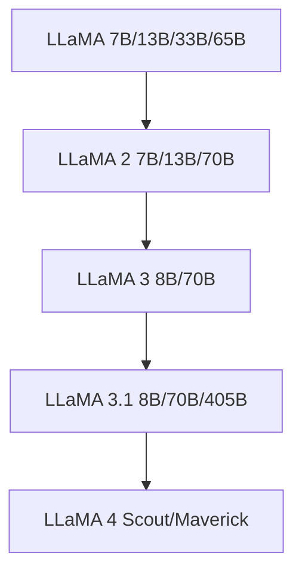

# Mainstream Models

This section introduces the most influential large language models and their characteristics.

## Closed-Source Models

### GPT Series (OpenAI)

| Model | Release Date | Parameters | Highlights |
|------|---------|---------|------|
| GPT-3 | 2020 | 175B | First to demonstrate few-shot learning |
| GPT-3.5 | 2022 | - | Foundation model for ChatGPT |
| GPT-4 | 2023 | - | Multimodal, significantly improved reasoning |
| GPT-4o | 2024 | - | End-to-end multimodal, low latency |
| o1/o3 | 2024-2025 | - | Reasoning models, enhanced chain-of-thought |

### Claude Series (Anthropic)

Known for safety and long context; Claude 3.5 supports approximately 200K token context window.

### Gemini Series (Google)

Natively multimodal design, deeply integrated with the Google ecosystem.

## Open-Source Models

### LLaMA Series (Meta)

The LLaMA series is the cornerstone of the open-source LLM ecosystem; the vast majority of open-source fine-tuned models are based on the LLaMA architecture.

### Mistral Series

Known for high efficiency; Mistral 7B achieves performance close to LLaMA 2 13B with far fewer parameters.

### Qwen Series (Alibaba)

- Outstanding Chinese language capabilities
- Multimodal versions (Qwen-VL)
- Multiple size options (1.5B ~ 72B+)

### DeepSeek Series

- DeepSeek-V2: MoE architecture, low inference cost
- DeepSeek-R1: Open-source reasoning model

## Model Selection Guide

| Requirement | Recommended Solution |
|------|---------|
| Highest quality | GPT-4o / Claude 3.5 |
| Chinese scenarios | Qwen 2.5 / DeepSeek |
| Local deployment | LLaMA 3.1 8B / Mistral 7B |
| Code generation | CodeLlama / DeepSeek-Coder |
| Low-cost inference | Quantized open-source models + vLLM |
