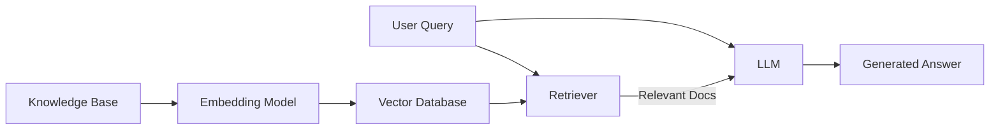

# RAG — Retrieval-Augmented Generation

RAG (Retrieval-Augmented Generation) retrieves relevant documents before generation, allowing LLMs to answer questions based on external knowledge and effectively mitigating hallucination issues.

## Basic Architecture



## Offline Indexing Stage

### 1. Document Chunking

```python
from langchain.text_splitter import RecursiveCharacterTextSplitter

splitter = RecursiveCharacterTextSplitter(
    chunk_size=500,
    chunk_overlap=50,
    separators=["\n\n", "\n", ".", "!", "?", " ", ""],
)
chunks = splitter.split_text(document)
```

### 2. Embedding

```python
from langchain_openai import OpenAIEmbeddings

embeddings = OpenAIEmbeddings(model="text-embedding-3-small")
vectors = embeddings.embed_documents([chunk.page_content for chunk in chunks])
```

### 3. Store in Vector Database

```python
from langchain_community.vectorstores import Chroma

vectorstore = Chroma.from_documents(
    documents=chunks,
    embedding=embeddings,
    persist_directory="./chroma_db",
)
```

## Online Query Stage

```python
retriever = vectorstore.as_retriever(search_kwargs={"k": 4})

from langchain.chains import create_retrieval_chain
from langchain.chains.combine_documents import create_stuff_documents_chain

question_answer_chain = create_stuff_documents_chain(llm, qa_prompt)
rag_chain = create_retrieval_chain(retriever, question_answer_chain)

response = rag_chain.invoke({"input": "What is LoRA?"})
```

## Advanced Optimizations

### Query Optimization

- **Query Rewriting**: Expand or simplify the user's original query
- **HyDE**: Have the LLM generate a hypothetical answer first, then use its embedding for retrieval
- **Multi-query Retrieval**: Generate multiple query variants and merge retrieval results

### Re-ranking

Use a Cross-Encoder to re-rank retrieval results:

```python
from langchain.retrievers import ContextualCompressionRetriever
from langchain.retrievers.document_compressors import CrossEncoderReranker

compressor = CrossEncoderReranker(model="BAAI/bge-reranker-v2-m3", top_n=3)
compression_retriever = ContextualCompressionRetriever(
    base_compressor=compressor, base_retriever=retriever
)
```

### Hybrid Retrieval

Combine keyword retrieval (BM25) and vector retrieval for better recall:

```python
from langchain.retrievers import EnsembleRetriever

bm25_retriever = BM25Retriever.from_documents(documents, k=5)
vector_retriever = vectorstore.as_retriever(k=5)

ensemble_retriever = EnsembleRetriever(
    retrievers=[bm25_retriever, vector_retriever],
    weights=[0.4, 0.6],
)
```

## Evaluation

Key evaluation dimensions for RAG systems:

| Dimension | Metric | Meaning |
|------|------|------|
| Retrieval quality | Recall@K | Proportion of relevant documents retrieved |
| Retrieval quality | MRR | Reciprocal rank of the first relevant document |
| Generation quality | Faithfulness | Whether the answer is faithful to retrieved documents |
| Generation quality | Relevancy | Whether the answer is on-topic |
