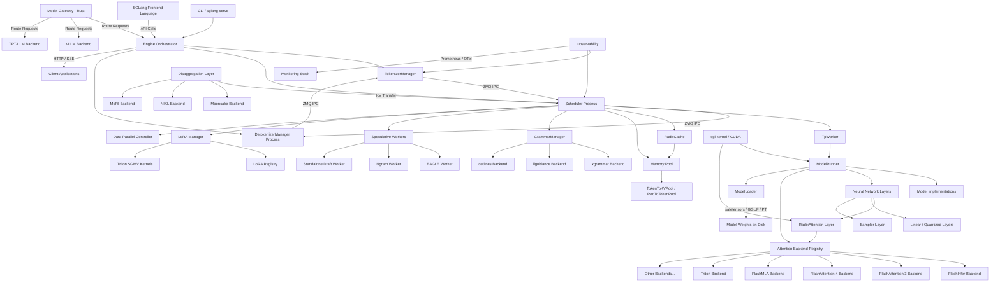

# SGLang — Overview & Architecture

## Project Classification

**Type:** Hybrid — Server/Service + CLI Tool + Library/SDK

SGLang is primarily a **long-running inference server** (SRT = SGLang Runtime) that exposes OpenAI-compatible HTTP/gRPC APIs for LLM and multimodal model serving. It also provides:

- A **CLI tool** (`sglang serve`, `sglang generate`) for launching and interacting with the server
- A **Python library/SDK** (`Engine` class) for programmatic access without running a separate server process
- A **frontend language** (`sglang.lang`) for writing LLM programs with a domain-specific syntax
- A **model gateway** (`sgl-model-gateway`) written in Rust for routing and load balancing across multiple backends

## Tech Stack

| Component | Technology | Version / Notes |
|-----------|-----------|----------------|
| Primary Language | Python | 3.10+, 2788 .py files |
| Gateway Language | Rust | Edition 2021, 248 .rs files |
| CUDA Kernels | C++/CUDA | 53 .h + 37 .cpp/.cu files |
| Go Utilities | Go | 22 .go files |
| ML Framework | PyTorch | 2.9.1 |
| Transformer Library | HuggingFace Transformers | 5.3.0 |
| HTTP Framework | FastAPI + Uvicorn | With uvloop for async |
| Async Runtime | uvloop | High-performance event loop |
| IPC | ZeroMQ (pyzmq) | Between scheduler/tokenizer/detokenizer processes |
| Attention Kernels | FlashInfer | 0.6.7.post3 |
| Custom Kernels | sglang-kernel | 0.4.1 (CMake + scikit-build-core) |
| Grammar Engine | xgrammar / llguidance / outlines | Structured output |
| Serialization | orjson, msgspec | Fast JSON |
| Metrics | prometheus-client | OpenMetrics format |
| Tracing | OpenTelemetry | Distributed tracing |
| Quantization | torchao, compressed-tensors | FP4/FP8/INT4/AWQ/GPTQ |
| Distributed | NCCL (pynccl), MSCCL++, custom all-reduce | Tensor/pipeline/expert parallelism |
| Build System (Python) | setuptools | pyproject.toml |
| Build System (Kernel) | scikit-build-core + CMake | sgl-kernel/pyproject.toml |
| Build System (Gateway) | Cargo | sgl-model-gateway/Cargo.toml |

### Optional/Conditional Backends

- **NVIDIA CUDA** — Primary GPU backend (GB200/B300/H100/A100/5090)
- **AMD ROCm** — MI355/MI300 support via AITER/Wave backends
- **Intel CPU** — Xeon with AMX support
- **Intel XPU** — GPU support
- **Google TPU** — Via SGLang-Jax backend
- **Ascend NPU** — Huawei Ascend support
- **MoRI** — MoE routing optimization for AMD

## Directory Map

| Directory | Purpose |
|-----------|---------|
| `python/sglang/` | Main Python package root |
| `python/sglang/srt/` | **SGLang Runtime (SRT)** — Core serving engine: scheduler, model executor, KV cache, layers, models |
| `python/sglang/srt/entrypoints/` | HTTP/gRPC server entry points, OpenAI/Anthropic/Ollama API handlers |
| `python/sglang/srt/managers/` | Process managers: Scheduler, TokenizerManager, DetokenizerManager, TpWorker |
| `python/sglang/srt/mem_cache/` | KV cache: RadixAttention tree, memory pools, storage backends (aibrix, lmcache, mooncake, nixl, hf3fs) |
| `python/sglang/srt/layers/` | Neural network layers: RadixAttention, linear, sampler, communicator, quantization, vocab embedding |
| `python/sglang/srt/models/` | Model implementations — 169 files covering Llama, DeepSeek, Qwen, Gemma, Mistral, GPT, etc. |
| `python/sglang/srt/disaggregation/` | Prefill-decode disaggregation: transfer backends (mooncake, nixl, mori, ascend) |
| `python/sglang/srt/distributed/` | Distributed training/serving: parallel state, NCCL communicators, custom all-reduce |
| `python/sglang/srt/speculative/` | Speculative decoding: EAGLE, ngram, standalone draft workers |
| `python/sglang/srt/constrained/` | Structured output / constrained decoding: xgrammar, llguidance, outlines backends |
| `python/sglang/srt/lora/` | Multi-LoRA batching: registry, manager, Triton/Torch/Ascend backends |
| `python/sglang/srt/sampling/` | Sampling logic: params, penalty library, custom logit processors |
| `python/sglang/srt/observability/` | Observability: Prometheus metrics, OpenTelemetry tracing, CPU monitor |
| `python/sglang/srt/configs/` | Configuration dataclasses: ModelConfig, ServerArgs, LoadConfig, DeviceConfig |
| `python/sglang/srt/grpc/` | gRPC server protocol definitions |
| `python/sglang/srt/hardware_backend/` | Hardware abstraction for NPU, CPU, etc. |
| `python/sglang/srt/eplb/` | Expert parallelism load balancing for MoE models |
| `python/sglang/srt/elastic_ep/` | Elastic expert parallelism: dynamic expert redistribution |
| `python/sglang/srt/dllm/` | Diffusion LLM support (LLaDA-style) |
| `python/sglang/srt/multiplex/` | Multiplexed serving support |
| `python/sglang/srt/function_call/` | Tool/function calling parser and executor |
| `python/sglang/srt/parser/` | Chat template and completion template parsers |
| `python/sglang/srt/tokenizer/` | Tokenizer wrappers |
| `python/sglang/srt/utils/` | Shared utilities: networking, PyTorch patches, watchdog, memory saver |
| `python/sglang/lang/` | SGLang frontend language: interpreter, IR, tracer, backends |
| `python/sglang/cli/` | CLI commands: serve, generate, killall |
| `python/sglang/multimodal_gen/` | Diffusion model serving (WAN, Qwen-Image) |
| `python/sglang/jit_kernel/` | JIT-compiled Triton/CUDA kernels |
| `sgl-kernel/` | Pre-built CUDA kernel library: attention, MoE, allreduce, mamba, quantization |
| `sgl-model-gateway/` | Rust-based LLM gateway: routing, load balancing, circuit breaking, auth |
| `benchmark/` | Benchmarks: hellaswag, mmlu, gsm8k, deepseek_v3, mtbench, etc. |
| `test/` | Test suite: pytest, SRT integration tests |
| `docs/` | Sphinx documentation site |
| `examples/` | Usage examples: chat templates, monitoring, runtime, profiler |
| `docker/` | Dockerfiles for various platforms (CUDA, ROCm, XPU, NPU, Xeon) |
| `scripts/` | Utility scripts: release, CI, playground |
| `3rdparty/` | Third-party code (AMD) |

## Module / Component Diagram

### Module Descriptions

- **CLI** (`python/sglang/cli/`): Command-line interface for launching the server, generating text, and managing processes. Parses arguments and dispatches to the appropriate server mode.

- **Engine Orchestrator** (`python/sglang/srt/entrypoints/engine.py`): The main entry point that coordinates all subprocess components. Spawns the TokenizerManager, Scheduler, and DetokenizerManager processes, manages their lifecycle, and provides both async and sync Python APIs.

- **TokenizerManager** (`python/sglang/srt/managers/tokenizer_manager.py`): Runs in the main process. Tokenizes incoming text requests, routes them to the Scheduler via ZMQ, and streams responses back to the HTTP server or Engine API.

- **Scheduler** (`python/sglang/srt/managers/scheduler.py`): Runs as a subprocess. Implements the core batch scheduling logic — continuous batching, prefix caching via RadixCache, memory management, grammar-constrained decoding, and speculative decoding coordination. Drives the TpWorker for forward passes.

- **TpWorker / ModelRunner** (`python/sglang/srt/managers/tp_worker.py`, `model_executor/model_runner.py`): The tensor-parallel GPU worker that loads model weights and executes forward passes. ModelRunner handles CUDA graph capture, weight loading, KV cache allocation, and dispatch to the appropriate model implementation.

- **RadixCache** (`python/sglang/srt/mem_cache/radix_cache.py`): The core KV cache data structure implementing RadixAttention — a radix tree that enables automatic prefix sharing across requests, dramatically reducing redundant computation for shared system prompts and conversation contexts.

- **Memory Pool** (`python/sglang/srt/mem_cache/memory_pool.py`): Two-level memory management: `ReqToTokenPool` maps requests to their token positions, `TokenToKVPoolAllocator` manages the physical KV cache slot allocation with configurable eviction policies (LRU, LFU, FIFO, etc.).

- **Model Implementations** (`python/sglang/srt/models/`): 169 model files covering all major architectures — Llama, DeepSeek (V2/V3/R1 with MLA), Qwen, Gemma, Mistral, GPT-2/NeoX, Phi, StarCoder, and many more. Each model uses `RadixAttention` layers for automatic prefix caching.

- **Attention Backend Registry** (`python/sglang/srt/layers/attention/attention_registry.py`): Pluggable attention backend system. Selectable at runtime via `--attention-backend` flag. Supports FlashInfer, FA3, FA4, FlashMLA, Triton, and platform-specific backends (AITER/Wave for AMD, Ascend, Intel AMX/XPU).

- **GrammarManager** (`python/sglang/srt/constrained/grammar_manager.py`): Orchestrates structured output generation. Supports JSON schema, regex, and custom grammar constraints through pluggable backends (xgrammar, llguidance, outlines).

- **Speculative Workers** (`python/sglang/srt/speculative/`): Draft model workers for speculative decoding — EAGLE (speculative decoding with draft heads), ngram (statistical n-gram prediction), and standalone (separate draft model).

- **LoRA Manager** (`python/sglang/srt/lora/`): Dynamic multi-LoRA batching. Supports runtime loading/unloading of LoRA adapters with Triton-optimized SGMV kernels for efficient batched serving.

- **Model Gateway** (`sgl-model-gateway/`): Rust-based L7 gateway for multi-backend routing. Supports SGLang, vLLM, TRT-LLM, OpenAI, and Anthropic backends. Includes JWT/API-key auth, circuit breaking, and load-aware routing.

- **sgl-kernel** (`sgl-kernel/`): Pre-compiled CUDA kernel library providing optimized operations for attention, MoE, all-reduce, mamba, quantization, and elementwise operations. Built with CMake and distributed as a Python wheel.

- **Disaggregation Layer** (`python/sglang/srt/disaggregation/`): Enables prefill-decode disaggregation where prefill and decode run on separate GPU nodes. KV cache is transferred between nodes via pluggable backends (Mooncake, NIXL, MoRI).

- **SGLang Frontend Language** (`python/sglang/lang/`): Domain-specific language for writing LLM programs with control flow, branching, and variable binding. Compiles to an IR that executes against backends (SRT, OpenAI, Anthropic, LiteLLM).

- **Observability** (`python/sglang/srt/observability/`): Integrated metrics (Prometheus), distributed tracing (OpenTelemetry), CPU monitoring, and request-level time statistics collection.
