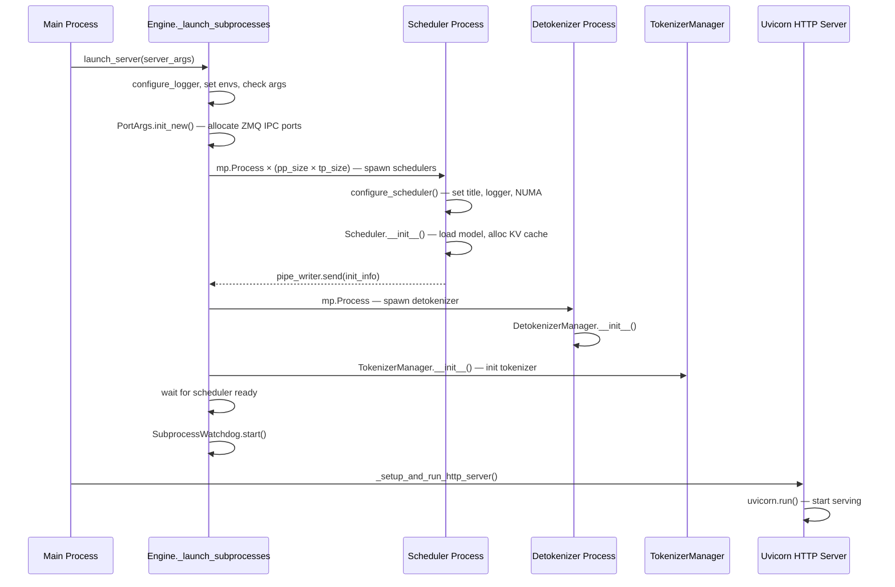
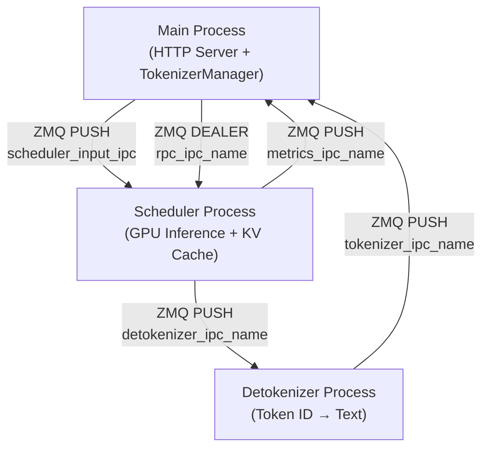

# SGLang — Startup Flow

## Entry Points

SGLang provides three primary entry points:

### 1. CLI Server Mode
```bash
python -m sglang.launch_server [options]
# or
python -m sglang_api [options]
```
Arguments are parsed via `ServerArgs` dataclass (server_args.py), which uses Python's `argparse` internally. Key flags include `--model-path`, `--tp`, `--host`, `--port`, `--mem-fraction-static`, etc.

### 2. Python API Mode
```python
engine = Engine(model_path="meta-llama/Meta-Llama-3-8B-Instruct")
```
The `Engine` class (engine.py:164) accepts the same arguments as `ServerArgs` as keyword arguments.

### 3. HTTP Server Mode (programmatic)
```python
launch_server(server_args)
```
Called internally by both the CLI and Engine paths.

---

## Core Initialization Sequence

The following traces the full startup sequence from `launch_server()` through all subprocess initialization.

### Launch Sequence Overview



### Detailed Step-by-Step

**Main Process — `launch_server()` (http_server.py:2135)**

1. Call `Engine._launch_subprocesses()` (engine.py:620) — spawns all child processes
2. Call `_setup_and_run_http_server()` (http_server.py:1962) — starts FastAPI/uvicorn

**`_launch_subprocesses()` (engine.py:620)**

1. `configure_logger(server_args)` — set log level and format (engine.py:640)
2. `_set_envs_and_config(server_args)` — configure CUDA/memory env vars (engine.py:641)
3. `server_args.check_server_args()` — validate arguments (engine.py:642)
4. `_set_gc(server_args)` — configure Python GC thresholds (engine.py:643)
5. `PortArgs.init_new(server_args)` — allocate ZMQ IPC port names and NCCL port (engine.py:647)
6. Optionally start `EngineInfoBootstrapServer` for multi-node (engine.py:652-665)
7. **Spawn scheduler processes** — `_launch_scheduler_processes()` (engine.py:668)
8. **Spawn detokenizer process** — `mp.Process(target=run_detokenizer_process_func)` (engine.py:710-717)
9. **Init TokenizerManager** — or `MultiTokenizerRouter` if `tokenizer_worker_num > 1` (engine.py:720-727)
10. `scheduler_init_result.wait_for_ready()` — block until scheduler reports readiness (engine.py:730)
11. Set `tokenizer_manager.max_req_input_len` from scheduler info (engine.py:733)
12. `SubprocessWatchdog(processes, names).start()` — monitor child process liveness (engine.py:743-746)

**`_launch_scheduler_processes()` (engine.py:514)**

For `dp_size == 1` (most common):
- Compute rank ranges: `_calculate_rank_ranges(nnodes, pp_size, tp_size, node_rank)` (engine.py:536)
- For each `(pp_rank, tp_rank)` pair:
  1. Create `mp.Pipe(duplex=False)` for init info callback (engine.py:547)
  2. Compute `gpu_id` from rank topology (engine.py:548-551)
  3. Compute parallelism ranks: `attn_cp_rank, moe_dp_rank, moe_ep_rank` (engine.py:553)
  4. Spawn `mp.Process(target=run_scheduler_process_func, args=(...))` (engine.py:558)
  5. `proc.start()` (engine.py:576)

For `dp_size > 1`:
- Spawn single `run_data_parallel_controller_process` which manages DP workers internally

**`run_scheduler_process()` (scheduler.py:3560)**

1. `configure_scheduler()` — set process title (`sglang::scheduler_TP0`), faulthandler, logger prefix (scheduler.py:3572)
2. `kill_itself_when_parent_died()` — auto-die if parent exits (scheduler.py:3576)
3. Set CPU affinity and NUMA binding if enabled (scheduler.py:3580-3586)
4. Init OpenTelemetry tracing if `enable_trace=True` (scheduler.py:3589)
5. **Create `Scheduler` object** — the heavy initialization (scheduler.py:3600)
6. `pipe_writer.send(scheduler.get_init_info())` — send init info to parent (scheduler.py:3613)
7. `scheduler.run_event_loop()` — enter main event loop (scheduler.py:3616)

**`Scheduler.__init__()` (scheduler.py:288)**

| Step | Method | Purpose |
|------|--------|---------|
| 1 | `init_model_config()` (scheduler.py:363) | Load `ModelConfig` from server_args |
| 2 | `init_metrics(tp_rank, pp_rank, dp_rank)` (scheduler.py:366) | Initialize Prometheus metrics |
| 3 | `init_ipc_channels(port_args)` (scheduler.py:369) | Create ZMQ PUSH/PULL/DEALER sockets |
| 4 | `init_pdmux()` (scheduler.py:372) | Init PD-multiplexing context |
| 5 | `init_tokenizer()` (scheduler.py:376) | Init tokenizer for detokenization |
| 6 | `init_moe_gemm_config()` (scheduler.py:379) | Configure FP8/FP4 MoE GEMM |
| 7 | `init_mamba_backend()` (scheduler.py:382) | Init Mamba selective state update |
| 8 | **`init_model_worker()`** (scheduler.py:385) | Create `TpModelWorker`, **load model weights onto GPU** |
| 9 | **`init_cache_with_memory_pool()`** (scheduler.py:391) | Allocate KV cache memory pools |
| 10 | `init_running_status()` (scheduler.py:394) | Init batch tracking state |
| 11 | `init_chunked_prefill()` (scheduler.py:397) | Configure chunked prefill |
| 12 | `init_overlap()` (scheduler.py:415) | Configure overlap scheduling |
| 13 | `init_request_dispatcher()` (scheduler.py:424) | Init request routing |
| 14 | `GrammarManager(self)` (scheduler.py:433) | Init constrained generation backend |

The most time-consuming steps are **#8** (model weight loading from disk/safetensors) and **#9** (KV cache allocation based on remaining GPU memory).

**`run_detokenizer_process()` (detokenizer_manager.py:389)**

1. `kill_itself_when_parent_died()` (line 394)
2. `setproctitle("sglang::detokenizer")` (line 395)
3. `configure_logger(server_args)` (line 396)
4. Create `DetokenizerManager(server_args, port_args)` (line 401)
5. Run `manager.event_loop()` or `multi_http_worker_event_loop()` (line 402-405)

**`TokenizerManager.__init__()` (tokenizer_manager.py:181)**

1. `init_model_config()` — read model config (tokenizer_manager.py:194)
2. `init_tokenizer_and_processor()` — load HF tokenizer (tokenizer_manager.py:197)
3. `init_ipc_channels(port_args)` — create ZMQ sockets to scheduler (tokenizer_manager.py:200)
4. `init_running_status()` — init async request tracking (tokenizer_manager.py:203)
5. `init_request_logging_and_dumping()` (tokenizer_manager.py:206)
6. `init_weight_update()` — set up weight update channel (tokenizer_manager.py:209)
7. `init_lora()` — init LoRA registry (tokenizer_manager.py:212)
8. `init_metric_collector_watchdog()` (tokenizer_manager.py:221)
9. `init_request_dispatcher()` (tokenizer_manager.py:224)

---

## Thread Model

| Thread | Created At | Role |
|--------|-----------|------|
| **Main thread** | OS | Uvicorn event loop, FastAPI request handling |
| **TokenizerManager async loop** | Engine.__init__ | `asyncio.EventLoop` for tokenization and IPC to scheduler |
| **Scheduler event loop** | scheduler.py:1290 | Main batch scheduling + GPU forward passes |
| **Scheduler CUDA stream** | scheduler.py:1296 | `torch.cuda.Stream(priority=0)` for GPU compute |
| **ZMQ recv thread** | init_ipc_channels | Background thread for receiving ZMQ messages |
| **SubprocessWatchdog** | engine.py:743 | Monitors child process liveness, auto-restart |

In overlap scheduling mode (scheduler.py:1331), the scheduler interleaves CPU processing of batch N+1 with GPU computation of batch N, using separate CUDA streams.

---

## Process Model



| Process | Spawned By | IPC Mechanism | Key Responsibility |
|---------|-----------|---------------|-------------------|
| Main (HTTP + TokenizerMgr) | OS / user | ZMQ client | Tokenize requests, route to scheduler, return results |
| Scheduler × (pp×tp) | `mp.Process` in `_launch_scheduler_processes` | ZMQ PUSH/PULL/DEALER | GPU batch scheduling, model forward, KV cache management |
| Detokenizer | `mp.Process` in `_launch_subprocesses` | ZMQ PUSH/PULL | Decode token IDs to text, stream to tokenizer manager |
| Data Parallel Controller | `mp.Process` (if dp_size>1) | Internal | Route requests across DP replicas |

**ZMQ IPC Channels** (defined in `PortArgs`, server_args.py:6547):

| Channel | Socket Type | Direction | Purpose |
|---------|------------|-----------|---------|
| `scheduler_input_ipc_name` | PULL | TokenizerMgr → Scheduler | Send tokenized requests |
| `detokenizer_ipc_name` | PUSH | Scheduler → Detokenizer | Send output token IDs |
| `tokenizer_ipc_name` | PUSH | Detokenizer → TokenizerMgr | Return decoded text |
| `rpc_ipc_name` | DEALER | Engine → Scheduler | RPC calls (weight update, flush, etc.) |
| `metrics_ipc_name` | PUSH | Scheduler → Main | Metrics data |

**Pipe Communication**: Scheduler processes also use `mp.Pipe` to send initialization info back to the parent process during startup.

**NCCL**: Tensor parallel communication uses `torch.distributed` initialized via NCCL on `port_args.nccl_port`.

---

## Memory Layout at Startup

### GPU VRAM Allocations

The GPU memory is divided as follows during scheduler initialization:

```
┌─────────────────────────────────────────────────┐
│                 GPU VRAM                         │
├─────────────────────────────────────────────────┤
│  Model Weights                                  │
│  (safetensors → torch.Tensor on GPU)             │
│  Loaded by TpModelWorker via ModelLoader         │
│  Size: depends on model + quantization           │
├─────────────────────────────────────────────────┤
│  KV Cache (token_to_kv_pool)                     │
│  Allocated by init_cache_with_memory_pool()      │
│  Size: (1 - mem_fraction_static) × remaining     │
│  Per-layer: [size, page_size, head_dim, 2]       │
│  dtype: FP16/F32/FP8 based on quantization       │
├─────────────────────────────────────────────────┤
│  req_to_token_pool                               │
│  torch.zeros((max_running_reqs, max_ctx_len))    │
│  dtype: int32 — maps request → token positions   │
├─────────────────────────────────────────────────┤
│  Activation buffers, CUDA workspace              │
│  Temporary tensors for forward pass              │
└─────────────────────────────────────────────────┘
```

### CPU Memory Allocations

| Region | Purpose | Size |
|--------|---------|------|
| Tokenizer vocab | HuggingFace tokenizer model | ~1-10 MB |
| ZMQ buffers | IPC message queues | Small |
| Request metadata | Pending/running request objects | O(max_running_reqs) |
| Model config | HuggingFace config.json | Small |
| LoRA adapters | If enabled, per-adapter weights | Variable |

### Memory Pool Architecture

1. **`ReqToTokenPool`** (memory_pool.py:126): Pre-allocated `[size × max_context_len]` int32 tensor. Each row maps a request's tokens to their KV cache slot indices.

2. **`TokenToKVPoolAllocator`** (allocator.py:117): Manages a pool of free KV cache pages. `free_pages` tensor tracks available slots; `alloc(n)` returns n consecutive page indices.

3. **`KVCache`** (memory_pool.py:645): Abstract base for per-layer KV cache tensors. Concrete implementations handle paged attention with configurable page size.

The KV cache size is determined by:
```
available_memory = total_gpu_memory - model_weights_size
kv_cache_tokens = available_memory × mem_fraction_static / bytes_per_token
```
where `bytes_per_token` depends on model hidden size, number of layers, and KV data type.
