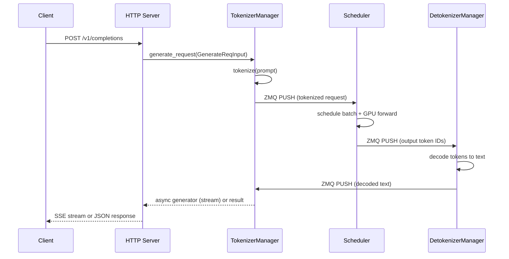

# SGLang — API / Interface Analysis

## API Surface

SGLang exposes three API interfaces:

1. **HTTP API** — OpenAI-compatible REST endpoints via FastAPI (http_server.py)
2. **Python API** — Direct `Engine` class for programmatic access (engine.py)
3. **Ollama/Anthropic Compatibility** — Subset of Ollama and Anthropic APIs

---

## HTTP API Endpoints

### Generation Endpoints

#### POST /v1/completions (http_server.py:1380)

OpenAI-compatible text completion endpoint.

**Handler:** `handle_completions()` via `generate_request` pipeline

**Input:**
| Field | Type | Description |
|-------|------|-------------|
| model | string | Model name |
| prompt | string/array | Input text or token IDs |
| max_tokens | int | Maximum tokens to generate |
| temperature | float | Sampling temperature |
| top_p | float | Nucleus sampling threshold |
| stream | bool | Enable SSE streaming |
| stop | string/array | Stop sequences |
| logprobs | int | Return log probabilities |

**Execution Flow:**
1. Parse and validate request body
2. Create `GenerateReqInput` object (io_struct.py:133)
3. Submit to `TokenizerManager.generate_request()` — tokenizes input
4. TokenizerManager sends tokenized request to Scheduler via ZMQ
5. Scheduler schedules batch, runs GPU forward pass
6. Output tokens sent to DetokenizerManager via ZMQ
7. DetokenizerManager decodes tokens, returns to TokenizerManager
8. TokenizerManager streams or returns response to HTTP client

#### POST /v1/chat/completions (http_server.py:1388)

OpenAI-compatible chat completion endpoint. Identical pipeline to `/v1/completions` but accepts chat message format (`messages` array) instead of raw `prompt`.

**Additional Input:**
| Field | Type | Description |
|-------|------|-------------|
| messages | array | Chat message history with roles |
| tools | array | Tool/function definitions |
| tool_choice | string/object | Tool selection policy |
| response_format | object | JSON schema constraint |

The chat template is applied via the model's `chat_template` from the tokenizer to convert messages into a single prompt string before tokenization.

#### POST /v1/responses (http_server.py:1563)

OpenAI Responses API — newer stateful API for multi-turn interactions.

**Handler:** Creates a `GenerateReqInput` with response-specific parameters.

**Additional Features:**
- Stateful response objects with `response_id`
- Support for `previous_response_id` chaining
- Built-in tool use

#### GET /v1/responses/{'{response_id}'} (http_server.py:1583)

Retrieve a previously created response by ID.

#### POST /v1/responses/{'{response_id}'}/cancel (http_server.py:1591)

Cancel an in-progress response.

---

### Embedding Endpoints

#### POST /v1/embeddings (http_server.py:1398)

OpenAI-compatible embedding generation.

**Handler:** `handle_embeddings()` → `TokenizerManager.encode_request()`

**Input:**
| Field | Type | Description |
|-------|------|-------------|
| model | string | Model name |
| input | string/array | Text or token IDs to embed |

**Execution Flow:** Same pipeline but the scheduler runs in embedding mode (no sampling, just hidden state extraction from the last layer).

#### POST /v1/score (http_server.py:1555)

Scoring/re-ranking endpoint. Computes log-probability scores for given texts.

---

### Audio Endpoints

#### POST /v1/audio/transcriptions (http_server.py:1458)

Audio transcription using Whisper-style models. Accepts multipart audio file upload, returns transcribed text.

---

### Model Information Endpoints

#### GET /v1/models (http_server.py:1498)

List available models. Returns OpenAI-compatible model list.

#### GET /v1/models/{'{model}'} (http_server.py:1530)

Get details for a specific model.

#### GET /get_model_info (http_server.py:551) / GET /model_info (http_server.py:561)

Returns model-specific info: context length, tokenizer info, etc.

#### GET /get_server_info (http_server.py:591) / GET /server_info (http_server.py:601)

Returns server status: GPU memory usage, queue lengths, etc.

#### GET /get_load (http_server.py:621)

Returns current server load metrics.

---

### Health Endpoints

#### GET /health (http_server.py:476)

Lightweight health check — returns 200 OK if server is running.

#### GET /health_generate (http_server.py:477)

Health check with actual generation — generates a short token to verify full pipeline works.

---

### Weight Management Endpoints

#### POST /update_weights_from_disk (http_server.py:938)

Load new model weights from disk path. Used for model hot-swapping.

**Input:**
| Field | Type | Description |
|-------|------|-------------|
| model_path | string | Path to new model weights |
| load_format | string | Weight loading format |

#### POST /update_weights_from_tensor (http_server.py:1066)

Update specific weight tensors in-memory.

#### POST /update_weights_from_distributed (http_server.py:1088)

Update weights from a distributed source (for multi-node weight sync).

#### POST /update_weights_from_ipc (http_server.py:1107)

Update weights via IPC shared memory.

#### POST /init_weights_update_group (http_server.py:1035)

Initialize a weight update group for coordinated multi-node updates.

#### POST /destroy_weights_update_group (http_server.py:1051)

Destroy a previously created weight update group.

#### POST /weights_checker (http_server.py:1193)

Validate current model weights integrity.

---

### Control Endpoints

#### POST /abort_request (http_server.py:1300)

Abort an in-progress request by ID.

**Input:**
| Field | Type | Description |
|-------|------|-------------|
| rid | string | Request ID to abort |

#### POST /pause_generation (http_server.py:1355)

Pause the generation engine (stops accepting new batches).

#### POST /continue_generation (http_server.py:1366)

Resume the generation engine after pause.

#### POST /flush_cache (internal)

Clear the KV cache and radix tree.

---

### Anthropic-Compatible Endpoints

#### POST /v1/messages (http_server.py:1658)

Anthropic Messages API compatibility layer. Converts Anthropic request format to internal `GenerateReqInput`.

#### POST /v1/messages/count_tokens (http_server.py:1668)

Count tokens for a given message sequence using the Anthropic API format.

---

### Ollama-Compatible Endpoints

#### POST /api/chat (http_server.py:1629)

Ollama chat API — converts Ollama request format to internal format.

#### POST /api/generate (http_server.py:1635)

Ollama generate API.

#### GET /api/tags (http_server.py:1643)

Ollama tags API — lists available models.

#### POST /api/show (http_server.py:1649)

Ollama show API — model details.

---

### HiCache Storage Endpoints

#### GET /hicache/storage-backend (http_server.py:831)

Returns information about the hierarchical cache storage backend configuration.

---

## Python API — Engine Class

The `Engine` class (engine.py:164) provides a programmatic Python API for all server functionality:

### Generation Methods

| Method | Description |
|--------|-------------|
| `generate(prompt, sampling_params)` | Generate text completion |
| `encode(prompt)` | Generate embeddings |
| `async_generate(prompt, sampling_params)` | Async generation with streaming |

### Session Methods

| Method | Description |
|--------|-------------|
| `open_session(capacity, session_id, streaming, timeout)` | Open a multi-turn conversation session with shared KV cache |
| `close_session(session_id)` | Close session and release resources |

### Weight Management Methods

| Method | Description |
|--------|-------------|
| `update_weights_from_disk(model_path)` | Hot-swap model weights |
| `update_weights_from_tensor(named_tensors)` | Update specific weight tensors |
| `init_weights_update_group()` | Initialize weight update coordination |
| `destroy_weights_update_group()` | Cleanup weight update group |

### Profiling Methods

| Method | Description |
|--------|-------------|
| `start_profile()` | Start PyTorch profiler |
| `stop_profile()` | Stop profiler and save trace |
| `start_expert_distribution_record()` | Record MoE expert usage |
| `stop_expert_distribution_record()` | Stop expert distribution recording |

### Utility Methods

| Method | Description |
|--------|-------------|
| `flush_cache()` | Clear KV cache |
| `shutdown()` | Gracefully shut down all subprocesses |

---

## Internal IPC API

Processes communicate via ZMQ using serialized Python objects. Key message types defined in `io_struct.py`:

### Request Messages (TokenizerManager → Scheduler)

| Class | Purpose |
|-------|---------|
| `GenerateReqInput` (io_struct.py:133) | Text generation request |
| `EmbeddingReqInput` (io_struct.py:771) | Embedding request |
| `TokenizedGenerateReqInput` (io_struct.py:671) | Pre-tokenized generation request |
| `TokenizedEmbeddingReqInput` (io_struct.py:922) | Pre-tokenized embedding request |

### Response Messages (Detokenizer → TokenizerManager)

| Class | Purpose |
|-------|---------|
| `BatchTokenIDOutput` (io_struct.py:961) | Batch of output token IDs |
| `BatchStrOutput` (io_struct.py:1029) | Batch of decoded strings |
| `BatchEmbeddingOutput` (io_struct.py:1092) | Batch of embedding vectors |

### RPC Messages (Engine → Scheduler via DEALER)

RPC calls support: `flush_cache`, `update_weights`, `start_profile`, `abort_request`, `open_session`, `close_session`, etc.
