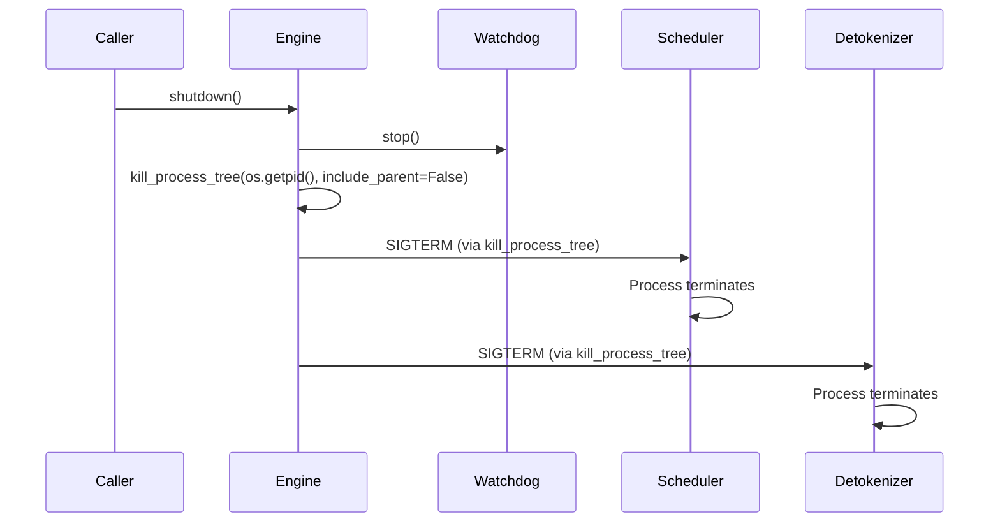

# SGLang — Shutdown & Cleanup

## Signal Handling

### Main Process Signal Handling

During the launch phase, SGLang registers a SIGQUIT handler (engine.py:1157):

```python
signal.signal(signal.SIGQUIT, launch_phase_sigquit_handler)
```

After server args are fully processed, if a custom SIGQUIT handler is specified, it replaces the default (engine.py:1163):

```python
signal.signal(signal.SIGQUIT, server_args.custom_sigquit_handler)
```

### Child Process Signal Behavior

Both scheduler and detokenizer subprocesses use:

- **`kill_itself_when_parent_died()`** (scheduler.py:3576, detokenizer_manager.py:394) — Monitors parent process liveness. If the parent dies, the child automatically terminates. This prevents orphan processes.

- **`faulthandler.enable()`** (scheduler.py:3551) — Enables Python's faulthandler to dump tracebacks on segfaults.

- **SIGQUIT to parent on exception** — If either child process encounters an unhandled exception, it sends `SIGQUIT` to the parent process before dying:
  - Scheduler: `parent_process.send_signal(signal.SIGQUIT)` (scheduler.py:3621)
  - Detokenizer: `parent_process.send_signal(signal.SIGQUIT)` (detokenizer_manager.py:411)

This design ensures that if any critical component fails, the entire server shuts down rather than continuing in a broken state.

---

## Shutdown Sequence

### Engine.shutdown() (engine.py:756)



**Detailed Steps:**

1. **Stop SubprocessWatchdog** (engine.py:762) — The watchdog thread that monitors child process liveness is stopped first.

2. **Kill all child processes** (engine.py:763) — `kill_process_tree(os.getpid(), include_parent=False)` sends SIGTERM to all descendant processes:
   - All scheduler processes (one per tp_rank × pp_rank)
   - The detokenizer process
   - Any data parallel controller processes

3. **Return** — The function does not explicitly wait for processes to terminate or clean up GPU resources. The OS handles process cleanup when they receive SIGTERM.

### atexit Registration

The `Engine.__init__` method registers `shutdown()` as an atexit handler (engine.py:188):

```python
atexit.register(self.shutdown)
```

This ensures that even if the user doesn't explicitly call `shutdown()`, child processes are killed when the Python interpreter exits.

### Context Manager Support

The Engine class supports Python's context manager protocol (engine.py:765-769):

```python
with Engine(model_path="...") as engine:
    result = engine.generate(...)
# shutdown() called automatically on exit
```

---

## Resource Cleanup Inventory

| Resource | Cleanup Method | Location | Notes |
|----------|---------------|---------|-------|
| Scheduler processes | `kill_process_tree()` | engine.py:763 | SIGTERM sent to all child PIDs |
| Detokenizer process | `kill_process_tree()` | engine.py:763 | Killed as child of main process |
| SubprocessWatchdog thread | `watchdog.stop()` | engine.py:762 | Stops monitoring thread |
| ZMQ sockets | Process exit cleanup | OS-level | ZMQ sockets closed when process dies |
| NCCL communicator | Process exit cleanup | OS-level | NCCL cleaned up on process termination |
| GPU KV cache memory | Process exit cleanup | CUDA runtime | `cudaFree` called by CUDA runtime on process exit |
| Model weights (GPU) | Process exit cleanup | CUDA runtime | `cudaFree` called by CUDA runtime on process exit |
| PyTorch CUDA streams | Process exit cleanup | CUDA runtime | Automatically destroyed |
| Shared memory (if used) | OS cleanup | OS-level | `/dev/shm` segments released on process exit |
| IPC pipes | `mp.Pipe` cleanup | OS-level | File descriptors closed on process exit |

---

## Graceful Shutdown Considerations

The current shutdown implementation is **not** graceful in the traditional sense:

- **No in-flight request draining**: Active requests are terminated when the scheduler process is killed.
- **No KV cache persistence**: The KV cache is not saved to disk before shutdown.
- **No WAL flushing**: There is no write-ahead log to replay on restart.
- **No connection draining**: The HTTP server stops accepting new connections but does not wait for active HTTP connections to complete.

The design philosophy prioritizes simplicity: since SGLang is a stateless inference server (beyond the KV cache which is rebuilt on startup), a hard shutdown with process tree killing is sufficient. The KV cache is ephemeral and can be reconstructed as requests arrive.
