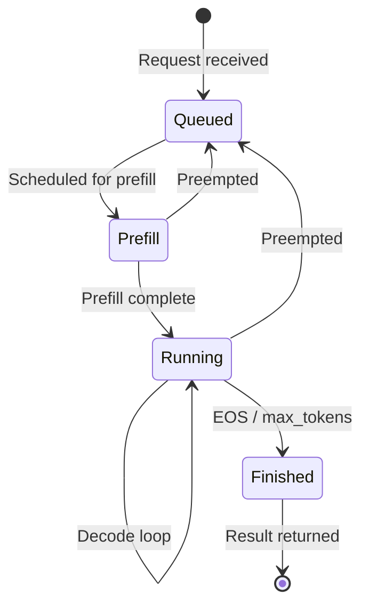

# SGLang — Core Data Structures

## Overview

SGLang's core data structures serve three main purposes:
1. **Request lifecycle** — tracking requests from receipt to completion
2. **Memory management** — efficient GPU memory allocation for KV caches
3. **Batch scheduling** — grouping requests for GPU execution

---

## Request Structures

### `Req` (schedule_batch.py:557)

The fundamental request object that tracks all state for a single inference request.

**Purpose:** Holds input, output, memory mapping, and scheduling state for one request throughout its lifecycle.

**Key Fields:**

| Field | Type | Purpose |
|-------|------|---------|
| `rid` | str | Unique request identifier |
| `origin_input_text` | str | Raw input text |
| `origin_input_ids` | List[int] | Tokenized input IDs (padded) |
| `origin_input_ids_unpadded` | Tuple[int] | Tokenized input IDs (before image padding) |
| `output_ids` | List[int] | Generated output token IDs |
| `fill_ids` | List[int] | Combined input + output token IDs |
| `sampling_params` | SamplingParams | Temperature, top_p, top_k, etc. |
| `stream` | bool | Whether to stream output |
| `return_logprob` | bool | Whether to return log probabilities |
| `req_pool_idx` | int/None | Index into `ReqToTokenPool` for this request |
| `kv_committed_len` | int | Length of KV cache that has been committed |
| `kv_allocated_len` | int | Length of KV cache that has been allocated |
| `session` | Session/None | Multi-turn session object |
| `lora_id` | str/None | LoRA adapter ID |
| `input_embeds` | List/None | Custom input embeddings |
| `priority` | int/None | Scheduling priority |
| `extend_batch_idx` | int | Index in the current extend (prefill) batch |
| `decode_batch_idx` | int | Index in the current decode batch |
| `http_worker_ipc` | str/None | IPC channel for multi-worker responses |

**Key State Machine:**



**Complex Logic:**
- KV cache memory tracking: `kv_committed_len` and `kv_allocated_len` track the boundary between committed (safe to keep) and over-allocated (may need to be freed) KV cache slots.
- SWA (Sliding Window Attention) eviction: `swa_evicted_seqlen` tracks how many old tokens have been evicted from the sliding window.

---

### `GenerateReqInput` (io_struct.py:133)

The public-facing request object received from HTTP or Python API, before tokenization.

**Purpose:** Carries user-facing parameters (text, sampling params) from the API layer to the TokenizerManager.

**Key Fields:**

| Field | Type | Purpose |
|-------|------|---------|
| `text` | str | Input prompt text |
| `sampling_params` | dict/SamplingParams | Generation parameters |
| `rid` | str | Client-provided request ID |
| `stream` | bool | Stream mode flag |
| `return_logprob` | bool | Return logprobs |
| `lora_path` | str/None | LoRA adapter path |
| `session_id` | str/None | Multi-turn session ID |

---

## Memory Pool Structures

### `ReqToTokenPool` (memory_pool.py:126)

**Purpose:** Maps each active request to its token positions in the KV cache. This is the central indirection layer that allows flexible KV cache sharing via the radix tree.

**Structure:**
```
req_to_token: torch.Tensor  # shape: [max_running_reqs, max_context_len], dtype=int32
free_slots: List[int]        # Available row indices
```

- Each row corresponds to one request (indexed by `req.req_pool_idx`).
- Each column holds a KV cache slot index for the token at that position.
- The pool is pre-allocated at startup based on `max_running_requests` and `max_context_len`.

**Key Methods:**

| Method | Complexity | Notes |
|--------|-----------|-------|
| `alloc(reqs)` | O(n) | Allocate rows for new requests; supports reusing existing slots for chunked prefill |
| `free(req)` | O(1) | Return a row to the free list |
| `write(indices, values)` | O(1) | Write token→KV mapping entries |

**Complex Logic:** The `alloc()` method supports reuse of existing slots for requests that are continuing from a previous chunked prefill batch. This is critical for chunked prefill where a single long request may span multiple batches.

---

### `TokenToKVPoolAllocator` (allocator.py:117)

**Purpose:** Manages the pool of free KV cache page slots. Allocates and frees pages of KV cache storage.

**Structure:**
```
free_pages: torch.Tensor      # Available page indices, shape: [N], dtype=int64
release_pages: torch.Tensor   # Pages pending release (sorted mode)
free_group: List[Tensor]      # Batched free operations
```

**Key Methods:**

| Method | Complexity | Notes |
|--------|-----------|-------|
| `alloc(need_size)` | O(1) amortized | Returns `need_size` consecutive page indices from the front of `free_pages` |
| `free(free_index)` | O(1) | Append freed pages to `release_pages` or `free_group` |
| `merge_and_sort_free()` | O(n log n) | Merge `release_pages` into `free_pages` and sort for contiguous allocation |

**Design Intent:** The two-tier free list (`free_pages` + `release_pages`) amortizes the cost of sorting. Freed pages are accumulated in `release_pages`, and only merged back when `alloc()` needs contiguous pages and the main `free_pages` is insufficient.

---

### `KVCache` (memory_pool.py:645)

**Purpose:** Abstract base class for per-layer KV cache storage on GPU.

**Key Fields:**

| Field | Type | Purpose |
|-------|------|---------|
| `size` | int | Total number of token slots |
| `page_size` | int | Number of tokens per page |
| `dtype` | torch.dtype | Storage data type (FP16, FP8, etc.) |
| `layer_num` | int | Total number of model layers |
| `start_layer` / `end_layer` | int | Layer range (for pipeline parallelism) |

**Concrete Implementations:**
- `TorchKVCache` — Standard PyTorch tensor-based KV cache
- `FlashInferKVCache` — Optimized for FlashInfer attention backend
- `TokenAttentionKVCache` — For token-level attention backends

---

## Cache Structures

### `RadixCache` (radix_cache.py:285)

**Purpose:** Prefix-aware cache tree that enables automatic KV cache sharing across requests with common prefixes. This is SGLang's key innovation for efficient multi-turn and multi-request serving.

**Structure:** A tree where:
- Each node represents a token sequence prefix
- Nodes store KV cache slot ranges (via `token_to_kv_pool_allocator`)
- The tree structure enables O(log n) prefix matching

**Key Operations:**

| Operation | Complexity | Notes |
|-----------|-----------|-------|
| `match_prefix(key)` | O(depth) | Find longest matching prefix in the tree |
| `insert(key, value)` | O(depth) | Insert a new prefix, potentially splitting nodes |
| `evict(size)` | O(evicted_nodes) | Evict least-recently-used nodes to free KV cache pages |

**Eviction Policies:**

| Policy | Class | Behavior |
|--------|-------|----------|
| LRU | `LRUStrategy` | Evict least recently accessed |
| LFU | `LFUStrategy` | Evict least frequently accessed |
| FIFO | `FIFOStrategy` | Evict oldest insertion |
| MRU | `MRUStrategy` | Evict most recently accessed |
| FILO | `FILOStrategy` | Evict newest insertion |
| Priority | `PriorityStrategy` | Evict by priority level |
| SLRU | `SLRUStrategy` | Segmented LRU |

**Design Intent:** The radix cache enables "automatic KV cache sharing" — when two requests share a common system prompt or conversation prefix, the KV cache for that prefix is computed only once and shared between them. This dramatically reduces both compute and memory for multi-turn conversations.

### `RadixCacheCpp` (radix_cache_cpp.py:35)

C++ implementation of the radix cache via pybind11 for higher performance. Supports write-through and write-back caching policies for the hierarchical cache (HiCache).

---

## Batch Structures

### `ScheduleBatch` (schedule_batch.py:1307)

**Purpose:** Groups all information needed to execute one batch of requests on the GPU.

**Key Fields:**

| Field | Type | Purpose |
|-------|------|---------|
| `reqs` | List[Req] | Requests in this batch |
| `req_to_token_pool` | ReqToTokenPool | Memory pool reference |
| `token_to_kv_pool_allocator` | TokenToKVPoolAllocator | KV page allocator |
| `tree_cache` | BasePrefixCache | Radix cache reference |
| `forward_mode` | ForwardMode | EXTEND (prefill) or DECODE |
| `input_ids` | torch.Tensor [b] | Token IDs for this batch step |
| `req_pool_indices` | torch.Tensor [b] | Request pool indices |
| `seq_lens` | torch.Tensor [b] | Current sequence lengths |
| `out_cache_loc` | torch.Tensor [b] | Output KV cache locations |
| `sampling_info` | SamplingBatchInfo | Batched sampling parameters |
| `multimodal_inputs` | List/None | Image/audio inputs |

**Design Intent:** The batch is a transient object created each iteration of the scheduler loop. It is assembled from pending/running requests, sent to the model worker for GPU execution, then disassembled to process results.

### `ModelWorkerBatch` (schedule_batch.py:2486)

**Purpose:** A flattened representation of a batch optimized for GPU execution. Contains pre-computed tensors ready for the model forward pass.

---

## Model Configuration

### `ModelConfig` (model_config.py:96)

**Purpose:** Centralizes all model-specific configuration parsed from HuggingFace config.json.

**Key Fields:**

| Field | Type | Purpose |
|-------|------|---------|
| `model_path` | str | HuggingFace model ID or local path |
| `context_len` | int | Maximum sequence length |
| `hf_config` | AutoConfig | Parsed HuggingFace config |
| `is_generation` | bool | Whether model generates text (vs. embedding) |
| `is_multimodal` | bool | Whether model accepts images/audio |
| `head_dim` | int | Attention head dimension |
| `num_attention_heads` | int | Number of attention heads |
| `num_key_value_heads` | int | Number of KV heads (GQA) |
| `num_hidden_layers` | int | Number of transformer layers |
| `hidden_size` | int | Hidden dimension |
| `vocab_size` | int | Vocabulary size |
| `page_size` | int | KV cache page size |

### `ModelImpl` (model_config.py:48)

Enum for model implementation backend:
- `SGLANG` — Custom SGLang implementation (optimized)
- `TRANSFORMERS` — HuggingFace Transformers backend (compatibility)

---

## IPC Message Structures

### `PortArgs` (server_args.py:6547)

**Purpose:** Defines all ZMQ IPC channel names and NCCL port for inter-process communication.

| Field | Type | Purpose |
|-------|------|---------|
| `tokenizer_ipc_name` | str | ZMQ socket: Detokenizer → TokenizerManager |
| `scheduler_input_ipc_name` | str | ZMQ socket: TokenizerManager → Scheduler |
| `detokenizer_ipc_name` | str | ZMQ socket: Scheduler → Detokenizer |
| `nccl_port` | int | Port for NCCL distributed initialization |
| `rpc_ipc_name` | str | ZMQ socket: Engine RPC → Scheduler |
| `metrics_ipc_name` | str | ZMQ socket: Scheduler metrics → Main |
| `tokenizer_worker_ipc_name` | str/None | Multi-tokenizer worker channel |

---

## Auxiliary Structures

### `Session` (io_struct.py)

**Purpose:** Multi-turn conversation session that maintains shared KV cache context across requests.

### `GrammarManager` (grammar_manager.py:24)

**Purpose:** Manages constrained generation (JSON schema, regex, grammar) via backend implementations:
- `XGrammarGrammarBackend` — xgrammar-based
- `GuidanceBackend` — llguidance-based
- `ReasonerGrammarBackend` — reasoning-aware

### `MemoryMetrics` (tokenizer_manager.py:1759)

**Purpose:** Tracks GPU memory usage statistics for monitoring and auto-scaling.
