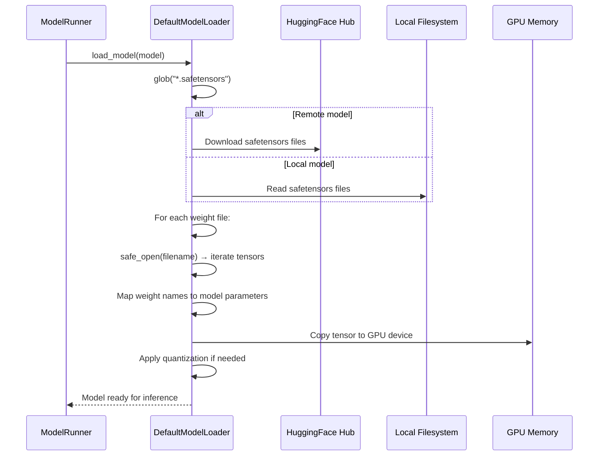

# SGLang — Storage File Analysis

## Overview

SGLang reads model weights from persistent storage and optionally writes hierarchical cache data. It does not maintain its own custom file format for model weights — it leverages the HuggingFace ecosystem (safetensors format) and adds specialized loaders.

---

## Model Weight Files

### SafeTensors Format (`.safetensors`)

**Location:** Specified by `--model-path` (HuggingFace model ID or local path)

**Loading Chain:**

1. `ModelRunner.load_model()` (model_runner.py:1071) — Entry point
2. `ModelRunner._load_model()` (model_runner.py:101) — Creates model architecture
3. `loader.load_model()` (model_runner.py:1159) — Loads weights into the model

**Model Loaders** (loader.py):

| Loader | Class | When Used |
|--------|-------|-----------|
| DefaultModelLoader | loader.py:302 | Standard safetensors/PyTorch loading |
| LayeredModelLoader | loader.py:712 | Layer-by-layer loading for memory efficiency |
| QuantizedRLModelLoader | loader.py:786 | Quantized models (GPTQ, AWQ) |
| GGUFModelLoader | loader.py:1974 | GGUF format models |
| BitsAndBytesModelLoader | loader.py:1496 | bitsandbytes quantized models |
| ShardedStateLoader | loader.py:1315 | Load from PyTorch sharded state dict |
| RemoteModelLoader | loader.py:2413 | Load from remote server |
| RemoteInstanceModelLoader | loader.py:2080 | Load from remote SGLang instance |
| DummyModelLoader | loader.py:1259 | Testing (no real weights) |
| ModelOptModelLoader | loader.py:2594 | NVIDIA ModelOpt quantized models |

**Default Loading Flow:**



**SafeTensors File Format:**
```
[8 bytes]    Header length (uint64, little-endian)
[N bytes]    JSON header: {"__metadata": {...}, "tensor_name": {dtype, shape, data_offsets}}
[Padding]    Alignment to 8-byte boundary
[N bytes]    Raw tensor data (contiguous, mmap-able)
```

The safetensors format is preferred over PyTorch's `.bin` format because:
- Memory-safe: No pickle deserialization (no arbitrary code execution)
- Mmap-friendly: Tensors can be memory-mapped without loading into RAM
- Fast: Zero-copy loading for large models

---

## Weight Update Storage

### Dynamic Weight Updates

SGLang supports hot-swapping model weights at runtime:

| Endpoint | Storage Source | Loader |
|----------|---------------|--------|
| `/update_weights_from_disk` | Local filesystem path | Re-loads via DefaultModelLoader |
| `/update_weights_from_tensor` | In-memory tensor dict | Direct parameter copy |
| `/update_weights_from_distributed` | Remote source | RemoteModelLoader |
| `/update_weights_from_ipc` | IPC shared memory | Direct memory copy |

Weight updates are applied in-place on the GPU without reinitializing the model architecture, enabling fast model switching.

---

## Hierarchical Cache Storage (HiCache)

### HiCacheFile (hicache_storage.py:303)

**Purpose:** Persistent hierarchical cache that can offload KV cache pages to disk or remote storage.

**Configuration:**

| Field | Type | Purpose |
|-------|------|---------|
| `hicache_storage_backend` | str/None | Backend type (file, etc.) |
| `hicache_write_policy` | str | "write_through" or "write_back" |

The HiCache storage extends the radix cache with a secondary storage tier:
- **Write-through**: KV cache pages are written to storage immediately when created
- **Write-back**: KV cache pages are written lazily when evicted from GPU memory

---

## Configuration Files

SGLang reads the following configuration files during startup:

| File | Location | Purpose |
|------|----------|---------|
| `config.json` | Model directory | HuggingFace model config (architecture, dimensions, attention type) |
| `tokenizer.json` / `tokenizer.model` | Model directory | Tokenizer vocabulary and merges |
| `tokenizer_config.json` | Model directory | Tokenizer metadata, chat template |
| `generation_config.json` | Model directory | Default generation parameters |
| `*.safetensors` | Model directory | Model weight files |
| `adapter_model.safetensors` | LoRA directory | LoRA adapter weights |

---

## Crash Dump Storage

When `--crash-dump-folder` is specified, SGLang writes diagnostic dumps on crashes:

| File | Content |
|------|---------|
| `scheduler_dump_*.json` | Scheduler state at crash time |
| `detokenizer_dump_*.json` | Detokenizer state at crash time |

---

## Summary

> SGLang does not define any custom persistent file format. It relies on the HuggingFace safetensors format for model weights and adds specialized loaders for various quantization schemes and remote sources. The only persistent storage it writes is the optional HiCache (for KV cache offloading) and crash dumps.
