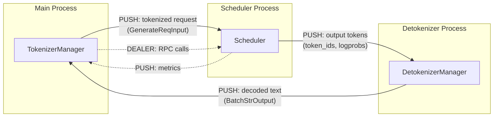

# SGLang — Network Protocol Analysis

## Overview

SGLang uses **ZMQ (ZeroMQ)** for inter-process communication between its three process components. The protocol is straightforward: Python objects are serialized (via pickle) and sent over ZMQ PUSH/PULL/DEALER sockets. There is no custom binary framing protocol — ZMQ handles message boundaries natively.

For external communication, SGLang uses standard HTTP (via FastAPI/uvicorn) with JSON request/response bodies and SSE for streaming.

---

## ZMQ IPC Protocol

### Message Transport

**Library:** `pyzmq` (Python bindings for ZeroMQ)

**Socket Types:**

| Socket | Type | Pattern | Purpose |
|--------|------|---------|---------|
| TokenizerMgr → Scheduler | PUSH/PULL | Pipeline | Send tokenized requests |
| Scheduler → Detokenizer | PUSH/PULL | Pipeline | Send output tokens |
| Detokenizer → TokenizerMgr | PUSH/PULL | Pipeline | Return decoded text |
| Engine → Scheduler (RPC) | DEALER/ROUTER | Request-Reply | RPC calls (weight update, flush, etc.) |
| Scheduler → Main (Metrics) | PUSH/PULL | Pipeline | Send metrics data |

### IPC Channel Setup (PortArgs)

Channels use Unix domain sockets (IPC transport) on Linux:

```python
# PortArgs.init_new() (server_args.py:6568)
tokenizer_ipc_name = f"ipc://{tempfile.NamedTemporaryFile(delete=False).name}"
scheduler_input_ipc_name = f"ipc://{tempfile.NamedTemporaryFile(delete=False).name}"
detokenizer_ipc_name = f"ipc://{tempfile.NamedTemporaryFile(delete=False).name}"
rpc_ipc_name = f"ipc://{tempfile.NamedTemporaryFile(delete=False).name}"
metrics_ipc_name = f"ipc://{tempfile.NamedTemporaryFile(delete=False).name}"
```

Each IPC name is a unique Unix domain socket path in `/tmp/`.

### Message Format

ZMQ messages are Python objects serialized with pickle:

```
┌─────────────────────────────────────────┐
│  ZMQ Message Frame (auto-delimited)     │
│  ┌───────────────────────────────────┐  │
│  │  Pickled Python object            │  │
│  │  (GenerateReqInput,               │  │
│  │   BatchTokenIDOutput,             │  │
│  │   FlushCacheReqInput, etc.)       │  │
│  └───────────────────────────────────┘  │
└─────────────────────────────────────────┘
```

ZMQ guarantees:
- **Message integrity**: Each `send()`/`recv()` pair transfers exactly one complete message
- **No framing needed**: ZMQ handles message boundaries internally
- **No checksum needed**: ZMQ guarantees in-order, lossless delivery over IPC

### Message Flow Diagram



### Key Message Types

**Request Messages (TokenizerManager → Scheduler):**

| Class | Fields | Purpose |
|-------|--------|---------|
| `TokenizedGenerateReqInput` | input_ids, sampling_params, rid, stream, ... | Generation request after tokenization |
| `TokenizedEmbeddingReqInput` | input_ids, rid, ... | Embedding request after tokenization |
| `FlushCacheReqInput` | (none) | Clear KV cache |
| `AbortReqInput` | rid | Cancel a running request |
| `UpdateWeightReqInput` | model_path, load_format | Hot-swap weights |

**Response Messages (Scheduler/Detokenizer → TokenizerManager):**

| Class | Fields | Purpose |
|-------|--------|---------|
| `BatchTokenIDOutput` | rids, output_ids, logprobs, ... | Raw token ID outputs |
| `BatchStrOutput` | rids, output_str, logprobs, ... | Decoded text outputs |
| `BatchEmbeddingOutput` | rids, embeddings | Embedding vectors |

---

## HTTP API Protocol

### Standard Request/Response

For non-streaming endpoints, SGLang uses standard HTTP JSON:

```
POST /v1/completions HTTP/1.1
Content-Type: application/json

{"model": "meta-llama/Meta-Llama-3-8B", "prompt": "Hello", "max_tokens": 100}
```

```
HTTP/1.1 200 OK
Content-Type: application/json

{"id": "cmpl-xxx", "choices": [{"text": " world!", "index": 0}], ...}
```

### Server-Sent Events (SSE) Streaming

For streaming endpoints (`stream: true`), SGLang uses SSE:

```
POST /v1/completions HTTP/1.1
Content-Type: application/json

{"model": "...", "prompt": "Hello", "max_tokens": 100, "stream": true}
```

```
HTTP/1.1 200 OK
Content-Type: text/event-stream
Cache-Control: no-cache

data: {"id": "cmpl-xxx", "choices": [{"text": " world", "index": 0}], ...}

data: {"id": "cmpl-xxx", "choices": [{"text": "!", "index": 0}], ...}

data: [DONE]
```

Streaming intervals are controlled by `--stream-interval` (default: 2 tokens per SSE event).

---

## NCCL Distributed Communication

For tensor parallelism and pipeline parallelism, SGLang uses NCCL (NVIDIA Collective Communications Library):

**Transport:** TCP over `nccl_port` for initialization, then NVLink/PCIe for data transfer.

**Collective Operations:**
- AllReduce — Tensor parallelism: sum partial results across GPUs
- AllGather — Pipeline parallelism: gather intermediate activations
- Broadcast — Model weight loading across ranks
- Send/Recv — Pipeline parallelism stage-to-stage communication

NCCL is initialized via `torch.distributed.init_process_group(backend="nccl")` during `TpModelWorker` startup.

---

## Summary

> SGLang does not implement a custom application-layer network protocol. It uses ZMQ with pickle serialization for internal IPC, standard HTTP/JSON for external APIs, and NCCL for GPU-to-GPU distributed communication. This design prioritizes simplicity and compatibility over protocol efficiency — the bottleneck is GPU compute, not IPC overhead.
