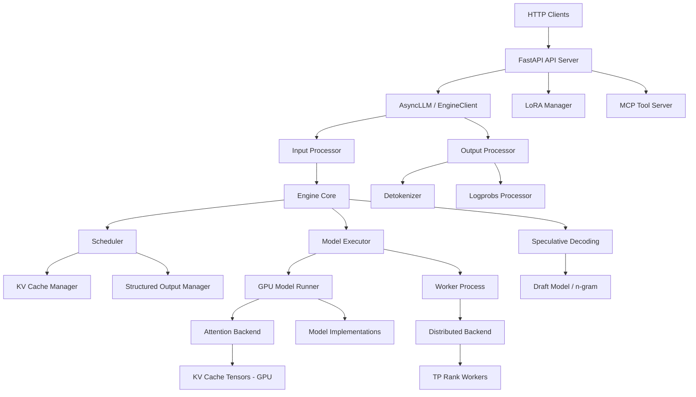

# vLLM — Overview & Architecture

## 1.1 Project Classification

**Hybrid: Server/Service + Library/SDK + CLI**

vLLM is a high-throughput, memory-efficient inference and serving engine for large language models (LLMs). It operates in three modes:

- **Server mode** (`vllm serve`): Long-running HTTP server exposing OpenAI-compatible, Anthropic-compatible, and other APIs.
- **Offline batch mode** (`LLM` class): Library-style Python API for batch inference without a server.
- **Async engine mode** (`AsyncLLM` class): Async library for integration into custom applications.

## 1.2 Tech Stack

| Component | Technology |
|-----------|-----------|
| Primary language | Python (with C++/CUDA extensions, Triton kernels) |
| Web framework | FastAPI + Uvicorn (ASGI) |
| GPU compute | PyTorch, custom CUDA/Triton kernels |
| Distributed execution | Ray, multiprocessing (mp), or uniprocess |
| Serialization | msgspec/msgpack for IPC, Pydantic for API validation |
| Inter-process communication | ZMQ (async), Python multiprocessing Queues |
| Metrics | Prometheus client (multiprocess mode) |
| Tracing | OpenTelemetry (optional) |
| Model formats | SafeTensors, GGUF, BitsAndBytes, Tensorizer, RunAI Streamer |
| Build system | `uv` (Python), CMake (C++/CUDA extensions), pre-commit hooks |

**Optional/conditional backends:** CUDA (NVIDIA GPU), ROCm (AMD GPU), CPU, Intel Gaudi (HPU), TPU, AWS Neuron, FPGA.

## 1.3 Directory Map

| Directory | Purpose |
|-----------|---------|
| `vllm/` | Core library source |
| `vllm/v1/` | V1 architecture — scheduler, engine core, worker, attention backends |
| `vllm/v1/engine/` | Engine core, async LLM, input/output processors, detokenizer |
| `vllm/v1/core/` | Scheduler, KV cache manager, structured output manager |
| `vllm/v1/worker/` | GPU model runner, block tables, KV cache worker-side logic |
| `vllm/v1/executor/` | Abstract executor, uniproc/multiproc/Ray executors |
| `vllm/v1/attention/` | Attention backend implementations (FlashAttn, FlashInfer, etc.) |
| `vllm/v1/spec_decode/` | Speculative decoding (Eagle, Medusa, n-gram, etc.) |
| `vllm/entrypoints/` | HTTP API servers (OpenAI, Anthropic, MCP, SageMaker) |
| `vllm/model_executor/` | Model loading, quantization layers, model implementations |
| `vllm/model_executor/models/` | 100+ model architectures (Llama, Qwen, Mixtral, etc.) |
| `vllm/model_executor/layers/` | Custom linear/attention/quantization layers |
| `vllm/distributed/` | Tensor parallel, pipeline parallel, data parallel, KV transfer |
| `vllm/lora/` | LoRA adapter loading, serving, and management |
| `vllm/tracing/` | OpenTelemetry integration |
| `vllm/v1/metrics/` | Prometheus metrics, stats collection, loggers |
| `vllm/v1/structured_output/` | Grammar-guided generation (xgrammar, outlines, guidance, LM format enforcer) |
| `vllm/plugins/` | Plugin system via Python entry points |
| `vllm/multimodal/` | Multi-modal input processing (vision, audio, video) |
| `vllm/compilation/` | torch.compile / CUDA graph support |
| `vllm/platforms/` | Hardware platform abstraction (CUDA, ROCm, CPU, TPU, etc.) |
| `tests/` | Unit and integration tests |
| `docs/` | User-facing documentation |
| `benchmarks/` | Performance benchmarking scripts |
| `examples/` | Usage examples and sample scripts |
| `csrc/` | C++/CUDA extension source code |

## 1.4 Module / Component Diagram

### Module Responsibilities

- **API Server**: FastAPI application with OpenAI-compatible endpoints (chat/completions, completions, embeddings, responses, etc.), Anthropic-compatible messages endpoint, and vLLM-specific management endpoints (sleep, profile, LoRA, cache, etc.).
- **AsyncLLM / EngineClient**: Async interface to the engine core. Manages request submission, output collection, and streaming via asyncio queues and ZMQ IPC.
- **Input Processor**: Tokenizes prompts, processes multi-modal inputs, resolves LoRA requests, and constructs `EngineCoreRequest` objects.
- **Engine Core**: Central orchestration loop — schedules requests, executes model forward pass, processes outputs. Runs in a separate process (multiproc mode) for isolation.
- **Scheduler**: Determines which requests get tokens in each step, manages KV cache block allocation, handles preemption, and enforces throughput/memory constraints.
- **KV Cache Manager**: Allocates and frees KV cache blocks, manages prefix caching via block hashing, and supports KV cache events for external observability.
- **Model Executor**: Abstract layer over uniproc/multiproc/Ray execution. Spawns worker processes, distributes model execution, and collects results.
- **GPU Model Runner**: Prepares input tensors, builds attention metadata, executes model forward pass, and manages CUDA graphs and KV cache operations on the worker side.
- **Attention Backend**: Pluggable backends (FlashAttn, FlashInfer, ROCm, CPU, Triton, etc.) that implement the actual KV-cache attention computation.
- **Output Processor**: Collects model outputs, applies stop tokens, runs incremental detokenization, computes logprobs, and assembles `RequestOutput` objects.
- **Structured Output Manager**: Compiles and applies grammar constraints (JSON schema, regex, choices) to ensure model outputs conform to specified formats.
- **Speculative Decoding**: Generates draft tokens via n-gram proposer, Eagle, or Medusa heads, then verifies them against the target model to speed up inference.
- **Distributed Backend**: Tensor parallelism (TP), pipeline parallelism (PP), data parallelism (DP), expert parallelism (EP), and KV connector for disaggregated serving.
