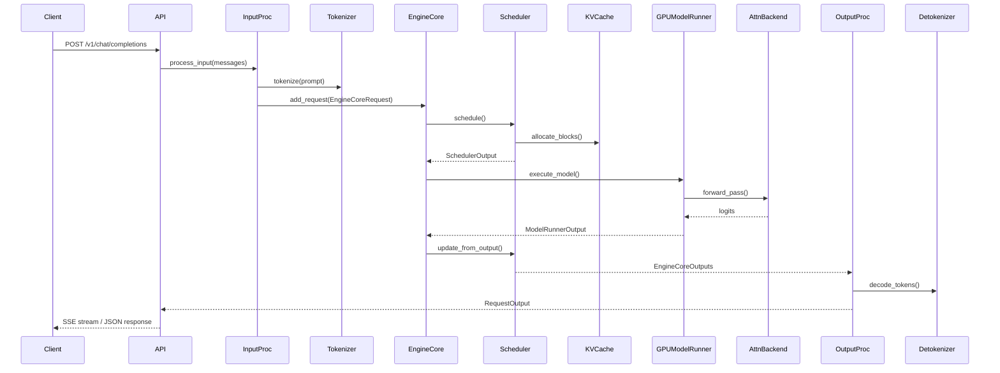

# vLLM — API / Interface Analysis

## 3.1 API Surface Overview

vLLM exposes multiple API families through a modular FastAPI router architecture. Routers are conditionally registered based on the model's supported tasks.

### Router Registration Hierarchy

```
api_server.py (build_and_serve)
├── register_vllm_serve_api_routers()    — Management/admin endpoints
│   ├── lora/       — LoRA adapter CRUD
│   ├── profile/    — CUDA profiling control
│   ├── sleep/      — Sleep/wake for power management
│   ├── rpc/        — Direct RPC to engine core
│   ├── cache/      — Prefix cache management
│   ├── tokenize/   — Tokenization utilities
│   └── instrumentator/ — Prometheus metrics
├── models/         — GET /v1/models
├── sagemaker/      — SageMaker-compatible endpoints
├── generate/       — Core generation endpoints
│   ├── chat_completion/  — /v1/chat/completions
│   ├── responses/        — /v1/responses
│   ├── completion/       — /v1/completions
│   └── anthropic/        — /v1/messages
├── disagg/         — Disaggregated serving coordination
├── rlhf/           — RLHF-specific endpoints
├── elastic_ep/     — Elastic expert parallelism
├── generative_scoring/ — Scoring endpoints
├── render/         — Prompt rendering
├── speech_to_text/ — Audio transcription
├── realtime/       — Real-time WebSocket API
└── pooling/        — Embeddings, scoring, ranking
```

## 3.2 Per-Endpoint Analysis

### POST /v1/chat/completions

**Handler:** `vllm/entrypoints/openai/chat_completion/api_router.py:create_chat_completion()`

**Input:** JSON body — model, messages (with role/content), temperature, max_tokens, stream, tools, response_format, etc.

**Execution Flow:**
1. Validate request via `validate_json_request` dependency
2. Check load-aware call gating
3. Resolve handler from `app.state.openai_serving_chat`
4. Call `OpenAIServingChat.create_chat_completion()`
5. If streaming: return `StreamingResponse` with SSE events
6. If non-streaming: return `JSONResponse` with full completion

**Complex Logic:**
- Tool calling support parses model output for function calls via configurable tool parsers (e.g., `ToolParserManager`)
- Structured output (JSON mode) integrates with `StructuredOutputManager` to constrain generation
- Batch endpoint (`/v1/chat/completions/batch`) supports offline batch processing



### POST /v1/completions

**Handler:** `vllm/entrypoints/openai/completion/api_router.py:create_completion()`

**Input:** JSON body — model, prompt, max_tokens, temperature, stream, logprobs, echo, etc.

**Execution Flow:** Similar to chat completions but accepts raw text prompt instead of messages. Uses `OpenAIServingCompletion` handler.

### POST /v1/responses

**Handler:** `vllm/entrypoints/openai/responses/api_router.py:create_responses()`

**Input:** JSON body — model, input, instructions, tools, stream, etc.

**Execution Flow:**
1. Parse responses request
2. Support tool use via MCP tool server integration
3. Stream events via SSE with typed event names
4. Convert internal generator to SSE format (`_convert_stream_to_sse_events`)

**Complex Logic:**
- Tool sessions are managed per-request via `ResponseContext.cleanup_session()`
- Supports MCP (Model Context Protocol) tool server connections for external tool execution

### POST /v1/messages (Anthropic-compatible)

**Handler:** `vllm/entrypoints/anthropic/api_router.py:create_messages()`

**Input:** Anthropic-format messages request (model, messages, max_tokens, etc.)

**Execution Flow:**
1. Translate Anthropic request format to internal format
2. Execute via `AnthropicServingMessages`
3. Translate errors back to Anthropic error format
4. Also exposes `POST /v1/messages/count_tokens` endpoint

### GET /v1/models

**Handler:** `vllm/entrypoints/openai/models/api_router.py:show_available_models()`

Returns list of available models including LoRA adapters.

### Pooling Endpoints (Embeddings, Scoring, Ranking)

**Registered via:** `vllm/entrypoints/pooling/factories.py:register_pooling_api_routers()`

Conditionally registered based on `supported_tasks`:
- Embeddings: `/v1/embeddings`
- Scoring: `/v1/score`
- Ranking: `/v1/rerank`, `/v1/score` (depending on model capabilities)

### Management Endpoints

| Endpoint | Method | Purpose |
|----------|--------|---------|
| `/v1/loras` | POST | Load a LoRA adapter |
| `/v1/loras/{'{lora_id}'}` | DELETE | Unload a LoRA adapter |
| `/v1/loras/{'{lora_id}'}/pin` | POST | Pin a LoRA adapter in memory |
| `/sleep` | POST | Sleep mode (power saving) |
| `/wake-up` | POST | Wake from sleep |
| `/start-profile` | POST | Start CUDA profiling |
| `/stop-profile` | POST | Stop CUDA profiling |
| `/reset_prefix_cache` | POST | Clear prefix cache |
| `/is_sleeping` | GET | Check sleep state |
| `/metrics` | GET | Prometheus metrics endpoint |

## 3.3 Python SDK Interface

### LLM (Offline Batch)

```python
from vllm import LLM, SamplingParams
llm = LLM(model="meta-llama/Llama-3-8B")
outputs = llm.generate(["Hello"], SamplingParams(max_tokens=100))
```

**Key methods:**
- `LLM.generate()` — batch text generation
- `LLM.encode()` — batch embedding/pooling
- `LLM.start_profile()` / `LLM.stop_profile()` — profiling

### AsyncLLM (Async)

```python
from vllm import AsyncLLMEngine
engine = AsyncLLMEngine.from_engine_args(engine_args)
async for output in engine.generate(request):
    process(output)
```

**Key methods:**
- `AsyncLLM.generate()` — async streaming generation
- `AsyncLLM.encode()` — async embedding
- `AsyncLLM.abort()` — cancel in-flight request
- `AsyncLLM.sleep()` / `AsyncLLM.wake_up()` — power management
